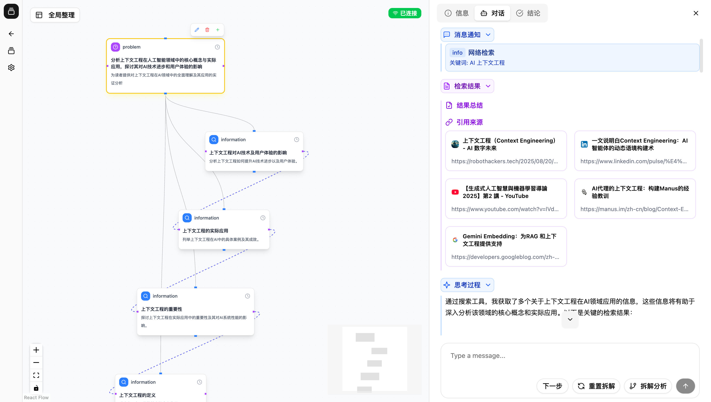

# Thinking Map
[English](README.en.md) | [简体中文](README.md)

An intelligent thinking assistant based on mind maps that uses structured visualization and AI agent collaboration to help you more clearly organize problems, explore solutions, and record knowledge.

## Project Overview

- Product Definition: ThinkingMap is an interactive AI problem‑solving visual assistant that turns AI thinking and problem‑solving processes into a visual graph structure, allowing users to intervene and ask questions at any time during the process.
- Product Vision: Make the AI‑assisted problem‑solving process transparent, controllable, and structured, enabling users to truly participate in the thinking process rather than only receiving the final answer.
- Target Users: researchers and scholars, students and educators, content creators and writers, analysts and decision‑makers, product and project managers.
- User Pain Points: opaque reasoning that is hard to understand and trust; multi‑step thinking is difficult to present clearly; hard to intervene and adjust at any time; lack of structured decomposition and visualization.
- Core Value: transparent thinking, user control, structured thinking, exploratory thinking.




## Tech Stack

**Frontend**
- Framework: Next.js 15 (App Router)
- Language: TypeScript
- UI: shadcn/ui + Radix UI
- State Management: Zustand
- Visualization: ReactFlow
- Styling: Tailwind CSS
- Package Manager: pnpm
- Icons: Lucide React

**Backend**
- Language/Framework: Go 1.24+, Gin, eino
- ORM/Database: GORM + PostgreSQL 14+
- Cache: Redis 7+
- Authentication: JWT
- Logging: Zap
- Configuration: Viper

## Blog and Documentation

**Blog (docs/blog)**
- [00 - Project Introduction and Thinking Map](docs/blog/00-introduction-and-thinking-map.md)
- [01 - From Pain Points to Product](docs/blog/01-from-painpoint-to-product.md)
- [02 - Experience with AI Coding Tools](docs/blog/02-ai-coding-tools-experience.md)
- [03 - eino and Multi‑Agent](docs/blog/03-eino-and-multiagent.md)
- [04 - SSE Context Streaming](docs/blog/04-sse-context-streaming.md)
- [05 - Retrospective and Outlook](docs/blog/05-retrospective-and-future.md)
- [Series Outline](docs/blog/blog-series-outline.md)

**Technical Documentation (docs)**
- [Backend Documentation](docs/backend.md)
- [API Documentation](docs/api.md)
- [Frontend Overview](docs/frontend.md)
- [Frontend Pages and Structure](docs/frontend-pages.md), [Frontend State](docs/frontend-state.md), [Frontend Workspace](docs/frontend-workspace.md)
- [SSE Technical Documentation](docs/sse-technical-documentation.md), [Streaming JSON Parser](docs/streaming-json-parser.md)
- [Interaction and Multi‑Agent Architecture](docs/interaction-flow.md), [Interaction Sequence Diagram](docs/interaction-sequence-diagram.md), [Multiagent Architecture](docs/multiagent-architecture.md)
- [UI Design and Components](docs/ui.md), [Frontend Visual Implementation](docs/frontend-visual.md)

## Project Structure

```
thinking-map/
├── server/          # Backend service (Go)
├── web/             # Frontend app (Next.js)
├── docs/            # Project documentation and blog
├── docker/          # Docker and Compose configuration
└── logs/            # Log files
```

## Development Guide

### Option 1: Docker (Recommended)

1) Prepare environment variables (in the `docker/` directory):
```bash
cd docker
cp .env.example .env
# Edit .env, and add your AI service keys (e.g., OPENAI/DeepSeek/Claude) and Tavily API key
```

2) Build and start all services:
```bash
docker-compose up -d --build
# View status and logs
docker-compose ps
docker-compose logs -f
```

3) Access the application:
- Frontend: http://localhost:3030
- Backend API: http://localhost:8080
- PostgreSQL: localhost:5432
- Redis: localhost:6379

4) Common commands:
```bash
# Start / stop
docker-compose up -d
docker-compose down

# Rebuild
docker-compose up -d --build

# View logs / enter container
docker-compose logs -f [service_name]
docker-compose exec [service_name] sh

# Clean data volumes (deletes all data)
docker-compose down -v
```

5) Development mode (run frontend and backend locally, use DB/Redis from containers):
```bash
cd docker
docker-compose up -d postgres redis

# Start backend locally
cd ../server
go mod download
go run cmd/server/main.go

# Start frontend locally
cd ../web
pnpm install
pnpm run dev
```

### Option 2: Run from Source (Local Environment)

**Backend (server)**
```bash
cd server
go mod download

# Edit configs/config.local.yaml to set PostgreSQL and Redis connection info

# Start the service
go run cmd/server/main.go
```

**Frontend (web)**
```bash
cd web
pnpm install
pnpm run dev
```

> Tip: If you don’t have a local database or cache installed, first start `docker-compose up -d postgres redis`, then run the frontend and backend locally.

## Requirements

- Go 1.24+
- Node.js 18+
- PostgreSQL 14+
- Redis 7+
- pnpm

## License

Apache-2.0 license