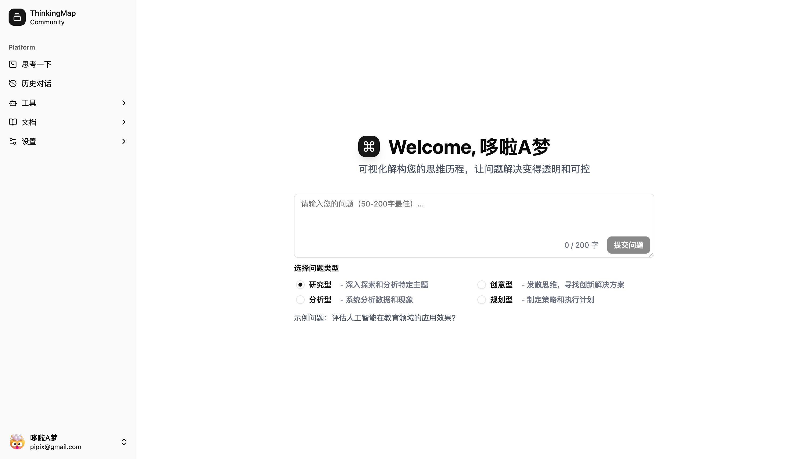
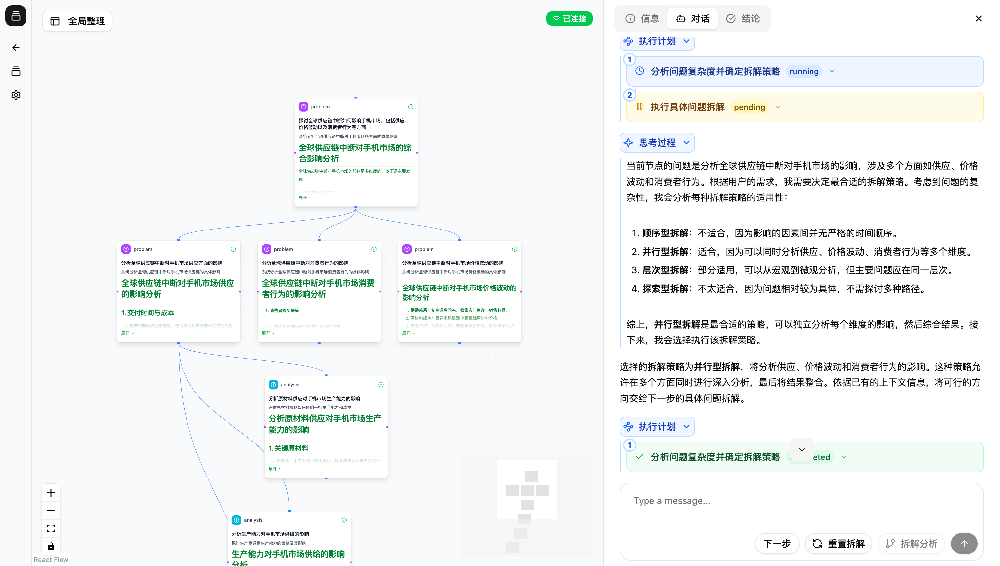

# Thinking Map

一个基于思维导图的智能思考辅助系统，用结构化可视化与 AI 代理协作，帮助你更清晰地梳理问题、探索方案与记录知识。

## 项目介绍

- 产品定义：ThinkingMap 是一款交互式 AI 问题解决可视化助手，将 AI 的思考和问题解决过程转化为可视化的图结构，允许用户在过程中随时干预、提问。
- 产品愿景：使 AI 辅助问题解决过程变得透明、可控且结构化，让用户真正参与到思考过程中，而不仅仅是得到最终答案。
- 目标用户：研究人员和学者、学生和教育工作者、内容创作者和写作者、分析师和决策者、产品和项目管理人员。
- 用户痛点：答案过程不透明、难以理解和信任；多步骤思路难以清晰展示；过程难以随时干预与调整；缺乏结构化拆解与可视化。
- 核心价值：透明化思考、用户控制、结构化思维、探索性思考。





## 技术栈

**Frontend**
- 框架：Next.js 15（App Router）
- 语言：TypeScript
- UI：shadcn/ui + Radix UI
- 状态管理：Zustand
- 可视化：ReactFlow
- 样式：Tailwind CSS
- 包管理：pnpm
- 图标：Lucide React

**Backend**
- 语言/框架：Go 1.24+，Gin，eino
- ORM/数据库：GORM + PostgreSQL 14+
- 缓存：Redis 7+
- 认证：JWT
- 日志：Zap
- 配置：Viper

## 博客与文档

**博客（docs/blog）**
- [00 - 项目介绍与 Thinking Map](docs/blog/00-introduction-and-thinking-map.md)
- [01 - 从痛点到产品](docs/blog/01-from-painpoint-to-product.md)
- [02 - AI 编码工具体验](docs/blog/02-ai-coding-tools-experience.md)
- [03 - eino 与多代理](docs/blog/03-eino-and-multiagent.md)
- [04 - SSE 上下文流式技术](docs/blog/04-sse-context-streaming.md)
- [05 - 回顾与展望](docs/blog/05-retrospective-and-future.md)
- [系列大纲](docs/blog/blog-series-outline.md)

**技术文档（docs）**
- [后端文档](docs/backend.md)
- [API 文档](docs/api.md)
- [前端概览](docs/frontend.md)
- [前端页面与结构](docs/frontend-pages.md)、[前端状态](docs/frontend-state.md)、[前端工作区](docs/frontend-workspace.md)
- [SSE 技术文档](docs/sse-technical-documentation.md)、[Streaming JSON Parser](docs/streaming-json-parser.md)
- [交互与多代理架构](docs/interaction-flow.md)、[交互时序图](docs/interaction-sequence-diagram.md)、[multiagent 架构](docs/multiagent-architecture.md)
- [UI 设计与组件](docs/ui.md)、[前端视觉实现](docs/frontend-visual.md)

## 项目结构

```
thinking-map/
├── server/          # 后端服务 (Go)
├── web/             # 前端应用 (Next.js)
├── docs/            # 项目文档与博客
├── docker/          # Docker 与 Compose 配置
└── logs/            # 日志文件
```

## 开发指南

### 方式一：Docker 启动（推荐）

1) 准备环境变量（在 `docker/` 目录下）：
```bash
cd docker
cp .env.example .env
# 编辑 .env，填入你的 AI 服务密钥（如 OPENAI/DeepSeek/Claude）和 tavily API 密钥
```

2) 构建并启动所有服务：
```bash
docker-compose up -d --build
# 查看状态与日志
docker-compose ps
docker-compose logs -f
```

3) 访问应用：
- 前端：http://localhost:6000
- 后端 API：http://localhost:8080
- PostgreSQL：localhost:5432
- Redis：localhost:6379

4) 常用命令：
```bash
# 启动 / 停止
docker-compose up -d
docker-compose down

# 重新构建
docker-compose up -d --build

# 查看日志/进入容器
docker-compose logs -f [service_name]
docker-compose exec [service_name] sh

# 清理数据卷（会删除所有数据）
docker-compose down -v
```

5) 开发模式（本地跑前后端，使用容器中的 DB/Redis）：
```bash
cd docker
docker-compose up -d postgres redis

# 后端本地启动
cd ../server
go mod download
go run cmd/server/main.go

# 前端本地启动
cd ../web
pnpm install
pnpm run dev
```

### 方式二：源码启动（本地环境）

**后端（server）**
```bash
cd server
go mod download

# 编辑 configs/config.local.yaml，设置 PostgreSQL 与 Redis 连接信息

# 启动服务
go run cmd/server/main.go
```

**前端（web）**
```bash
cd web
pnpm install
pnpm run dev
```

> 提示：若本地未安装数据库与缓存，可按上文先启动 `docker-compose up -d postgres redis`，然后本地运行前后端。

## 环境要求

- Go 1.24+
- Node.js 18+
- PostgreSQL 14+
- Redis 7+
- pnpm

## 许可证

Apache-2.0 license