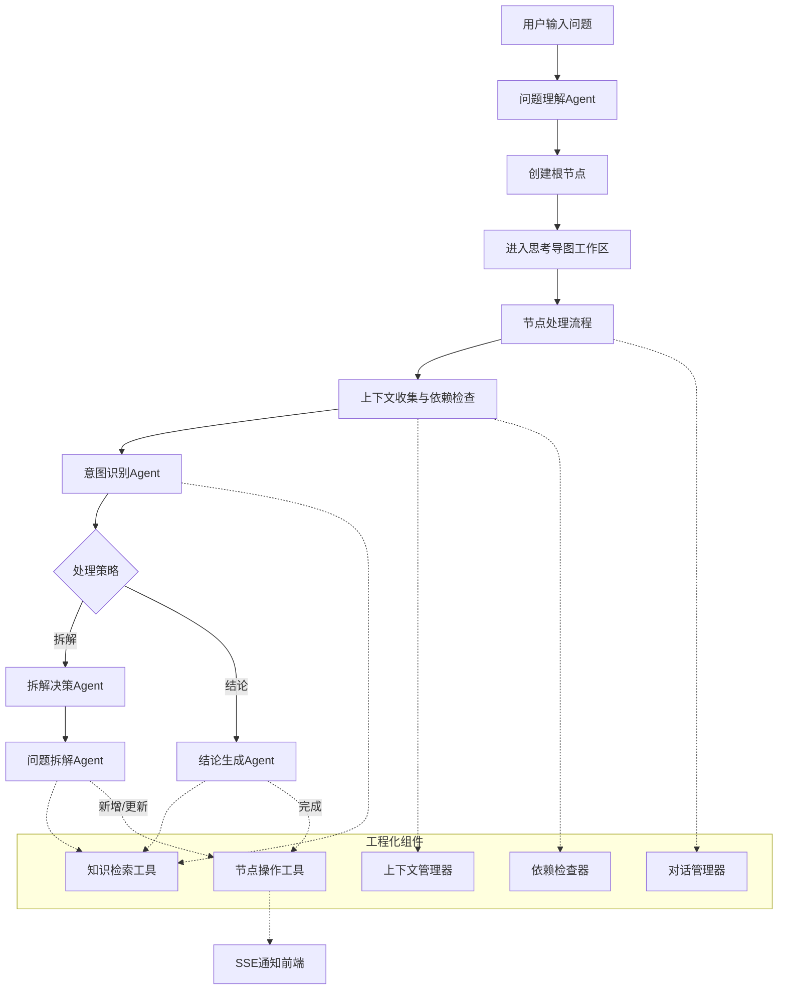
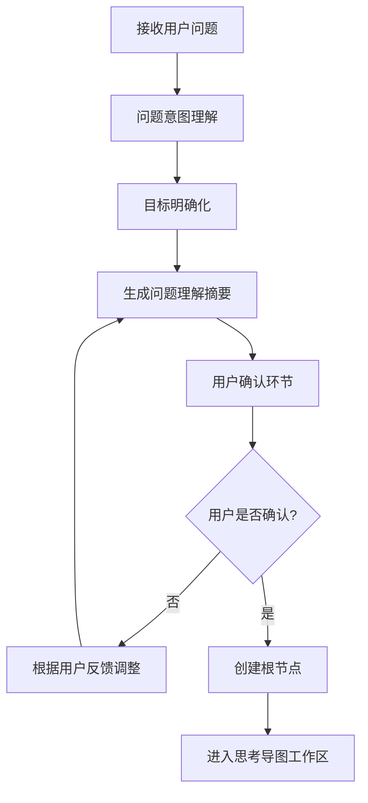
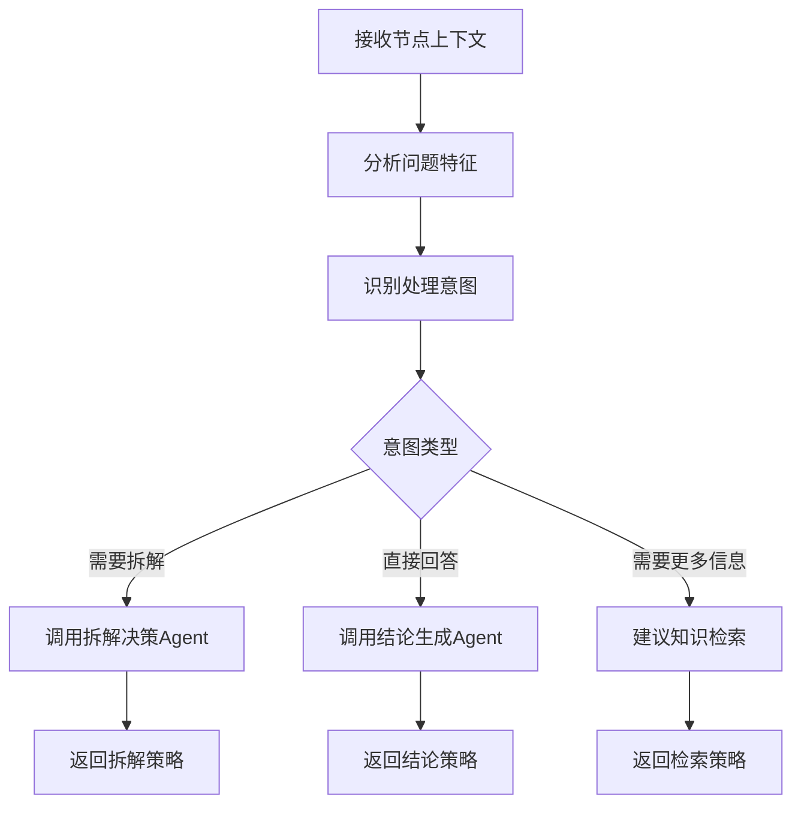
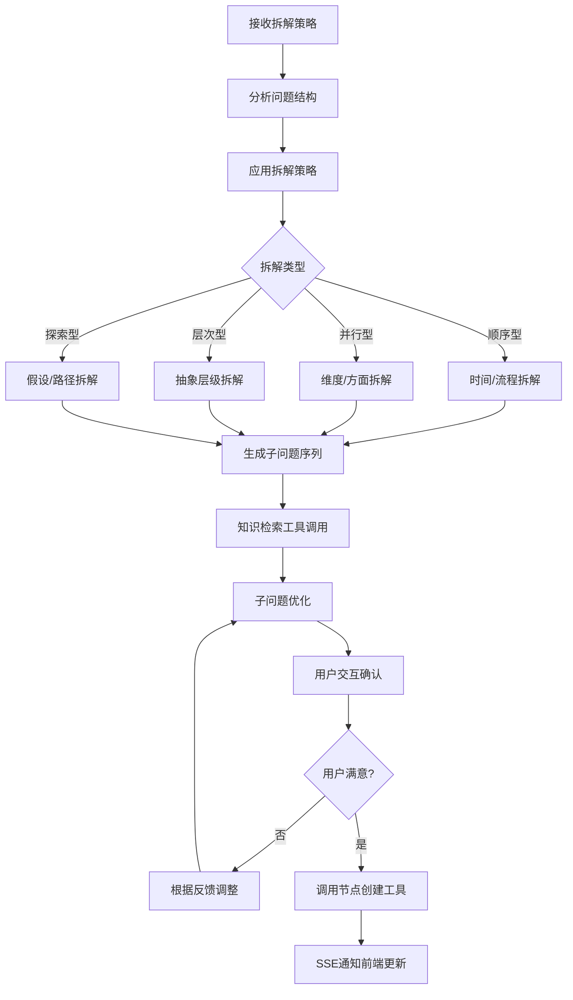
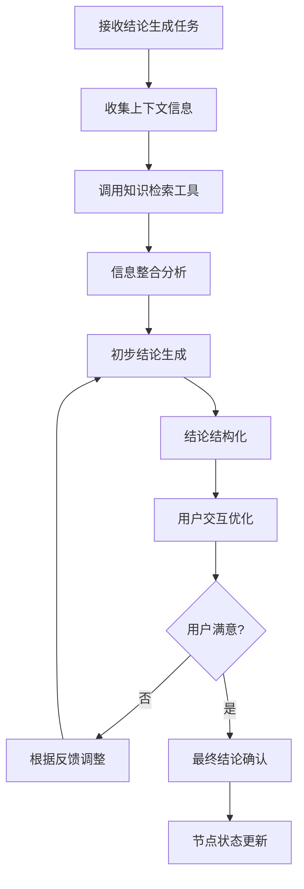
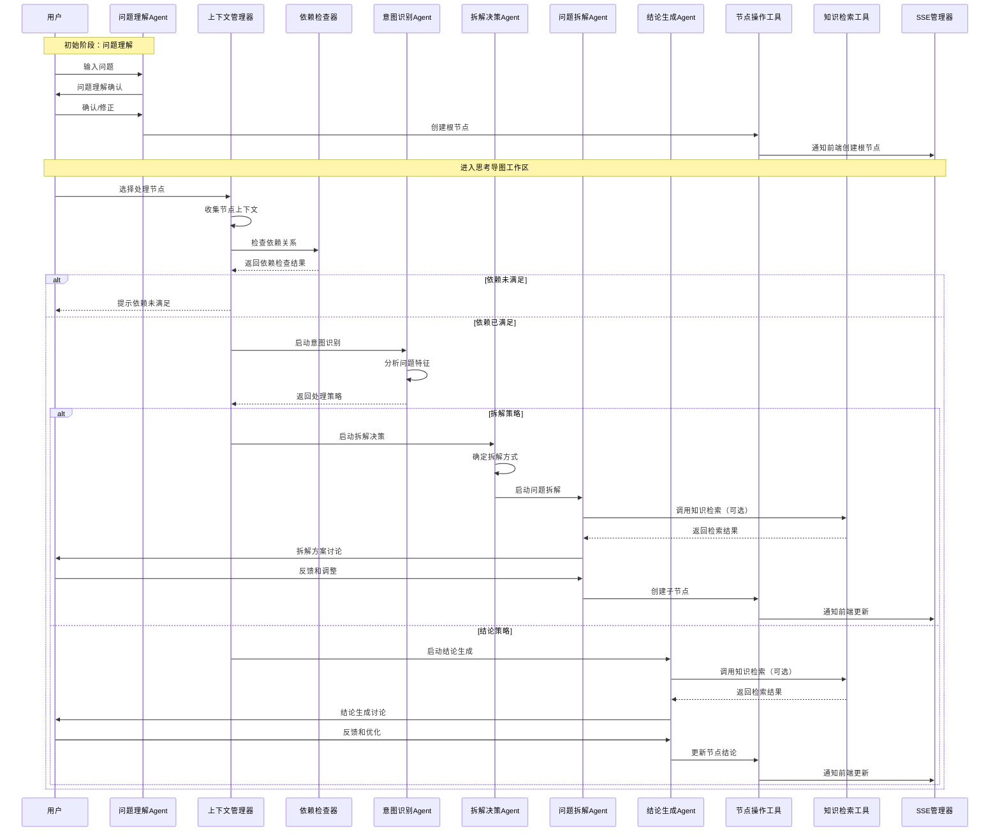
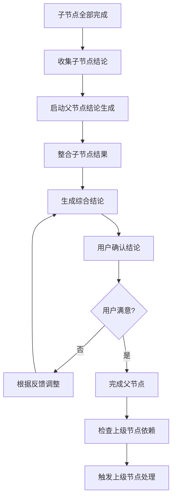

# ThinkingMap Agent系统设计

## 1. 设计概述

### 1.1 设计原则

ThinkingMap的Agent系统设计围绕产品的核心价值：**思考过程可视化**和**用户可干预**。与传统的端到端AI助手不同，本系统强调：

- **透明性优先**：每个思考步骤都可见、可理解
- **用户主导**：用户可以在任何节点干预和调整方向
- **渐进式推理**：将复杂问题分解为可管理的小步骤
- **交互式协作**：AI和用户共同完成问题解决过程

### 1.2 系统架构概览



## 2. 核心Agent组件设计

### 2.1 问题理解Agent (Problem Understanding Agent)

**职责**：仅在用户首次提交问题时使用，解析用户输入，确认用户意图，创建根节点

**使用时机**：
- 用户首次输入问题时
- 创建新的思考导图时
- 不参与后续节点的处理流程

**处理流程**：


**输出**：
- 结构化的问题描述
- 明确的目标定义
- 根节点数据结构
- 进入思考导图工作区

**关键特性**：
- 一次性使用，专注于初始问题理解
- 支持用户确认和修正
- 创建根节点后即完成使命

### 2.2 意图识别Agent (Intent Recognition Agent)

**职责**：分析当前节点的处理需求，识别用户意图，决定后续处理策略

**处理流程**：


**意图类型**：
1. **拆解型意图**：问题复杂，需要分解为子问题
2. **结论型意图**：问题明确，可以直接生成结论
3. **探索型意图**：需要先获取更多背景信息
4. **澄清型意图**：问题模糊，需要进一步明确

### 2.3 拆解决策Agent (Decomposition Decision Agent)

**职责**：在意图识别确定需要拆解后，判断具体的拆解策略和方式

**决策逻辑**：
```python
class DecompositionDecisionAgent:
    def decide_decomposition_strategy(self, node_context):
        factors = {
            'complexity_score': self.assess_complexity(node_context.question),
            'knowledge_gaps': self.identify_knowledge_gaps(node_context),
            'subtask_potential': self.detect_subtasks(node_context.question),
            'user_preference': node_context.user_settings.decomposition_preference
        }
        
        # 选择最适合的拆解策略
        strategy = self.select_decomposition_strategy(factors)
        return strategy
```

**拆解策略类型**：
1. **顺序型拆解**：按时间或流程顺序分解
2. **并行型拆解**：按维度或方面并行分解
3. **层次型拆解**：按抽象层级递进分解
4. **探索型拆解**：按假设或路径分支分解

### 2.4 问题拆解Agent (Problem Decomposition Agent)

**职责**：基于拆解决策Agent的策略，将复杂问题分解为可管理的子问题，通过工具创建子节点

**拆解流程**：



**可用工具**：
- **知识检索工具**：根据需要调用MCP方式实现的知识检索
- **节点创建工具**：创建子节点并设置依赖关系
- **节点修改工具**：修改已创建的子节点信息
- **SSE通知工具**：实时通知前端更新可视化界面

**拆解类型示例**：

1. **顺序型拆解**（适用于流程性问题）：
   - 研究问题 → 文献调研 → 方法设计 → 数据收集 → 分析结论

2. **并行型拆解**（适用于多维度分析）：
   - 产品设计 → 用户需求分析 + 技术可行性 + 商业模式 + 竞品分析

3. **层次型拆解**（适用于复杂概念）：
   - 理解机器学习 → 基础数学概念 → 算法原理 → 实际应用

4. **探索型拆解**（适用于开放性问题）：
   - 创新方案 → 方案A探索 + 方案B探索 + 方案C探索

**用户干预机制**：
- 实时对话调整拆解方向
- 通过工具手动添加/删除子问题
- 调整子问题优先级和依赖关系
- 修改子问题的描述和目标

### 2.5 结论生成Agent (Conclusion Generation Agent)

**职责**：基于上下文信息和检索知识生成节点结论，支持用户交互优化

**生成流程**：


**信息来源**：
- 当前节点的问题和目标
- 父节点的问题目标（上下文管理器提供）
- 同级依赖节点的问题目标和结论（上下文管理器提供）
- 直接子节点的问题目标和结论（上下文管理器提供）
- 知识检索工具获取的相关知识
- 用户提供的额外信息

**结论类型**：
- **分析型结论**：基于数据和逻辑的客观分析
- **创意型结论**：包含创新想法和建议的方案
- **决策型结论**：明确的选择建议和理由
- **学习型结论**：知识总结和理解要点

## 3. 工程化组件设计

### 3.1 上下文管理器 (Context Manager)

**职责**：通过工程化方式管理思考导图的上下文信息，基于导图结构自动收集相关上下文

**上下文来源**：
- **父节点上下文**：父节点的问题和目标
- **同级依赖节点上下文**：同级依赖节点的问题目标和结论
- **子节点上下文**：直接子节点的问题目标和结论
- **对话历史上下文**：当前节点的对话历史记录，用于问题拆解和结论生成的对话框交互
  - 包含最近10条对话记录，保持对话的连续性
  - 提供对话摘要信息（消息总数、时间范围、用户/助手消息数量）
  - 支持Agent理解当前对话的进展和上下文背景
- **用户干预上下文**：用户手动添加或修改的上下文信息

**实现方式**：
```python
class ContextManager:
    def __init__(self, thinking_tree, conversation_manager=None):
        self.thinking_tree = thinking_tree
        self.conversation_manager = conversation_manager
    
    def get_node_context(self, node_id):
        """获取节点的完整上下文"""
        node = self.thinking_tree.get_node(node_id)
        context = {
            'current_node': node,
            'parent_context': self._get_parent_context(node_id),
            'dependency_context': self._get_dependency_context(node_id),
            'children_context': self._get_children_context(node_id),
            'conversation_context': self._get_conversation_context(node_id),
            'user_context': self._get_user_context(node_id)
        }
        return context
    
    def _get_parent_context(self, node_id):
        """获取父节点的问题和目标"""
        parent = self.thinking_tree.get_parent(node_id)
        if parent:
            return {
                'question': parent.question,
                'goal': parent.goal,
                'constraints': parent.constraints
            }
        return None
    
    def _get_dependency_context(self, node_id):
        """获取同级依赖节点的问题目标和结论"""
        dependencies = self.thinking_tree.get_dependencies(node_id)
        return [{
            'question': dep.question,
            'goal': dep.goal,
            'conclusion': dep.conclusion
        } for dep in dependencies]
    
    def _get_children_context(self, node_id):
        """获取直接子节点的问题目标和结论"""
        children = self.thinking_tree.get_children(node_id)
        return [{
            'question': child.question,
            'goal': child.goal,
            'conclusion': child.conclusion
        } for child in children]
    
    def _get_conversation_context(self, node_id, parent_msg_id):
        """获取节点的对话历史上下文,通过parent_msg_id查找消息链"""
        if not self.conversation_manager:
            return []
        
        # 获取最近的对话历史，用于问题拆解和结论生成的对话框交互
        recent_messages = self.conversation_manager.get_recent_node_conversation(node_id, parent_msg_id, limit=10)
        
        # 格式化对话历史，提供给Agent作为上下文
        formatted_history = []
        for msg in recent_messages:
            formatted_history.append({
                'role': msg['role'],
                'content': msg['content'],
                'timestamp': msg['timestamp']
            })
        
        return {
            'recent_messages': formatted_history,
            'summary': self.conversation_manager.get_conversation_summary(node_id)
        }
    
    def _get_user_context(self, node_id):
        """获取用户手动添加或修改的上下文信息"""
        # 这里可以从数据库或其他存储中获取用户自定义的上下文
        # 暂时返回空，具体实现根据需求定义
        return None
```

**对话框交互中的上下文使用示例**：
```python
# 在问题拆解或结论生成的对话框中使用上下文
def handle_dialog_interaction(node_id, user_message, context_manager, conversation_manager):
    # 获取完整的节点上下文
    context = context_manager.get_node_context(node_id)
    
    # 添加用户消息到对话历史
    conversation_manager.add_message('user', user_message, node_id)
    
    # 构建Agent的提示词，包含所有相关上下文
    prompt = f"""
    当前节点信息：
    - 问题：{context['current_node'].question}
    - 目标：{context['current_node'].goal}
    
    父节点上下文：{context['parent_context']}
    依赖节点上下文：{context['dependency_context']}
    子节点上下文：{context['children_context']}
    
    对话历史：
    {format_conversation_history(context['conversation_context']['recent_messages'])}
    
    对话摘要：{context['conversation_context']['summary']}
    
    用户消息：{user_message}
    """
    
    # 调用Agent进行处理
    agent_response = agent.process(prompt)
    
    # 添加Agent响应到对话历史
    conversation_manager.add_message('assistant', agent_response, node_id)
    
    return agent_response

def format_conversation_history(messages):
    """格式化对话历史为可读文本"""
    formatted = []
    for msg in messages:
        formatted.append(f"{msg['role']}: {msg['content']}")
    return "\n".join(formatted)
```

### 3.2 依赖检查器 (Dependency Checker)

**职责**：通过工程化方式检查节点的依赖关系，确保执行顺序的正确性

**实现伪代码**：
```python
class DependencyChecker:
    def __init__(self, thinking_tree):
        self.thinking_tree = thinking_tree
    
    def check_execution_readiness(self, node_id):
        """检查节点是否可以执行"""
        dependencies = self.thinking_tree.get_dependencies(node_id)
        
        for dep_node_id in dependencies:
            dep_node = self.thinking_tree.get_node(dep_node_id)
            if dep_node.status != 'completed':
                return False, f"依赖节点 {dep_node.title} 尚未完成"
        
        return True, "所有依赖已满足"
    
    def get_execution_order(self, node_ids):
        """获取节点的执行顺序（拓扑排序）"""
        return self._topological_sort(node_ids)
    
    def validate_dependency_cycle(self, from_node, to_node):
        """检查是否会产生循环依赖"""
        return not self._has_path(to_node, from_node)
```

### 3.3 知识检索工具 (Knowledge Retrieval Tool)

**职责**：作为Agent的工具使用，可通过MCP方式实现，Agent根据需要决定是否调用

**工具接口**：
```python
class KnowledgeRetrievalTool:
    def __init__(self, mcp_client):
        self.mcp_client = mcp_client
    
    def search_knowledge(self, query, context=None, search_type="semantic"):
        """搜索相关知识"""
        request = {
            'query': query,
            'context': context,
            'search_type': search_type,
            'max_results': 10
        }
        return self.mcp_client.call_tool('knowledge_search', request)
    
    def get_domain_knowledge(self, domain, topic=None):
        """获取特定领域知识"""
        request = {
            'domain': domain,
            'topic': topic
        }
        return self.mcp_client.call_tool('domain_knowledge', request)
```

### 3.4 对话管理器 (Conversation Manager)

**职责**：通过工程化方式管理对话状态
* 一个节点存在两个对话：一个是拆解tab页对话、一个是总结tab页对话
* 消息通过parent_id进行关联，可实现消息回溯
* 消息记录表 messages

**实现伪代码**：
```python
class ConversationManager:
    def __init__(self, user_id, db_session):
        self.user_id = user_id
        self.db = db_session
        self.current_node_id = None
        self.conversation_state = "idle"
    
    def start_node_conversation(self, node_id, agent_type, conversation_id=None):
        """开始节点对话"""
        self.current_node_id = node_id
        self.conversation_state = f"{agent_type}_processing"
        
        # 如果没有提供conversation_id，则创建新的对话ID
        if not conversation_id:
            conversation_id = str(uuid.uuid4())
        
        self._log_conversation_start(node_id, agent_type, conversation_id)
        return conversation_id
    
    def add_message(self, role, content, conversation_id, parent_id=None, 
                   message_type="text", metadata=None):
        """添加对话消息到数据库"""
        message = Message(
            id=str(uuid.uuid4()),
            parent_id=parent_id,
            conversation_id=conversation_id,
            user_id=self.user_id,
            message_type=message_type,
            role=role,
            content=MessageContent(
                text=content if message_type == "text" else "",
                rag=content if message_type == "rag" else [],
                notice=content if message_type == "notice" else []
            ),
            metadata=metadata or {},
            created_at=datetime.now(),
            updated_at=datetime.now()
        )
        
        self.db.add(message)
        self.db.commit()
        return message.id
    
    def get_conversation_messages(self, conversation_id, limit=None):
        """获取特定对话的消息历史"""
        query = self.db.query(Message).filter(
            Message.conversation_id == conversation_id,
            Message.user_id == self.user_id
        ).order_by(Message.created_at)
        
        if limit:
            query = query.limit(limit)
        
        return query.all()
    
    def get_recent_conversation_messages(self, conversation_id, limit=10):
        """获取特定对话的最近消息历史"""
        return self.db.query(Message).filter(
            Message.conversation_id == conversation_id,
            Message.user_id == self.user_id
        ).order_by(Message.created_at.desc()).limit(limit).all()[::-1]
    
    def get_message_thread(self, message_id):
        """通过parent_id获取消息线程（回溯功能）"""
        messages = []
        current_id = message_id
        
        while current_id:
            message = self.db.query(Message).filter(
                Message.id == current_id,
                Message.user_id == self.user_id
            ).first()
            
            if message:
                messages.insert(0, message)
                current_id = message.parent_id
            else:
                break
        
        return messages
    
    def clear_conversation(self, conversation_id):
        """软删除特定对话的所有消息"""
        self.db.query(Message).filter(
            Message.conversation_id == conversation_id,
            Message.user_id == self.user_id
        ).update({"deleted_at": datetime.now()})
        self.db.commit()
    
    def get_conversation_summary(self, conversation_id):
        """获取对话的摘要信息"""
        messages = self.get_conversation_messages(conversation_id)
        if not messages:
            return None
        
        return {
            'total_messages': len(messages),
            'first_message_time': messages[0].created_at,
            'last_message_time': messages[-1].created_at,
            'user_messages': len([msg for msg in messages if msg.role == 'user']),
            'assistant_messages': len([msg for msg in messages if msg.role == 'assistant']),
            'system_messages': len([msg for msg in messages if msg.role == 'system'])
        }
    
    def get_node_conversations(self, node_id):
        """获取节点的所有对话（拆解和总结）"""
        # 通过metadata中的node_id字段查询
        return self.db.query(Message.conversation_id).filter(
            Message.user_id == self.user_id,
            Message.metadata.contains({"node_id": node_id})
        ).distinct().all()
    
    def _log_conversation_start(self, node_id, agent_type, conversation_id):
        """记录对话开始"""
        self.add_message(
            role='system',
            content=f'开始{agent_type}对话',
            conversation_id=conversation_id,
            message_type='notice',
            metadata={"node_id": node_id, "agent_type": agent_type}
        )
```

### 3.5 节点操作工具 (Node Operation Tools)

**职责**：封装节点的创建、修改、删除操作，供Agent调用，并通过SSE通知前端

**工具集合**：
```python
class NodeOperationTools:
    def __init__(self, thinking_tree, sse_manager):
        self.thinking_tree = thinking_tree
        self.sse_manager = sse_manager
    
    def create_node(self, parent_id, question, goal, node_type="task"):
        """创建新节点"""
        node = self.thinking_tree.create_node(
            parent_id=parent_id,
            question=question,
            goal=goal,
            node_type=node_type
        )
        
        # 通知前端
        self.sse_manager.broadcast_event('node_created', {
            'node_id': node.id,
            'parent_id': parent_id,
            'question': question,
            'goal': goal
        })
        
        return node
    
    def update_node(self, node_id, updates):
        """更新节点信息"""
        node = self.thinking_tree.update_node(node_id, updates)
        
        # 通知前端
        self.sse_manager.broadcast_event('node_updated', {
            'node_id': node_id,
            'updates': updates
        })
        
        return node
    
    def set_node_conclusion(self, node_id, conclusion):
        """设置节点结论"""
        node = self.thinking_tree.set_conclusion(node_id, conclusion)
        
        # 通知前端
        self.sse_manager.broadcast_event('node_concluded', {
            'node_id': node_id,
            'conclusion': conclusion
        })
        
        return node
    
    def add_dependency(self, node_id, dependency_id):
        """添加节点依赖"""
        self.thinking_tree.add_dependency(node_id, dependency_id)
        
        # 通知前端
        self.sse_manager.broadcast_event('dependency_added', {
            'node_id': node_id,
            'dependency_id': dependency_id
        })
```

## 4. 节点处理流程设计

### 4.1 完整节点处理流程



### 4.2 节点处理的核心原则

1. **上下文优先**：每个节点处理前必须先收集完整上下文
2. **依赖检查**：确保所有依赖节点已完成才能开始处理
3. **意图驱动**：根据问题特征智能选择处理策略
4. **工具化操作**：所有节点操作通过工具完成，确保状态同步
5. **实时反馈**：通过SSE实时通知前端更新可视化界面

### 4.3 用户干预处理机制

**干预类型和处理**：

1. **节点内容修正**：
   ```python
   def handle_node_modification(self, node_id, modifications):
       # 1. 通过节点操作工具更新节点
       # 2. 检查对子节点的影响
       # 3. 重新评估处理策略
       # 4. 通过SSE通知前端更新
       node_tools.update_node(node_id, modifications)
   ```

2. **拆解方向调整**：
   ```python
   def handle_decomposition_adjustment(self, node_id, user_feedback):
       # 1. 解析用户调整意图
       # 2. 重新启动拆解决策Agent
       # 3. 保持已有工作成果
       # 4. 通过工具创建新的子节点
       pass
   ```

3. **上下文手动添加**：
   ```python
   def handle_context_addition(self, node_id, additional_context):
       # 1. 验证上下文的相关性
       # 2. 添加到节点的用户上下文中
       # 3. 重新评估节点处理需求
       context_manager.add_user_context(node_id, additional_context)
   ```

4. **依赖关系调整**：
   ```python
   def handle_dependency_modification(self, node_id, dependency_changes):
       # 1. 验证依赖关系的合理性
       # 2. 检查是否产生循环依赖
       # 3. 通过工具更新依赖关系
       # 4. 重新检查执行就绪状态
       if dependency_checker.validate_dependency_cycle(node_id, new_dep):
           node_tools.add_dependency(node_id, new_dep)
   ```

### 4.4 拆解后的处理流程

**子问题完成后的处理**：



**处理原则**：
1. **自动触发**：当所有子节点完成时，自动启动父节点的结论生成
2. **结果整合**：将子节点的结论作为父节点结论生成的重要输入
3. **递归处理**：父节点完成后，检查是否可以触发更上级节点的处理
4. **用户参与**：在结论生成过程中保持用户的参与和确认

## 5. 技术实现要点

### 5.1 组件间协调机制

**工程化组件协调**：
```python
class ThinkingMapOrchestrator:
    def __init__(self):
        self.thinking_tree = ThinkingTree()
        self.context_manager = ContextManager(self.thinking_tree)
        self.dependency_checker = DependencyChecker(self.thinking_tree)
        self.conversation_manager = ConversationManager()
        self.node_tools = NodeOperationTools(self.thinking_tree, self.sse_manager)
        self.knowledge_tool = KnowledgeRetrievalTool()
        self.sse_manager = SSEManager()
        
        # Agent实例
        self.intent_agent = IntentRecognitionAgent()
        self.decomposition_agent = DecompositionDecisionAgent()
        self.problem_decomposition_agent = ProblemDecompositionAgent()
        self.conclusion_agent = ConclusionGenerationAgent()
    
    def process_node(self, node_id, user_id):
        """处理指定节点"""
        # 1. 收集上下文
        context = self.context_manager.get_node_context(node_id)
        
        # 2. 检查依赖
        ready, message = self.dependency_checker.check_execution_readiness(node_id)
        if not ready:
            return {'status': 'blocked', 'message': message}
        
        # 3. 意图识别
        intent = self.intent_agent.recognize_intent(context)
        
        # 4. 根据意图选择处理策略
        if intent.type == 'decomposition':
            return self._handle_decomposition(node_id, context)
        elif intent.type == 'conclusion':
            return self._handle_conclusion(node_id, context)
        
    def _handle_decomposition(self, node_id, context):
        """处理拆解类型节点"""
        strategy = self.decomposition_agent.decide_strategy(context)
        result = self.problem_decomposition_agent.decompose(
            context, strategy, self.node_tools, self.knowledge_tool
        )
        return result
    
    def _handle_conclusion(self, node_id, context):
        """处理结论类型节点"""
        result = self.conclusion_agent.generate_conclusion(
            context, self.knowledge_tool, self.node_tools
        )
        return result
```

**事件通知机制**：
```python
# 节点状态变更事件
NODE_EVENTS = {
    'NODE_CREATED': 'node_created',
    'NODE_UPDATED': 'node_updated',
    'NODE_CONCLUDED': 'node_concluded',
    'DEPENDENCY_ADDED': 'dependency_added',
    'CONTEXT_UPDATED': 'context_updated'
}
```

### 5.2 状态持久化

**思考树状态管理**：
```python
class ThinkingTreeState:
    def __init__(self):
        self.nodes = {}  # node_id -> Node
        self.edges = {}  # edge_id -> Edge
        self.dependencies = {}  # node_id -> [dependency_node_ids]
        self.metadata = {
            'created_at': datetime.now(),
            'last_updated': datetime.now(),
            'user_id': str,
            'session_id': str,
            'root_node_id': str
        }
    
    def save_checkpoint(self):
        """保存当前状态快照"""
        checkpoint = {
            'nodes': self.nodes,
            'edges': self.edges,
            'dependencies': self.dependencies,
            'metadata': self.metadata,
            'timestamp': datetime.now().isoformat()
        }
        return checkpoint
    
    def restore_from_checkpoint(self, checkpoint_data):
        """从快照恢复状态"""
        self.nodes = checkpoint_data['nodes']
        self.edges = checkpoint_data['edges']
        self.dependencies = checkpoint_data['dependencies']
        self.metadata = checkpoint_data['metadata']
```

### 5.3 实时通信

**SSE事件推送**：
```python
class SSEManager:
    def __init__(self):
        self.connections = {}  # session_id -> SSE connection
    
    def broadcast_event(self, event_type, event_data, session_id=None):
        """广播事件到前端"""
        event = {
            'type': event_type,
            'data': event_data,
            'timestamp': datetime.now().isoformat()
        }
        
        if session_id:
            # 发送给特定会话
            if session_id in self.connections:
                self.connections[session_id].send(json.dumps(event))
        else:
            # 广播给所有连接
            for connection in self.connections.values():
                connection.send(json.dumps(event))
    
    def add_connection(self, session_id, connection):
        """添加SSE连接"""
        self.connections[session_id] = connection
    
    def remove_connection(self, session_id):
        """移除SSE连接"""
        if session_id in self.connections:
            del self.connections[session_id]
```

### 5.4 MCP知识检索集成

**MCP客户端封装**：
```python
class MCPKnowledgeClient:
    def __init__(self, mcp_server_config):
        self.client = MCPClient(mcp_server_config)
    
    def search_knowledge(self, query, context=None):
        """通过MCP搜索知识"""
        try:
            result = self.client.call_tool('knowledge_search', {
                'query': query,
                'context': context,
                'max_results': 10
            })
            return result
        except Exception as e:
            logger.error(f"Knowledge search failed: {e}")
            return None
    
    def get_domain_knowledge(self, domain, topic=None):
        """获取领域知识"""
        try:
            result = self.client.call_tool('domain_knowledge', {
                'domain': domain,
                'topic': topic
            })
            return result
        except Exception as e:
            logger.error(f"Domain knowledge retrieval failed: {e}")
            return None
```

## 6. 用户体验优化

### 6.1 渐进式信息披露

- **节点摘要**：在可视化界面只显示关键信息
- **详情展开**：点击节点查看完整内容和处理历史
- **上下文提示**：基于上下文管理器智能提示相关信息
- **依赖可视化**：清晰显示节点间的依赖关系

### 6.2 智能引导

- **处理建议**：基于意图识别结果提供处理建议
- **依赖提示**：当节点依赖未满足时，提供明确的提示和建议
- **拆解建议**：根据问题特征推荐最适合的拆解策略
- **上下文补充**：主动建议用户添加有用的上下文信息

### 6.3 实时反馈

- **即时更新**：通过SSE实时更新节点状态和可视化界面
- **处理进度**：显示Agent处理的实时进度
- **错误提示**：及时反馈依赖检查、循环依赖等问题
- **完成通知**：节点完成时自动通知并建议下一步操作

### 6.4 个性化适配

- **拆解偏好**：学习用户的拆解粒度和策略偏好
- **领域适配**：根据问题领域调整Agent行为
- **上下文偏好**：记录用户常用的上下文类型
- **交互模式**：适应用户的交互习惯和节奏

## 7. 总结

本Agent系统设计完全围绕ThinkingMap产品的核心价值构建，实现了以下关键特性：

### 7.1 架构优势

1. **工程化优先**：将上下文管理、依赖检查、对话管理等通过工程化方式实现，提高系统稳定性和可维护性
2. **Agent专业化**：每个Agent专注于特定的认知任务，职责清晰，易于优化
3. **工具化操作**：所有节点操作通过统一的工具接口，确保状态一致性
4. **实时同步**：通过SSE机制实现前后端的实时同步

### 7.2 核心价值实现

1. **透明化思考**：
   - 每个节点的处理过程都可见
   - 上下文来源清晰可追溯
   - Agent决策逻辑透明

2. **用户主导**：
   - 在每个关键节点都可以干预
   - 支持手动修改上下文和依赖关系
   - 用户可以随时调整拆解方向

3. **结构化思维**：
   - 基于思考导图的天然结构化
   - 专门的拆解Agent系统性分解问题
   - 依赖关系确保逻辑顺序

4. **探索性思考**：
   - 支持多路径并行探索
   - 动态调整和重新拆解
   - 渐进式深入和回溯

### 7.3 技术创新

1. **混合架构**：Agent负责认知任务，工程化组件负责基础设施
2. **上下文自动化**：基于导图结构自动收集和管理上下文
3. **工具化集成**：知识检索、节点操作等通过工具方式集成
4. **实时协作**：通过SSE实现用户与AI的实时协作

这个设计确保了AI不是一个黑盒，而是一个透明、可控、可协作的思考伙伴，真正实现了"让用户参与到思考过程中"的产品愿景，同时通过工程化的方式保证了系统的稳定性和可扩展性。