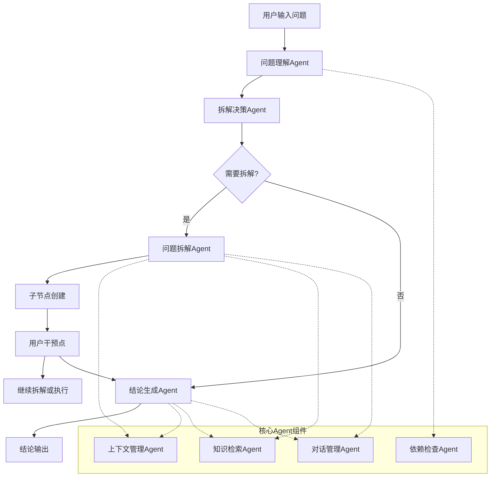
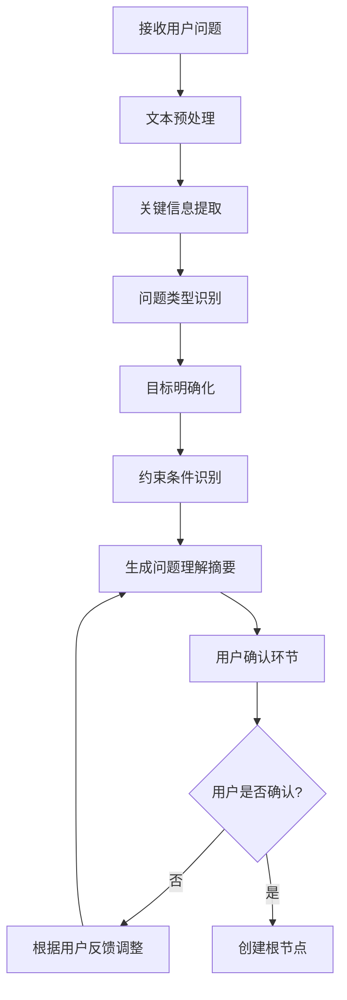
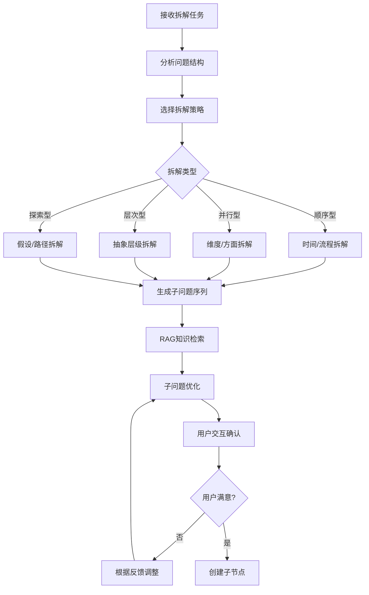
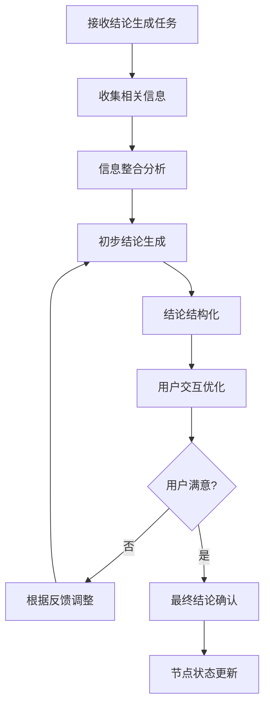
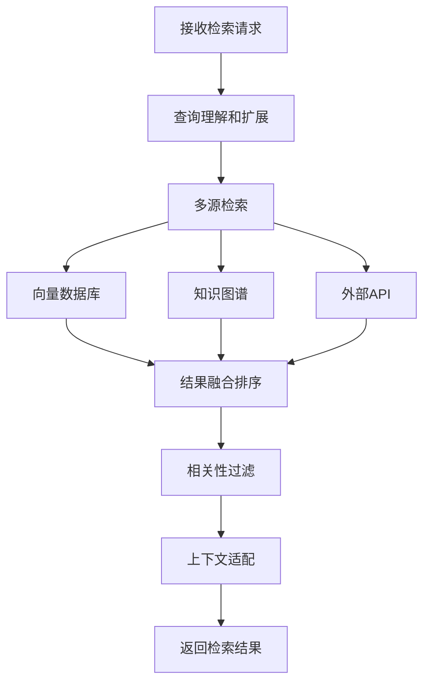
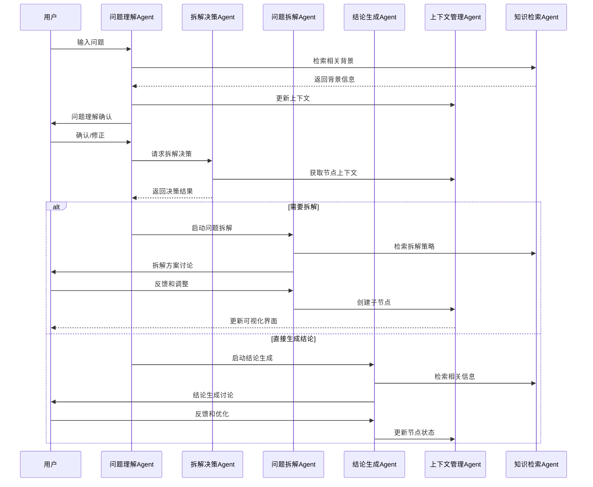

# ThinkingMap Agent系统设计

## 1. 设计概述

### 1.1 设计原则

ThinkingMap的Agent系统设计围绕产品的核心价值：**思考过程可视化**和**用户可干预**。与传统的端到端AI助手不同，本系统强调：

- **透明性优先**：每个思考步骤都可见、可理解
- **用户主导**：用户可以在任何节点干预和调整方向
- **渐进式推理**：将复杂问题分解为可管理的小步骤
- **交互式协作**：AI和用户共同完成问题解决过程

### 1.2 系统架构概览



## 2. 核心Agent组件设计

### 2.1 问题理解Agent (Problem Understanding Agent)

**职责**：解析用户输入，提取核心要素，建立初始问题框架

**输入**：
- 用户原始问题文本
- 问题类型标签（研究型、创意型、分析型、规划型）
- 历史上下文（如果有）

**处理流程**：


**输出**：
- 结构化的问题描述
- 明确的目标定义
- 识别的约束条件
- 初始节点数据结构

**关键特性**：
- 支持多轮澄清对话
- 用户可以修正AI的理解
- 生成可编辑的问题框架

### 2.2 拆解决策Agent (Decomposition Decision Agent)

**职责**：判断当前问题是否需要进一步拆解，决定处理策略

**决策逻辑**：
```python
class DecompositionDecisionAgent:
    def should_decompose(self, node_context):
        factors = {
            'complexity_score': self.assess_complexity(node_context.question),
            'knowledge_gaps': self.identify_knowledge_gaps(node_context),
            'subtask_potential': self.detect_subtasks(node_context.question),
            'user_preference': node_context.user_settings.decomposition_preference
        }
        
        # 综合评分决策
        decision_score = self.calculate_decision_score(factors)
        return decision_score > self.decomposition_threshold
```

**判断维度**：
1. **复杂度评估**：问题是否包含多个独立的子问题
2. **知识依赖**：是否需要先获取背景知识
3. **执行步骤**：是否可以分解为顺序执行的步骤
4. **用户偏好**：用户是否倾向于详细拆解

### 2.3 问题拆解Agent (Problem Decomposition Agent)

**职责**：将复杂问题分解为可管理的子问题，支持用户交互调整

**拆解策略**：



**拆解类型示例**：

1. **顺序型拆解**（适用于流程性问题）：
   - 研究问题 → 文献调研 → 方法设计 → 数据收集 → 分析结论

2. **并行型拆解**（适用于多维度分析）：
   - 产品设计 → 用户需求分析 + 技术可行性 + 商业模式 + 竞品分析

3. **层次型拆解**（适用于复杂概念）：
   - 理解机器学习 → 基础数学概念 → 算法原理 → 实际应用

4. **探索型拆解**（适用于开放性问题）：
   - 创新方案 → 方案A探索 + 方案B探索 + 方案C探索

**用户干预机制**：
- 实时对话调整拆解方向
- 手动添加/删除子问题
- 调整子问题优先级和依赖关系
- 修改子问题的描述和目标

### 2.4 结论生成Agent (Conclusion Generation Agent)

**职责**：基于已有信息和上下文生成结论，支持用户交互优化

**生成流程**：


**信息来源**：
- 当前节点的问题和目标
- 子节点的结论（如果有）
- RAG检索的相关知识
- 用户提供的额外信息
- 历史对话上下文

**结论类型**：
- **分析型结论**：基于数据和逻辑的客观分析
- **创意型结论**：包含创新想法和建议的方案
- **决策型结论**：明确的选择建议和理由
- **学习型结论**：知识总结和理解要点

### 2.5 上下文管理Agent (Context Management Agent)

**职责**：维护全局和局部上下文，确保信息一致性和连贯性

**管理维度**：

```python
class ContextManager:
    def __init__(self):
        self.global_context = {
            'session_id': str,
            'user_profile': UserProfile,
            'problem_domain': str,
            'thinking_tree': ThinkingTree
        }
        
        self.node_context = {
            'current_node': Node,
            'parent_nodes': List[Node],
            'sibling_nodes': List[Node],
            'child_nodes': List[Node],
            'conversation_history': List[Message]
        }
        
        self.knowledge_context = {
            'retrieved_documents': List[Document],
            'domain_knowledge': DomainKnowledge,
            'user_provided_info': List[Information]
        }
```

**关键功能**：
- 跨节点信息传递
- 依赖关系维护
- 冲突检测和解决
- 上下文压缩和摘要

### 2.6 知识检索Agent (Knowledge Retrieval Agent)

**职责**：基于问题上下文检索相关知识，支持RAG增强

**检索策略**：


**检索优化**：
- 基于问题类型的检索策略
- 动态调整检索范围和深度
- 结果去重和质量评估
- 用户反馈学习优化

### 2.7 对话管理Agent (Conversation Management Agent)

**职责**：管理用户与AI的交互对话，确保对话的连贯性和有效性

**对话类型**：
1. **澄清对话**：理解用户意图和需求
2. **拆解对话**：协商问题分解方案
3. **分析对话**：深入探讨具体问题
4. **确认对话**：验证结论和决策

**对话状态管理**：
```python
class ConversationState:
    def __init__(self):
        self.current_phase = "understanding"  # understanding, decomposing, analyzing, concluding
        self.user_intent = None
        self.pending_confirmations = []
        self.conversation_goals = []
        self.interaction_history = []
```

## 3. Agent协作流程设计

### 3.1 完整问题解决流程



### 3.2 用户干预处理机制

**干预类型和处理**：

1. **问题修正干预**：
   ```python
   def handle_problem_modification(self, node_id, new_question):
       # 1. 验证修改的合理性
       # 2. 检查对子节点的影响
       # 3. 重新评估拆解需求
       # 4. 更新相关上下文
       pass
   ```

2. **拆解方向调整**：
   ```python
   def handle_decomposition_adjustment(self, node_id, user_feedback):
       # 1. 解析用户调整意图
       # 2. 重新生成拆解方案
       # 3. 保持已有工作成果
       # 4. 平滑过渡到新方案
       pass
   ```

3. **结论质疑和优化**：
   ```python
   def handle_conclusion_challenge(self, node_id, user_concern):
       # 1. 分析用户关注点
       # 2. 重新检索相关证据
       # 3. 调整结论生成策略
       # 4. 提供多角度分析
       pass
   ```

### 3.3 依赖关系处理

**依赖检查逻辑**：
```python
class DependencyChecker:
    def check_execution_readiness(self, node_id):
        node = self.get_node(node_id)
        dependencies = self.get_dependencies(node_id)
        
        for dep_node_id in dependencies:
            dep_node = self.get_node(dep_node_id)
            if dep_node.status != 'completed':
                return False, f"依赖节点 {dep_node.title} 尚未完成"
        
        return True, "所有依赖已满足"
    
    def get_execution_order(self, node_ids):
        # 拓扑排序确定执行顺序
        return self.topological_sort(node_ids)
```

## 4. 技术实现要点

### 4.1 Agent间通信机制

**事件驱动架构**：
```python
class AgentEventBus:
    def __init__(self):
        self.subscribers = defaultdict(list)
    
    def subscribe(self, event_type, agent_callback):
        self.subscribers[event_type].append(agent_callback)
    
    def publish(self, event_type, event_data):
        for callback in self.subscribers[event_type]:
            callback(event_data)

# 事件类型示例
EVENT_TYPES = {
    'NODE_CREATED': 'node_created',
    'NODE_UPDATED': 'node_updated', 
    'USER_INTERVENTION': 'user_intervention',
    'CONTEXT_CHANGED': 'context_changed'
}
```

### 4.2 状态持久化

**思考树状态管理**：
```python
class ThinkingTreeState:
    def __init__(self):
        self.nodes = {}  # node_id -> Node
        self.edges = {}  # edge_id -> Edge
        self.metadata = {
            'created_at': datetime.now(),
            'last_updated': datetime.now(),
            'user_id': str,
            'session_id': str
        }
    
    def save_checkpoint(self):
        # 保存当前状态快照
        pass
    
    def restore_from_checkpoint(self, checkpoint_id):
        # 从快照恢复状态
        pass
```

### 4.3 实时通信

**SSE事件推送**：
```python
class SSEEventManager:
    def __init__(self):
        self.connections = {}  # session_id -> SSE connection
    
    def broadcast_node_event(self, session_id, event_type, node_data):
        if session_id in self.connections:
            event = {
                'type': event_type,
                'data': node_data,
                'timestamp': datetime.now().isoformat()
            }
            self.connections[session_id].send(json.dumps(event))
```

## 5. 用户体验优化

### 5.1 渐进式信息披露

- **节点摘要**：在可视化界面只显示关键信息
- **详情展开**：点击节点查看完整内容
- **上下文提示**：智能提示相关信息和建议操作

### 5.2 智能引导

- **操作建议**：基于当前状态提供下一步操作建议
- **问题提示**：在用户可能困惑的地方主动提供帮助
- **最佳实践**：根据问题类型推荐最佳的思考路径

### 5.3 个性化适配

- **用户偏好学习**：记录用户的拆解偏好和交互习惯
- **领域适配**：针对不同领域优化Agent行为
- **复杂度调节**：根据用户水平调整拆解粒度

## 6. 总结

本Agent系统设计完全围绕ThinkingMap产品的核心价值构建：

1. **透明化思考**：每个Agent的处理过程都可见，用户能理解AI的思考逻辑
2. **用户控制**：在每个关键节点都设置了用户干预点，确保用户主导权
3. **结构化思维**：通过专门的拆解Agent将复杂问题系统性分解
4. **探索性思考**：支持多路径探索和动态调整

这个设计确保了AI不是一个黑盒，而是一个透明、可控、可协作的思考伙伴，真正实现了"让用户参与到思考过程中"的产品愿景。