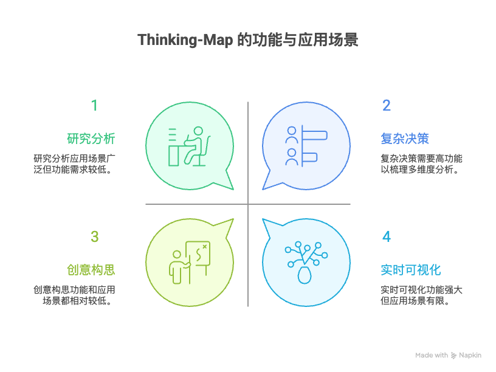
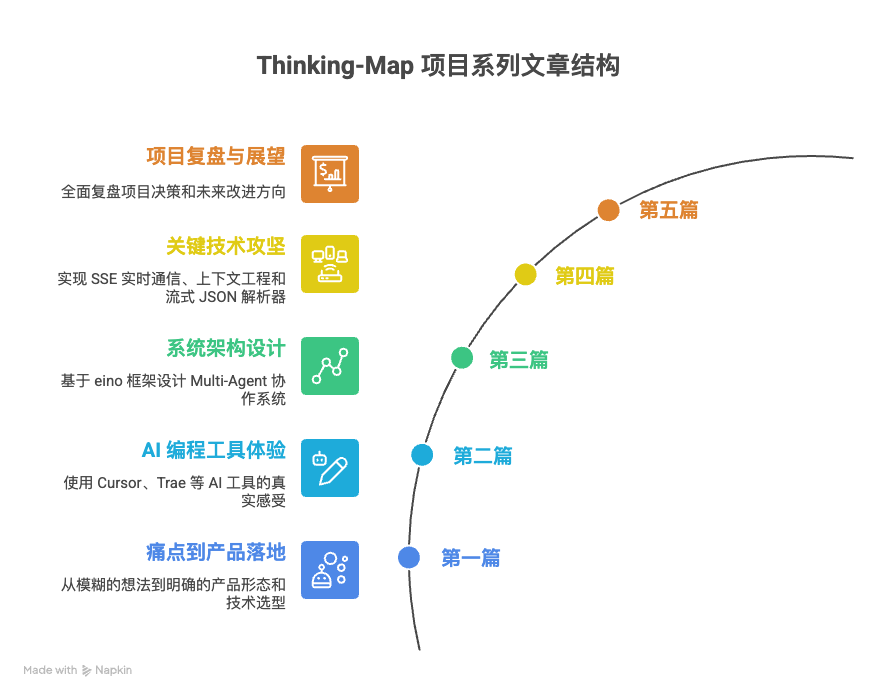

# 为什么写这个系列，以及关于 Thinking-Map 项目的一切

> 本文是“AI 编程实践：从想法到产品”系列的开篇。在这里，我将分享编写这个系列的初衷，介绍贯穿始终的实战项目——Thinking-Map，并为你提供一份清晰的“阅读指南”，帮助你更好地探索这个将 AI 与真实开发流程深度融合的完整记录。

## 一、 为什么决定写这个系列博客

在技术世界里，我们习惯于阅读“最终成功”的案例：优雅的架构、完美的代码、无懈可击的性能。但真实的项目开发，尤其是探索性强的 AI 应用开发，远非如此。它充满了试错、妥协、灵光一闪以及大量的“如果当初……就好了”。

这个系列，我想记录的正是后者——一个真实、未经美化的 AI 辅助产品开发全过程。

**我的初衷很简单：**

1.  **记录真实的思考过程**：相比于展示最终的“正确答案”，我更想分享“如何找到答案”的过程。这包括在技术选型时的纠结、在架构设计上的反复、以及在与 AI 协作时的那些“鸡同鸭讲”和“心领神会”的瞬间。
2.  **分享可复用的实践方法**：在 Thinking-Map 项目中，我沉淀了一套与 AI 高效协作的模式，尤其是在“上下文工程”（Context Engineering）上的探索。我希望这些方法能帮助其他开发者，在面对复杂项目时，更好地驾驭 AI 这个强大的“副驾驶”。
3.  **构建一个透明的学习案例**：Thinking-Map 项目是完全开源的。我希望这个系列能成为一份详尽的“代码导读”，将抽象的架构设计、复杂的功能模块与真实的代码实现一一对应，为想要学习现代 Web 全栈开发和 AI Agent 应用的同学提供一个鲜活的样本。

简单来说，这个系列不是一份“成功学”报告，而是一份详尽、真诚的“实验记录”。

## 二、 主角登场：Thinking-Map 项目介绍

Thinking-Map 是贯穿本系列的核心项目。

**1. 核心理念：可视化并加速思考过程**

你是否也曾感觉，与 AI 对话时，它的思考过程像一个“黑盒”？你得到了答案，却不知道它从何而来，也无法在过程中引导和修正。

Thinking-Map 的核心理念正是要打破这个黑盒。它将复杂问题的解决过程，通过一棵“思维树”（Thinking Tree）的形式实时、动态地可视化出来。AI 的每一步思考——无论是信息收集、分析推理，还是生成结论——都会成为树上的一个新节点。

**2. 主要功能与应用场景**

-   **实时可视化**：AI 的思考路径以节点和边的形式动态生长，全程透明。
-   **过程可干预**：在任何节点，你都可以暂停、提问、补充信息，甚至引导 AI 走向一个全新的分支。
-   **结构化输出**：最终产出的不仅是一个答案，而是一整套结构化的思维路径图，便于复盘和分享。

它尤其适合以下场景：
-   **研究分析**：对一个陌生领域进行快速、深入的结构化调研。
-   **创意构思**：进行头脑风暴，并系统化地探索各种可能性。
-   **复杂决策**：梳理决策的各个维度，并进行多角度的利弊分析。

**3. 开源地址**

Thinking-Map 是一个开源项目，你可以在 GitHub 上找到它的全部源码：[https://github.com/PGshen/thinking-map](https://github.com/PGshen/thinking-map)。

## 三、 技术栈概览：现代 Web 与 AI 的碰撞

Thinking-Map 的技术选型充分体现了“产品形态驱动技术选择”的原则，它是一个典型的现代 Web 应用与 AI 技术深度融合的产物。

-   **前端**
    -   **框架**: Next.js 15 (App Router)
    -   **可视化**: ReactFlow
    -   **状态管理**: Zustand
    -   **UI**: shadcn/ui + Tailwind CSS
-   **后端**
    -   **语言**: Go
    -   **Web 框架**: Gin
    -   **AI 编排**: eino (一个面向 Agent 的链式执行框架)
    -   **数据库**: GORM + PostgreSQL
    -   **实时通信**: Server-Sent Events (SSE)
-   **AI**
    -   **核心架构**: Multi-Agent + ReAct 模式
    -   **关键技术**: 上下文工程 (Context Engineering)、流式 JSON 解析

这个技术栈的选择背后有大量的思考和权衡，我会在后续的文章中详细展开。

## 四、 系列文章结构导览

为了让你能更好地跟上这个旅程，我将整个系列分成了几个循序渐进的篇章：

-   **第一篇：从痛点到产品落地**
    -   讲述如何从一个模糊的想法出发，通过与 AI 的反复“拉扯”，最终明确产品形态、完成技术选型的完整历程。
-   **第二篇：AI 编程工具的真实体验**
    -   分享我在使用 Cursor、Trae 等 AI 编程工具时的真实感受，包括它们的优势、局限，以及如何通过“提示词工程”榨干它们的价值。
-   **第三篇：系统架构设计实践**
    -   深入后端，探讨如何基于 eino 框架设计一个 Multi-Agent 协作系统，以及在实现 ReAct 模式时踩过的坑。
-   **第四篇：关键技术攻坚**
    -   聚焦几个核心技术难点：如何实现稳定的 SSE 实时通信、如何构建支撑复杂任务的“上下文工程”体系，以及如何手写一个流式 JSON 解析器。
-   **第五篇：项目复盘与展望**
    -   在项目完成后，进行一次全面的复盘：哪些决策是正确的？哪些地方走了弯路？如果重来一次，我会怎么做？

建议你按照顺序阅读，因为每一篇都建立在前一篇的基础上。当然，如果你对特定主题感兴趣，也可以直接跳转。

---

现在，旅程正式开始。希望这个系列能为你带来启发。让我们在下一篇《从痛点到产品落地》中再见！