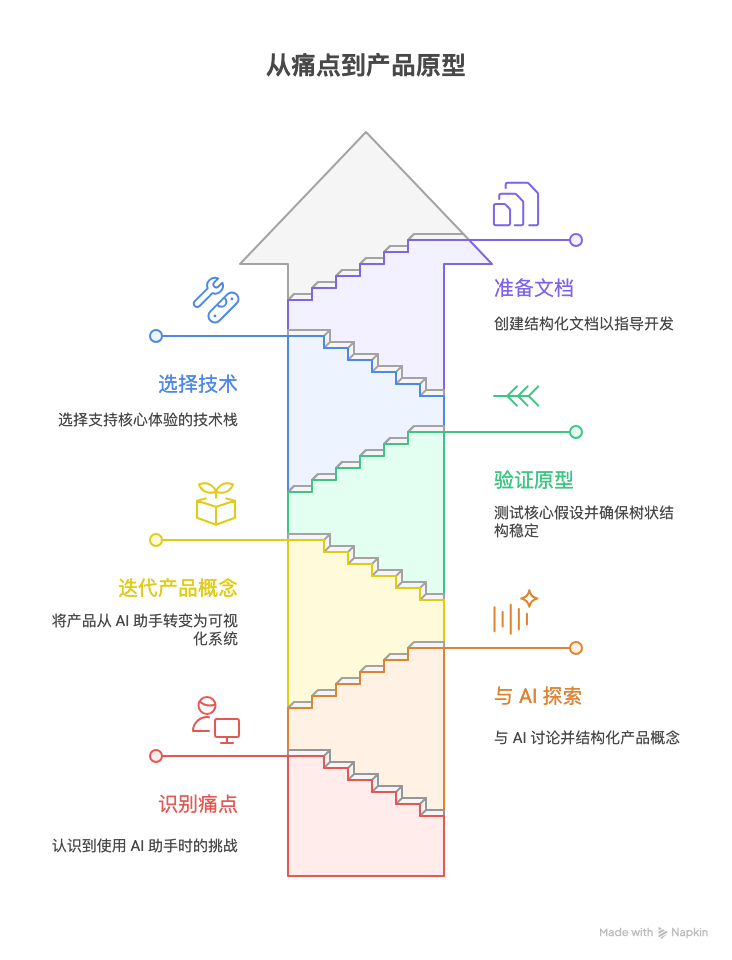

# 从痛点到产品落地：ThinkingMap 的想法、设计与选型全记录

> 本文是“AI 编程实践：从想法到产品”系列的第一篇，聚焦于从真实痛点出发，到明确产品概念、完成技术选型与文档准备的全过程。文中包含与 AI 的原始讨论片段、关键决策的思考路径，以及可复用的实践方法。


## 为什么要做这件事：真实痛点的出现

过去一段时间里，我在使用 ChatGPT、Claude 等通用型助手时，频繁感到两类不适：
- 黑盒困境：AI 给出答案，但过程不可见，难以复盘与验证；
- 控制感不足：复杂问题往往需要多步骤、分支探索，但传统对话只能线性推进，很难让用户在过程中插手、改变路径。

这些问题不仅影响效率，还直接影响了信任与决策质量。一次与 AI 的讨论中，我把这份直觉具象化成了一个产品方向：

“用户输入问题后，大模型进行问题拆解，规划解决问题步骤，可视化展示处理过程；用户可以在过程随时干预、提问等。每一步可以是检索、工具调用、头脑风暴等，完成后生成总结与可能的分支。整体用一棵生长的树来表达。”

这是 ThinkingMap 的最初火花。

## 与 AI 的需求探索：从模糊到清晰的对话

我把上述设想抛给了 AI，请它协助我结构化。如果概括这段探索，有三个关键动作：
- 让 AI 复述并确认理解，收敛需求边界；
- 要求它从产品经理视角拆解用户价值、目标群体、功能模块；
- 在功能之外追问“交互与可视化”细节，确保体验能支撑复杂思维过程。

在这次实录中，AI 给出了一个非常契合的产品分析框架：
- 核心价值：透明化 AI 思考、增强用户控制、结构化问题解决；
- 目标场景：研究分析、创意构思、复杂决策、学习辅助；
- 功能模块：问题输入与解析、自动拆解、步骤执行引擎、树状可视化、用户干预系统。

更重要的是，它把“树状生长结构”确认成核心交互隐喻，这直接决定了后续的前端框架选择与数据结构设计方式。

## 产品概念的迭代：从“AI 助手”到“思考过程可视化系统”

最初我以为是在做一个“更好的 AI 助手”，但随着讨论推进，产品的本质逐渐变成了“可视化思考系统”：
- 输入不再只是问题，而是带类型的任务（研究/创意/分析/规划），以便选择不同的拆解策略；
- 输出不再是单个答案，而是一棵包含步骤、分支、总结、状态的“思维树”；
- 用户与 AI 的关系不再是问答，而是一种合作：在每个节点里，用户都能提问、修正、添加信息、切换分支。

这次迭代带来了两个重要设计结论：
- 步骤类型需要标准化：信息收集、分析、生成、评估；
- 节点状态需要可视化：待执行、执行中、已完成（含摘要与产出）。

为了让这个系统能跑起来，我提出了一个最小的结构化输出约定（便于前后端联调与演化）：

```json
{
  "root": {
    "id": "question-root",
    "title": "主要问题",
    "type": "problem",
    "children": [
      {
        "id": "step-1",
        "title": "信息收集：关键背景与数据",
        "type": "collect",
        "status": "pending",
        "expected": "列出对问题有决定性影响的背景信息与数据来源",
        "children": []
      },
      {
        "id": "step-2",
        "title": "分析：拆解核心子问题",
        "type": "analyze",
        "status": "pending",
        "expected": "3-7 个可执行的子问题与依赖关系",
        "children": []
      }
    ]
  }
}
```

这个最小 JSON 模型后来被拓展为完整的节点/边结构，但它很好地承载了 MVP 的早期联调。

## 原型验证：先证明“树能长起来”

做原型时我刻意压住“功能欲望”，只验证最核心的假设：
- 能否把一次 AI 的思考过程映射成节点与边？
- 能否在用户每一次干预后，生成新的分支并保持上下文连续？
- 能否做到“实时更新”，让用户看到执行的动态而非只看结果？

第一版原型的目标非常简单：
- 中心问题节点 + 3—5 个一级步骤节点；
- 点击步骤即可执行，生成摘要与 1—3 个后续分支；
- 分支可以被选择或暂存，树保持可导航、可缩放。

事实证明，只要把输入/输出结构约定清晰、把状态变更统一走一个通道（后端事件流 + 前端状态机），这棵树就能稳定“长起来”。

## 技术选型：纠结、试错与最终决定

在技术选型阶段，我尽量让“产品形态”驱动“技术选择”，而不是反过来。以下是几个关键抉择。

- 前端：React 生态 + Next.js 15
  - 理由：App Router 的组织能力、SSR/ISR 的灵活性、生态成熟；
  - 踩坑：Next.js 15 的部分变更与文档滞后，需要在严格的 TypeScript 模式下约束组件/状态边界；
  - 可视化：选择 ReactFlow 来承载“树状生长”的交互隐喻，生命周期与状态管理与项目需求高度吻合。

- 后端：Go + Gin + GORM + Redis + eino
  - 理由：Go 的并发与部署友好，Gin 的简洁，GORM + PostgreSQL 的成熟，Redis 支撑事件与会话状态；
  - AI 框架：eino 被选为核心链式执行框架，虽然文档不完备，但其 Graph/Node/Chain 的理念与“思维树”强耦合；
  - 实际：需要为 eino 补充一层服务封装以提升可测试性与可观测性（日志/指标/错误传播）。

- 实时通信：SSE（服务端事件）
  - 理由：对“单向、少量、多步”事件推送非常友好；
  - 取舍：相比 WebSocket，SSE 的分布式与连接管理更容易出现坑，但在 MVP 阶段更符合轻量需求。

## 文档驱动的开发准备：让“上下文工程”落地

在与 AI 的对话之后，我要求它协助产出 MVP 级别的 PRD，并把文档结构拓展为以下几类（在项目 docs/ 下可见）：
- 产品需求（prd.md）：明确范围、场景、功能、非功能与里程碑；
- 架构设计（agent-system-design.md、react-agent-architecture.md、multiagent-architecture.md）：描述前后端、Agent 设计、协作模式；
- 前端规范（frontend-*.md 系列）：组件模式、状态管理、可视化、UX、API 调用；
- 实时通信（sse-technical-documentation.md）：SSE 的实现细节、重连、心跳、资源管理与分布式兼容；

这些文档不仅是给 AI 的“上下文”，更是给未来自己的“参照系”。随着复杂度增加，文档成为降低对话成本的关键手段。

## 决策片段：与 AI 的原始对话节选

为了保持“真实感”，这里保留两段关键片段（已做少量编辑以便阅读）：
- 用户设想：
  - “输入问题，拆解为多步骤……每一步后面总结，基于执行情况产生分支……整体的交互形式是树状的生长结构。”
- AI 响应：
  - “这是一款将 AI 大模型能力与可视化决策树结合的创新产品……核心价值是透明化 AI 思考、增强用户控制、结构化问题解决……”

这两段话基本决定了后续路径：把“树”作为一等公民，把“过程”作为主要产品。

## 关键收获与可复用方法

- 行动第一步：只要有想法，不管多小、多么不完善，尝试与AI对话，会有意想不到的收获；
- 从痛点到方案的转换技巧：先明确最本质的不适，再把它转译为交互隐喻（树状结构）；
- 与 AI 协作的有效姿势：要求它先“确认理解”，再“结构化输出”，最后“约束格式（JSON/类型）”；
- 技术选型的判断标准：是否直接服务于核心体验，是否可在 MVP 阶段快速验证；
- 文档驱动的上下文工程：用结构化文档压住提示词随意性，降低复杂系统中的沟通成本；
- 控制范围、快速闭环：先证明“树能长起来”，后续再扩展协作、多 Agent、工具调用等高级能力。

## 关联文档
项目文档：《原始对话》、《产品需求文档》、《UI》等（均在项目 docs/ 目录）

## 下一篇预告

第二篇将分享我在 Cursor、Trae 等 AI 编程工具上的真实体验：从期待到现实的落差、如何调整协作方式、以及在实际开发中总结出的提示工程与代码审查技巧。