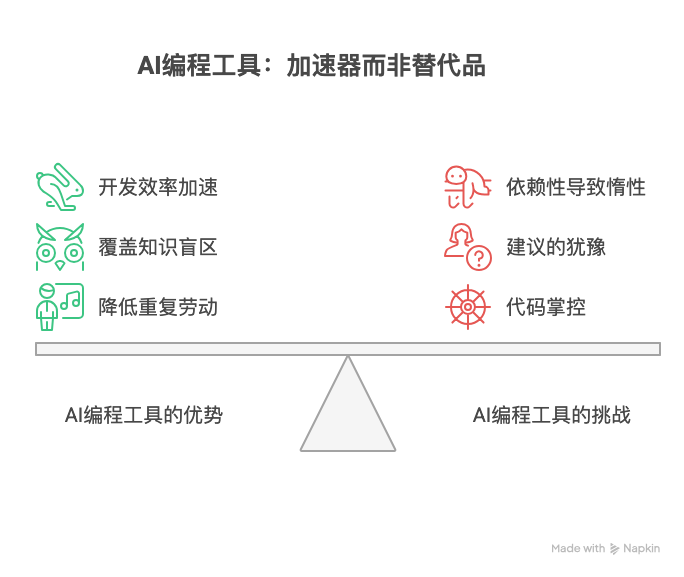
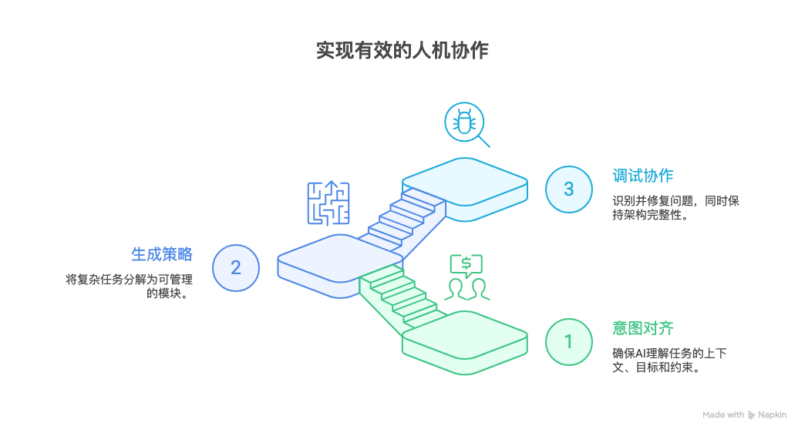

# AI 编程工具的真实体验：从期待到现实的落差与适应

> 本文是“AI 编程实践：从想法到产品”系列的第二篇。聚焦我在 Cursor、Copilot、Trae AI 等工具中的真实使用体验：哪些地方好用、哪些地方踩坑、如何调整人机协作模式，以及可落地的提示工程与代码审查方法。

## 初次接触：震撼、困惑与认知失衡
最初被官方演示与自媒体的“智能”“效率”震撼，冷静后随之而来的是焦虑：我会不会很快被替代？于是我开始系统地尝试这些工具。在 demo 项目里，它们确实效果惊艳；一旦落到真实复杂项目，问题也迅速暴露——理解偏差、上下文失真、隐性复杂度上升。

第一次把 AI 编程工具用到正经项目里，体验是复杂的：
- 代码自动补全的惊喜：类型推断、样板代码、测试样例草拟都更快；
- 面对建议的犹豫：当 AI 给出“看似合理”的重构或架构建议时，很难迅速判断是否该接受；
- 依赖带来的惰性：一旦习惯“AI 先写”，容易忽略系统性思考与边界条件；
- 失去对代码的掌控：如果AI写了代码，没有review，照单全收，很容易后续总感觉无从下手。

我很快意识到：就目前而言，这些工具是“加速器”，不是“替代品”。当你清楚要到达哪儿，它们让你更快；当你还没想清楚，它们会把你带到更远的歧路。

## 利与弊：工具好用在哪里，不好用在哪里
一句话总结：
- 爽点：写得飞快、补你不会的坑、少敲很多样板；
- 雷点：它常“会错意”，悄悄把逻辑搞复杂，还藏 bug 让你加班找。

好用的场景：
- 重复性或模板化代码（DTO、校验逻辑、Hook 模板、测试样例草拟）；
- 跨文件检索与重构建议（统一接口命名、提取通用组件或工具函数）；
- 类型补全与边界条件枚举（TS 严格模式下尤为明显）。

不好用的场景：
- 复杂业务下架构设计与具体实现（需要明确的约束与权衡，用文档约束，先实现框架，然后再写具体业务）；
- 复杂数据逻辑容易搞错（无中生有或者牛头不对马嘴）；
- 对新近开源的框架不友好（和模型学习到的知识有关系）。

## 使用过程中的真实问题：代码质量与上下文理解

两个最常见的痛点：
- 质量参差不齐：相比不同AI编程工具之间的差别，模型和是否付费对输出质量具有更大的影响；
- 上下文理解有限：项目复杂后，工具容易忽略已有约束（命名规则、状态管理模式、API 约定）。

缓解方法：
- 选择Claude + 付费会员： 一个很深的体验就是cursor不付费，输出相当偷懒，约等于不能用；
- 提示词说明上下文：AI有时不能找到相关代码，需要显式的在提示中说明引导；
- 约束前置：对复杂任务，先要求 AI 梳理功能点，确认他的理解无误后再让它写代码。若复述不到位，立即修正而非继续生成。

## 人机协作模式：提示工程与生成策略

学习曲线的关键在于“让 AI 理解你的真实意图”。以下是我形成的几条实用规则。

- 意图对齐三步法：
  - 背景：给出任务上下文（模块、边界、现状问题）；
  - 目标：明确输出形态（接口、类型、文件、测试）；
  - 约束：列出必须遵守的项目规则（命名、错误处理、状态管理）或者让AI参考已有代码的风格编写。

- 生成策略：
  - 先理解后动手：要求 AI 先理解目标与约束；
  - 分模块生成：把复杂任务拆成“可验收”的小块；

- 调试协作：
  - 明确问题复述：提供错误日志、触发条件、期望 vs 观察；
  - 根因定位：要求输出“最可能原因的排序”与“可验证实验”；
  - 最小修复：优先选择“对现有架构侵入最小”的修复方案。

> 以上是一个完整的工作流，但随着AI编程工具和模型的迭代，我们不必要每次都提供完整的信息也能得到很好的结果，另外一个感触很深的是，当我们的项目框架越清晰，AI便能从中学习到相关规范，输出也越符合我们的预期，因此在项目初期，一定要有一个比较清晰的框架设计，这对后续迭代有很大的好处。

## 代码审查的新挑战：如何审 AI 生成的代码

在 ThinkingMap 项目里，AI 生成的代码需要落到既有规范与架构上。以下是结合ThinkingMap项目的审查清单：

前端审查清单
- 目标与约束对齐：是否符合 PRD 与 docs/frontend-* 规范；组件用 shadcn/ui，样式用 Tailwind，toast 必须用 sonner；遵循 Next.js 15 App Router 约定。
- TypeScript 严格：无隐式 any；类型集中在 `src/types`；ReactFlow 节点/边使用正确类型；API 响应与 SSE 事件有明确类型定义。
- 状态管理（Zustand）：按 feature 拆分 store；选择器最小化订阅避免不必要渲染；动作保持纯函数；避免把大型对象直接放入全局 store。
- ReactFlow 可视化：`id` 与 `key` 稳定；节点/边更新避免引发整树重渲染；合理使用 `memo`/`useCallback`；布局与缩放体验一致。
- UI 与访问性：组件组合遵循 shadcn/ui + Radix 模式；提供 Loading/Error/空态；颜色与对比度符合设计系统；交互具备可访问性。
- API/SSE：遵循 `src/api` 的请求模式；错误处理统一并反馈到 UI（sonner）；SSE 连接管理使用既有 Hook（如 `use-sse-connection`），包含清理、重连、心跳与资源释放。
- 导入组织：内部模块使用 `@/` 绝对导入；相近文件用相对路径；导入分组清晰，避免循环依赖。
- 文档与示例：涉及公共接口/组件的变更，需要同步更新相关文档或示例；必要时补充轻量测试用例。

后端审查清单
- 路由与中间件：Gin 路由组织与中间件使用符合既有模式；认证用 JWT 中间件；CORS 配置合理。
- 服务/仓储分层：Service 不直接操作 GORM；Repository 负责数据库访问；复杂操作使用事务封装，避免跨层耦合。
- 模型与迁移：GORM 模型 Tag、索引与关系正确；新增字段是否补充迁移脚本；避免 N+1 查询。
- 错误与日志：使用自定义错误类型；Zap 结构化日志完整记录关键字段；错误响应格式一致、可追踪。
- 配置与依赖：Viper 配置校验与默认值合理；Redis 连接/发布订阅管理规范；eino 节点/链路实现遵循项目的 Graph/Node 约定。

## 效率与新问题的平衡：何时用、何时不用

效率提升是真实的，但应选择性使用：
- 最适合 AI 辅助的任务：样板代码、跨文件检索、类型补全、简单测试样例、前端页面；
- 不适合的任务：架构设计、跨领域复杂业务、强一致性安全逻辑、后端较复杂数据模型；
- 仍需人工完成的工作：边界条件设计、异常路径推演、性能与资源评估、最终的审查与决策。

随时间推移，一个新的能力需求也变得明显：
- 提示工程能力（结构化描述、约束管理、上下文引用）；
- 代码审查能力（识别隐性复杂度、统一风格）；
- 架构思维（把生成结果纳入长期演进的框架）。

## 一些技巧
- 文档驱动开发，把需求文档作为AI的输入，而不是直接把需求描述给AI；
- 在代码中写todo，然后让AI完成对应的代码实现；
- 引用已有的代码实现，让AI参照已有代码的风格编写；
- 对于前端页面，我们仅用文字可能不太容易描述清楚页面布局，我们可以在需求文档节点让AI帮我们根据功能设计画出线框图（@/docs/ui.md），然后通过引用线框图来引导AI；
- 当AI输出很不符合预期时，及时回退是个好方法，而不是在不好的基础上让它修改。

## 关键收获：实用策略与可复用方法

- 把工具当“加速器”，而非“自动驾驶”；
- 用文档做“上下文工程”，把约束显式化并可检索；
- 生成前先对齐意图与约束，生成后做旁路校验；
- 建立适配项目的审查清单，避免“看起来正确”的陷阱；
- 不要让项目变成黑盒，保持对代码的掌控力。

## 下一篇预告

第三篇将进入系统架构设计实践：为何选择 eino，如何在 Multi Agent 协作中落地 ReAct 模式，以及这套架构在 ThinkingMap 项目中的真实挑战与妥协。