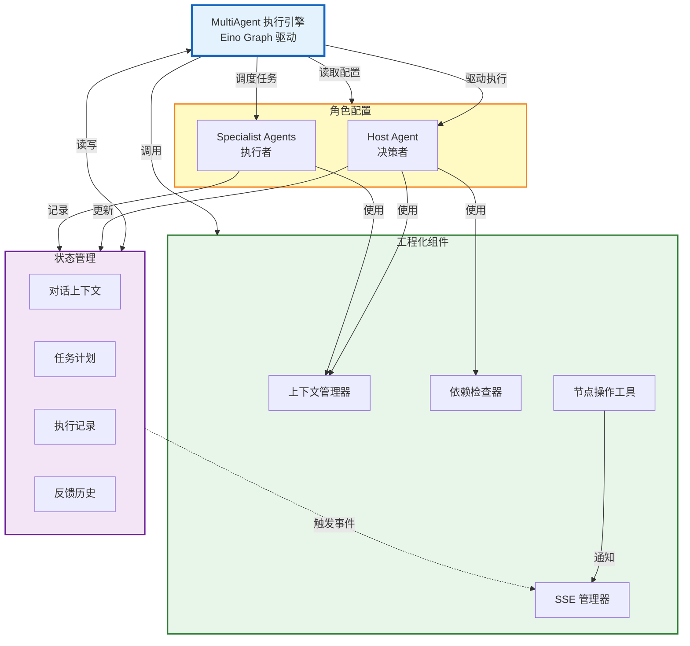
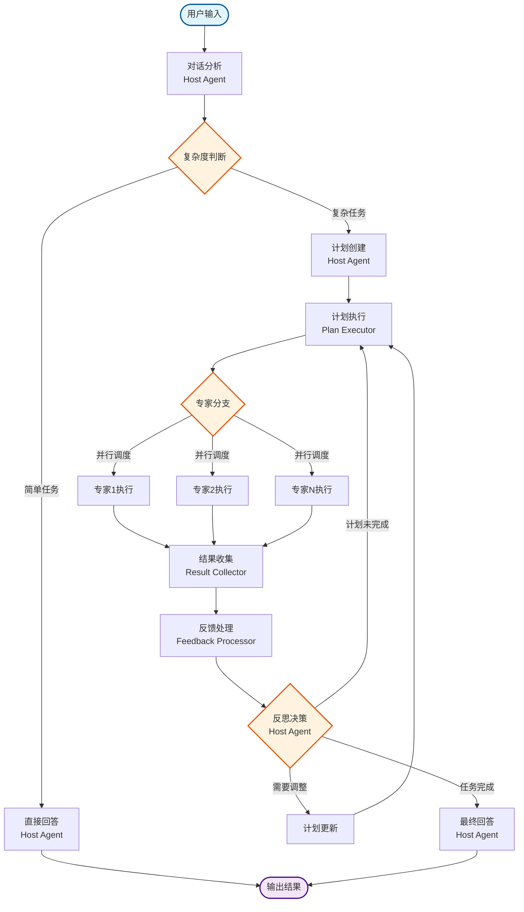
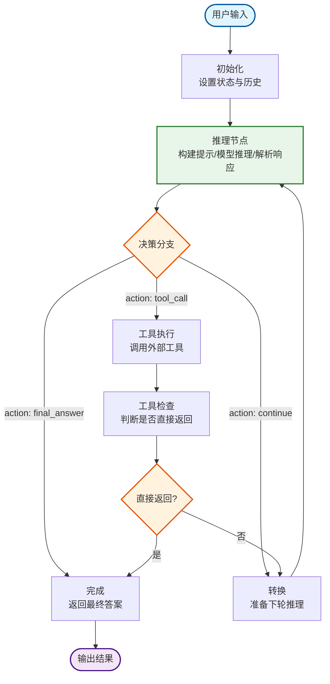
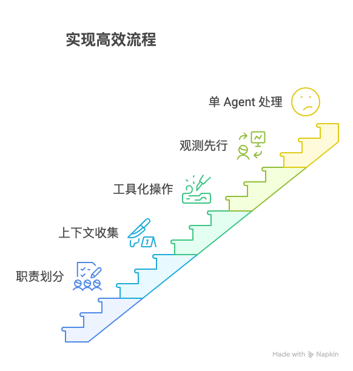

# 系统架构设计实践：eino 框架与 Multi Agent 协作的探索之路

> 本文是“AI 编程实践：从想法到产品”系列的第三篇，聚焦于我们在 ThinkingMap 项目中，从单一 AI 调用到多智能体（Multi Agent）架构的演进过程，为什么选择了 CloudWeGo/Eino 作为核心编排框架，以及 ReAct 模式在多智能体协作中的落地经验。全文严格依据项目文档与实践记录，不做臆造；

## 架构设计的初始思考

在第一版原型里，我们只需要“让树长起来”。但随着真实场景增多，单一 Agent 无法同时兼顾“意图识别、拆解决策、递归拆解、结论生成”这几类不同能力，协作的需求自然浮现。

- 从单一调用到多智能体的演进：当一个节点既要判断“该拆解还是给结论”，又要设计具体拆解方式，还要生成可被前端理解的结论时，职责耦合导致复杂度失控。将职责拆分为多个专职 Agent，更符合工程化设计。
- 为什么选择 Eino：Eino 提供“组件抽象 + 编排框架 + 类型安全 + 流式处理 + 并发管理 + 切面注入”等能力。参考官方概述：Eino 以简洁、可扩展、可靠与有效为目标，强调在 Go 生态中的工程落地（参见 CloudWeGo/Eino 概述：https://www.cloudwego.io/zh/docs/eino/overview/）。
- 决策过程：与其他框架对比时，我们更看重“图式编排 + 强类型 + 流式回调”，以及在 ReAct 模式上的易用性。最终选择 Eino，但在实践中仍需补齐服务封装与观测能力。


## 基于 Eino 的 Multi Agent 系统架构设计

结合项目文档的职责划分，我们将核心能力拆分为以下 Agent，并通过统一的工程化组件（上下文管理、依赖检查、节点操作、SSE 通知）协同执行。

- 问题理解 Agent：用于首次输入，解析意图、创建根节点，支持用户确认（一次性使用）。
- 意图识别 Agent：分析当前节点特征，判断“拆解/直接回答/检索/澄清”。
- 拆解决策 Agent：在确认为拆解后，选择拆解策略（顺序/并行/层次/探索）。
- 问题拆解 Agent：应用策略生成子问题，必要时调用知识检索工具，并支持用户互动调整。
- 结论生成 Agent：整合上下文与检索结果，生成结构化结论并迭代优化。

### 架构设计：核心与协作组件

我们采用**组件化协作架构**，围绕 `MultiAgent` 执行引擎构建了四类核心组件，它们相互协作完成复杂任务处理。

**组件一：执行引擎（MultiAgent）**

`MultiAgent` 是整个系统的"指挥中枢"，基于 Eino Graph 构建。它不是传统意义上的"单个智能体"，而是一个**图编排执行引擎**。这个设计将"如何执行（编排逻辑）"和"执行什么（具体任务）"解耦：
- 编排逻辑由 Graph 的节点和边定义（对话分析→复杂度分支→计划创建→专家执行→反馈处理）
- 具体任务由各类 Agent 和工具组件完成
- 执行过程中持续调用状态管理和工程化组件，形成闭环

这种设计让系统既有"全局视角"的编排能力，又保持了各组件的独立性和可测试性。

**组件二：角色配置（MultiAgentConfig）**

通过 `MultiAgentConfig` 定义系统中的"谁来做什么"：

**Host Agent**（主控智能体）承担全局决策职责：
- 对话分析：理解用户意图和任务复杂度
- 计划创建：将复杂任务拆解为可执行步骤
- 反思决策：评估执行结果并决定下一步动作
- 配置包含 `ThinkingConfig` 和 `PlanningConfig`，分别控制深度思考和动态规划能力

**Specialist Agents**（专家智能体）专注于具体执行：
- 按专业领域配置（如"问题拆解专家""结论生成专家"）
- 每个专家有独立的模型和系统提示词，聚焦单一职责
- 由 Host Agent 调度，接收明确的任务指令和上下文

这种"决策与执行分离"的设计，避免了单一智能体"全能却不精"的问题，也让专家智能体可以并行工作。

**组件三：状态管理（MultiAgentState）**

`MultiAgentState` 是系统的"记忆中枢"，贯穿整个执行过程：
- **对话上下文**（`ConversationContext`）：用户意图、关键主题、复杂度分析结果
- **任务计划**（`TaskPlan`）：步骤序列、依赖关系、每步的执行状态
- **执行记录**（`ExecutionRecord`）：每个步骤的输入输出、耗时、结果质量
- **反馈历史**（`Feedback History`）：质量评估、问题识别、改进建议

状态管理的价值在于**可追溯与可恢复**：任何时刻都能回答"当前在哪一步、为什么这样做、结果如何、接下来做什么"。在出现错误或需要人工介入时，可以精确定位问题并从断点恢复。

**组件四：工程化支撑组件**

围绕实际工程需求，我们封装了一组"看似辅助、实则关键"的组件：

- **上下文管理器**（`ContextManager`）：为每个节点收集父节点、同级节点、子节点的上下文信息。智能体在处理任务时不仅能看到"当前节点"，还能看到"来龙去脉"，避免"盲人摸象"式的决策。

- **依赖检查器**（`DependencyChecker`）：在执行前校验"是否满足执行条件"，在规划时检测"是否存在循环依赖"。这是防止"死锁"和"数据未就绪就开始处理"的关键守卫。

- **节点操作工具**（`NodeOperator`）：统一封装节点的创建、更新、依赖调整等操作。所有状态变更都走这一个通道，保证了原子性和一致性。

- **SSE 管理器**（`SSE Broker`）：将内部事件（节点状态变更、智能体输出、执行进度）实时推送到前端。这不仅是"用户体验"的需要，更是系统"可观测性"的基础——能看见，才能调试和优化。

这些组件在文档中可能看起来"辅助"，但在实际开发中，它们是从"状态混乱、依赖失控、过程不可见"的困境中一步步沉淀出的"必需品"。

**组件协作关系**

这四类组件的关系不是传统的"上下层依赖"，而是**围绕执行引擎的协作**：



从图中可以看出：
- **MultiAgent** 是中心节点，它通过 Eino Graph 定义的编排逻辑，协调其他所有组件
- **角色配置**定义"谁来做"，由 MultiAgent 在运行时读取并驱动执行
- **状态管理**记录"做了什么"，所有组件都会读写状态，形成信息流转
- **工程化组件**提供"怎么做得更好"，被各个 Agent 按需调用

这种设计的优势在于：各组件职责单一、耦合度低、可独立测试，同时通过 MultiAgent 的编排形成完整的协作流程。

### 执行流程：从分析到反馈闭环

系统的执行流程体现了"分析→规划→执行→反馈"的完整闭环，这与我们"树状生长"的交互隐喻高度契合。

**阶段一：对话分析与复杂度判断**

用户输入进入系统后，首先由 Host Agent 的 `ConversationAnalyzer` 处理：
1. 识别用户意图（是提问、拆解请求、还是澄清）
2. 提取关键主题与上下文信息
3. 评估任务复杂度（Simple/Moderate/Complex/VeryComplex）

复杂度判断是第一个关键决策点：简单任务（如明确的事实性问题）会直接进入"直接回答"流程；复杂任务（如多步骤分析、需要拆解的大问题）则进入"计划创建"流程。

**阶段二：任务规划**

对于复杂任务，Host Agent 创建 `TaskPlan`：
- 将任务分解为多个 `PlanStep`（步骤）
- 为每个步骤分配合适的 Specialist Agent
- 标注步骤间的依赖关系（如"步骤 B 依赖步骤 A 完成"）
- 设置优先级与参数

这里的关键是**动态规划**：根据上下文与依赖关系，计划可能是"顺序执行"或"并行执行"，系统会选择最高效的方式。

**阶段三：计划执行与专家协作**

进入 `PlanExecution` 阶段，系统按计划调度 Specialist Agents：
- 通过**专家分支**（Specialist Branch）将任务分派给对应的专家
- 支持**并行执行**：多个无依赖关系的步骤可以同时进行
- 每个专家完成后将结果写入 `ExecutionRecord`

这一阶段的执行由依赖检查器保驾护航：只有依赖满足的步骤才会被触发，避免"数据未就绪就开始处理"的错误。

**阶段四：结果收集与反馈处理**

所有专家执行完成后，`ResultCollector` 聚合结果并传递给 `FeedbackProcessor`：
1. 评估执行质量（完成度、是否有遗漏）
2. 识别问题（如某个步骤失败、结果不符合预期）
3. 生成反馈与改进建议

**阶段五：反思决策**

Host Agent 根据反馈做出决策（`ReflectionBranch`）：
- **继续执行**：如果还有未完成的步骤，继续执行计划
- **更新计划**：如果发现计划不合理或有新需求，调整计划后重新执行
- **生成答案**：如果任务已完成且质量达标，进入最终回答

这种"反思→调整→再执行"的机制，让系统具备了**自我修正能力**，而不是"一条路走到黑"。

完整执行流程如下：



这套流程的核心优势在于：
- **自适应**：根据复杂度选择执行路径，不做无谓的过度设计
- **可并行**：专家智能体并行执行，提升效率
- **可修正**：通过反馈闭环持续优化，而非"一次性交付"
- **可观测**：每个阶段的状态变更都通过 SSE 推送，前端实时展示

在实际项目中，这套架构让我们在"单次简单问答"和"复杂多步骤任务"之间找到了平衡：既不会让简单任务变得臃肿，也能让复杂任务有条不紊地执行。

## 基于 Eino 的 React Agent 实现

ReAct（Reasoning and Acting）的核心思想是"思考→行动→观察"的迭代循环。但如何在工程上落地这个理念？我们基于 Eino Graph 实现了一个**可编排、可观测、可控制**的 ReAct Agent。

### ReAct 模式的工程化挑战

在原始论文中，ReAct 是一个"提示词技巧"：让模型在推理时显式输出"思考"和"行动"。但实际工程化时，我们面临三个核心问题：

1. **如何控制循环**：模型可能陷入"思考→行动→思考"的无限循环，或者过早结束
2. **如何处理工具**：工具调用、结果处理、错误恢复需要统一机制
3. **如何保证可观测**：推理过程是"黑盒"，难以调试和优化

Eino Graph 为这些问题提供了天然的解决方案：通过**图节点**承载处理逻辑，通过**分支决策**控制流转，通过**状态管理**记录全程。

### 核心组件设计

**组件一：图节点（Graph Nodes）**

我们将 ReAct 循环拆解为六个独立节点，每个节点职责单一：

- **init**（初始化）：设置 `AgentState` 初始状态，包含消息历史、最大迭代次数、完成标记等。这是整个流程的"起点"。

- **reasoning**（推理）：核心节点，负责"思考"。它的职责包括：
  - **PreHandler**：构建系统提示词，将历史消息和工具信息组装为模型输入
  - **模型推理**：调用 ChatModel 生成结构化推理结果（包含 thought、action、tool_calls）
  - **PostHandler**：解析模型响应，更新推理历史到状态

- **tools**（工具执行）：负责"行动"。接收 reasoning 节点输出的工具调用指令，执行工具（支持并发执行多个工具），将结果写入消息历史。

- **tools_checker**（工具检查）：特殊的检查节点。某些工具（如天气查询、计算器）可以配置为"直接返回"，执行后无需进一步推理。这个节点判断是否满足直接返回条件。

- **to_reasoning**（转换节点）：将状态转换为下一轮推理的输入。看似"多余"，实际上是为了保持节点接口的一致性（Graph 的节点输入输出类型需要匹配）。

- **complete**（完成）：生成最终的 `schema.Message`，从状态中提取 `FinalAnswer` 并格式化返回。

这种拆分的价值在于：每个节点可以独立测试、独立优化，而不是写成一个"大函数"。

**组件二：分支决策（Branch Logic）**

图的"边"由两个分支组件控制：

- **DecisionBranch**：在 reasoning 节点后，根据 action 类型路由：
  - `tool_call` → 路由到 tools 节点（需要使用工具）
  - `final_answer` → 路由到 complete 节点（已有答案）
  - `continue` → 路由到 reasoning 节点（继续思考）

- **ToolsCheckerBranch**：在 tools_checker 节点后，判断：
  - 如果工具标记为"直接返回"且已完成 → 路由到 complete
  - 否则 → 路由到 to_reasoning，继续推理循环

这两个分支是"控制循环"的关键：它们将推理和行动串联成闭环，同时提供了"退出"机制（final_answer 或直接返回）。

**组件三：状态管理（AgentState）**

`AgentState` 是整个推理过程的"记录仪"：

```go
type AgentState struct {
    Messages         []*schema.Message  // 完整的对话历史
    ReasoningHistory []Reasoning        // 每轮推理的 thought/action
    Iteration        int                // 当前迭代次数
    MaxIterations    int                // 最大迭代限制（防止死循环）
    Completed        bool               // 是否完成
    FinalAnswer      string             // 最终答案
    ReturnDirectlyToolCallID string     // 直接返回的工具调用 ID
}
```

状态设计的关键是**可追溯**：任何时刻都能知道"推理了几轮、每轮想了什么、调用了哪些工具、结果如何"。在调试时，可以精确定位"第 3 轮推理出错"或"工具返回异常"。

**组件四：推理格式（Reasoning Structure）**

为了让模型的推理"结构化"，我们要求模型输出标准 JSON 格式：

```json
{
  "thought": "我需要先查询当前天气，再决定是否需要提醒用户",
  "action": "tool_call",  // continue | tool_call | final_answer
  "tool_calls": [...],    // 仅在 action=tool_call 时提供
  "final_answer": "",     // 仅在 action=final_answer 时提供
  "confidence": 0.85
}
```

这种结构化的好处：
1. **可解析**：后续节点可以精确提取字段，而非自然语言解析
2. **可约束**：通过 prompt 或 schema 约束模型行为
3. **可评估**：confidence 字段可以用于质量监控

### 执行流程：推理-行动循环

完整的 ReAct 循环如下图所示：



**流程解读**：

1. **用户输入后初始化**：创建空白的 `AgentState`，设置最大迭代次数（通常 5-10 轮）

2. **进入推理节点**：
   - 构建系统提示：包含用户问题、可用工具列表、历史推理记录
   - 调用模型推理：生成结构化的 thought + action
   - 解析并记录：将推理结果追加到 `ReasoningHistory`

3. **决策分支判断**：
   - 如果 action = `tool_call`，说明需要使用工具（如搜索、计算），路由到工具节点
   - 如果 action = `final_answer`，说明已有答案，直接路由到完成节点
   - 如果 action = `continue`，说明需要继续思考（信息不足或需要多步推理）

4. **工具执行与检查**：
   - 执行工具调用，将结果追加到消息历史
   - 工具检查节点判断：如果工具配置为"直接返回"（如天气查询），跳过后续推理，直接完成；否则继续循环

5. **循环直到完成**：最多执行 `MaxIterations` 轮，超出则强制结束（防止死循环）

这种设计的核心优势：
- **可控**：通过最大迭代次数和分支逻辑，防止无限循环
- **灵活**：支持"多轮思考"（continue）和"直接返回"（工具结果）两种模式
- **透明**：每轮推理、每次工具调用都记录在状态中，可观测、可回放

### 与 Multi Agent 的结合

在 ThinkingMap 项目中，ReAct Agent 除了可以独立使用，还可以作为 Multi Agent 系统的"专家智能体"：

- **Host Agent** 使用 Multi Agent 架构，负责全局决策（对话分析、计划创建、反思决策）
- **Specialist Agents**（如问题拆解、结论生成）内部可以是 ReAct Agent，利用其推理-行动能力完成具体任务

这种"嵌套"设计让系统既有"全局规划"能力（Multi Agent），又有"局部推理"能力（ReAct Agent）。例如：
- Host Agent 决定"需要拆解问题"，创建计划
- 调度"问题拆解专家"（一个 ReAct Agent）
- 该专家通过推理-行动循环，调用知识检索工具，生成拆解结果
- Host Agent 收集结果并进入下一步

这也是为什么我们在博客开头强调"职责拆分"的原因：ReAct Agent 擅长"推理+工具使用"，但不擅长"全局决策"；Multi Agent 擅长"协调与规划"，但不需要频繁调用工具。各司其职，才能发挥最大价值。

## 架构实施中的挑战与妥协

真实实现远不止“把图连起来”。我们经历的几类典型挑战与妥协如下：

- 沟通障碍：Agent 间传递的消息格式不断调整，尤其在“推理结果结构化”“工具返回规范化”上，需要统一约定与校验。
- 循环依赖：拆解与结论可能互相触发，若缺少依赖检查与拓扑排序，容易产生执行闭环。我们将依赖检查器前置为“执行就绪”门槛。
- 黑盒困境：没有过程观测时，难以定位问题。我们通过 Eino 的回调切面（OnStart/OnEnd）与 SSE 事件，将节点状态与流式消息回放到前端，提升可观测性。
- 状态一致性：多 Agent 并行时，消息与节点状态的更新需原子化。我们在节点操作工具层统一入口，保证“创建/更新/依赖调整”均走一个通道并广播 SSE。

## 妥协后的实用方案

在理想与现实之间，我们沉淀出几条“可跑、可维护”的方案：

- 职责划分保持“最小可用”：优先保证“意图识别—拆解决策—问题拆解—结论生成”的主干通路，不强求一开始覆盖所有边缘场景。
- 上下文与依赖前置：任何处理前先收集上下文并校验依赖，必要时返回“依赖未满足”的用户提示，避免盲目执行。
- 工具化操作统一出口：节点创建、更新、依赖变更全部封装为工具，确保状态一致与 SSE 可视化同步。
- 观测先行：为每个关键节点配置回调与事件推送，优先保证“看得见”，其次再做“更聪明”。
- 何时单 Agent 更好：对于明确且上下文简单的节点，直接由结论生成 Agent 处理，减少不必要的拆解与协作开销。


## 关键收获

- Eino 的价值与局限：强类型与图式编排非常适合工程化落地，但需要额外封装日志、指标与错误传播，才能满足生产级观测要求。
- Multi Agent 的复杂性陷阱：职责边界、消息格式、依赖关系、一致性与观测，是协作系统的五个高风险点。
- ReAct 的实际实现：将“推理—行动—观察”拆为节点并以分支循环，效果显著；关键在于“结构化推理输出”与“工具执行的标准化”。
- 理想与现实的平衡：在 MVP 阶段，先保证主干通路与可观测性；细节优化与专家协作可以逐步增加。

## 参考与关联文章

- 项目文档：《Agent 系统设计》《多智能体系统架构》《React Agent 架构文档》（均在项目 docs/ 目录）
- 框架概述：CloudWeGo/Eino 概述（https://www.cloudwego.io/zh/docs/eino/overview/）

## 下一篇预告
《关键技术问题与解决方案 - SSE、上下文工程、数据解析的实践之路》将详细介绍我们在实时通信、上下文工程等关键环节的技术挑战与落地经验，欢迎关注。