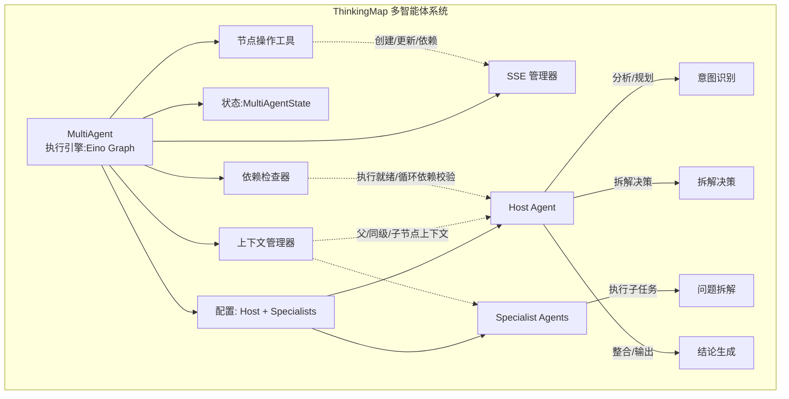
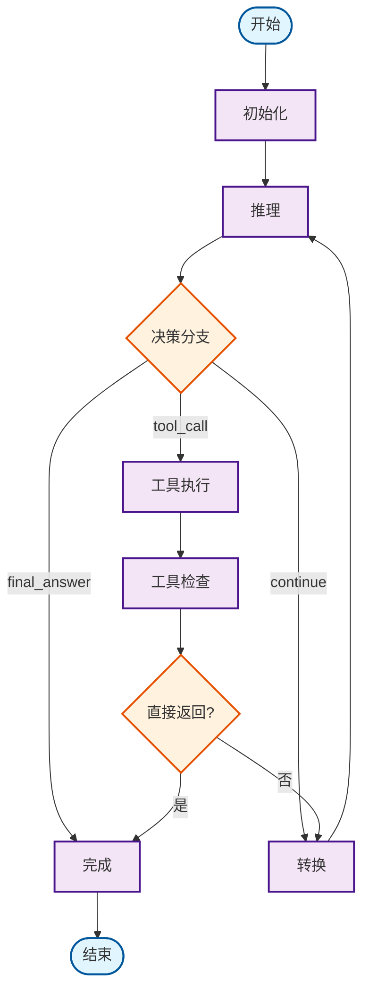
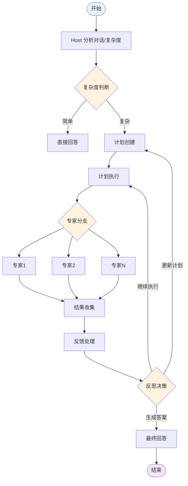

# 系统架构设计实践：eino 框架与 Multi Agent 协作的探索之路

> 本文是“AI 编程实践：从想法到产品”系列的第三篇，聚焦于我们在 ThinkingMap 项目中，从单一 AI 调用到多智能体（Multi Agent）架构的演进过程，为什么选择了 CloudWeGo/Eino 作为核心编排框架，以及 ReAct 模式在多智能体协作中的落地经验。全文严格依据项目文档与实践记录，不做臆造；相关内容出自《Agent 系统设计》《多智能体系统架构》《React Agent 架构文档》等。

## 架构设计的初始思考

在第一版原型里，我们只需要“让树长起来”。但随着真实场景增多，单一 Agent 无法同时兼顾“意图识别、拆解决策、递归拆解、结论生成”这几类不同能力，协作的需求自然浮现。

- 从单一调用到多智能体的演进：当一个节点既要判断“该拆解还是给结论”，又要设计具体拆解方式，还要生成可被前端理解的结论时，职责耦合导致复杂度失控。将职责拆分为多个专职 Agent，更符合工程化设计。
- 为什么选择 Eino：Eino 提供“组件抽象 + 编排框架 + 类型安全 + 流式处理 + 并发管理 + 切面注入”等能力，且拥有 Chain/Graph/Workflow 三类编排模型，能自然承载我们“树状生长 + 多步推理 + 工具化操作”的模式。参考官方概述：Eino 以简洁、可扩展、可靠与有效为目标，强调在 Go 生态中的工程落地（参见 CloudWeGo/Eino 概述：https://www.cloudwego.io/zh/docs/eino/overview/）。
- 决策过程：与其他框架对比时，我们更看重“图式编排 + 强类型 + 流式回调”，以及在 ReAct 模式上的易用性。最终选择 Eino，但在实践中仍需补齐服务封装与观测能力。

## Multi Agent 系统架构设计

结合项目文档的职责划分，我们将核心能力拆分为以下 Agent，并通过统一的工程化组件（上下文管理、依赖检查、节点操作、SSE 通知）协同执行。

- 问题理解 Agent：用于首次输入，解析意图、创建根节点，支持用户确认（一次性使用）。
- 意图识别 Agent：分析当前节点特征，判断“拆解/直接回答/检索/澄清”。
- 拆解决策 Agent：在确认为拆解后，选择拆解策略（顺序/并行/层次/探索）。
- 问题拆解 Agent：应用策略生成子问题，必要时调用知识检索工具，并支持用户互动调整。
- 结论生成 Agent：整合上下文与检索结果，生成结构化结论并迭代优化。

为更直观地呈现系统关系，我们以项目中的多智能体体系为骨架，结合 Eino 的图执行引擎与工程化组件，绘制整体架构：

这一设计严格对应项目文档中的组件职责与数据流：上下文优先、依赖可证、工具化操作、SSE 实时反馈。

## 基于 Eino 的 Agent 实现

结合《React Agent 架构文档》与《多智能体系统架构》，我们在 Eino 的 Graph 上实现了可迭代的推理-行动闭环，并以节点形式承载各阶段处理器。

- 编排模型：以 Graph 为主，必要时使用 Chain/Workflow 承载简单链式或字段级映射。
- 节点语义：init/reasoning/tools/tools_checker/to_reasoning/complete，配合分支决策组件（DecisionBranch、ToolsCheckerBranch）形成循环。
- 状态管理：AgentState/MultiAgentState 记录消息、推理历史、迭代计数、完成标记、最终答案等，保证过程可追溯。

我们以项目中的 ReAct Agent 为例，给出简化的执行流示意：

对应的处理器职责亦清晰：
- Init：初始化状态与消息历史；
- Reasoning：构建提示、模型推理、解析响应、更新历史；
- Tools：执行工具，必要时并发处理；
- ToolsChecker：处理直接返回场景；
- Complete：生成最终响应消息。

## ReAct 框架在 Multi Agent 中的应用

ReAct（Reasoning and Acting）的核心是“思考—行动—观察”的迭代。我们的落地重点在于将“推理”与“工具调用”解耦为可编排的节点，并以分支机制在图中循环。

- 推理阶段：由 Host（或专职推理 Agent）承担，输出结构化决策（continue/tool_call/final_answer）。
- 行动阶段：触发工具节点（可包含检索、节点操作、依赖校验等），将结果反馈为新的消息上下文。
- 观察阶段：由工具检查分支决定是否直接完成或继续推理。

当问题复杂度较高时，我们结合《多智能体系统架构》中的专家分支，将部分子任务分派给 Specialist Agents 并行处理，再由结果收集与反馈处理组件统一汇总。示意如下：

该协作方式与我们“树状生长”的交互隐喻一致：子任务的结果会被纳入父节点的结论生成流程，必要时递归触发上级节点处理。

## 架构实施中的挑战与妥协

真实实现远不止“把图连起来”。我们经历的几类典型挑战与妥协如下：

- 沟通障碍：Agent 间传递的消息格式不断调整，尤其在“推理结果结构化”“工具返回规范化”上，需要统一约定与校验。
- 循环依赖：拆解与结论可能互相触发，若缺少依赖检查与拓扑排序，容易产生执行闭环。我们将依赖检查器前置为“执行就绪”门槛。
- 黑盒困境：没有过程观测时，难以定位问题。我们通过 Eino 的回调切面（OnStart/OnEnd）与 SSE 事件，将节点状态与流式消息回放到前端，提升可观测性。
- 状态一致性：多 Agent 并行时，消息与节点状态的更新需原子化。我们在节点操作工具层统一入口，保证“创建/更新/依赖调整”均走一个通道并广播 SSE。

## 妥协后的实用方案

在理想与现实之间，我们沉淀出几条“可跑、可维护”的方案：

- 职责划分保持“最小可用”：优先保证“意图识别—拆解决策—问题拆解—结论生成”的主干通路，不强求一开始覆盖所有边缘场景。
- 上下文与依赖前置：任何处理前先收集上下文并校验依赖，必要时返回“依赖未满足”的用户提示，避免盲目执行。
- 工具化操作统一出口：节点创建、更新、依赖变更全部封装为工具，确保状态一致与 SSE 可视化同步。
- 观测先行：为每个关键节点配置回调与事件推送，优先保证“看得见”，其次再做“更聪明”。
- 何时单 Agent 更好：对于明确且上下文简单的节点，直接由结论生成 Agent 处理，减少不必要的拆解与协作开销。

## 关键收获

- Eino 的价值与局限：强类型与图式编排非常适合工程化落地，但需要额外封装日志、指标与错误传播，才能满足生产级观测要求。
- Multi Agent 的复杂性陷阱：职责边界、消息格式、依赖关系、一致性与观测，是协作系统的五个高风险点。
- ReAct 的实际实现：将“推理—行动—观察”拆为节点并以分支循环，效果显著；关键在于“结构化推理输出”与“工具执行的标准化”。
- 理想与现实的平衡：在 MVP 阶段，先保证主干通路与可观测性；细节优化与专家协作可以逐步增加。

## 参考与关联文章

- 项目文档：《Agent 系统设计》《多智能体系统架构》《React Agent 架构文档》（均在项目 docs/ 目录）
- 框架概述：CloudWeGo/Eino 概述（https://www.cloudwego.io/zh/docs/eino/overview/）

> 下一篇将继续分享多智能体协作在真实业务中的评估与迭代策略：如何监控质量、处理失败与做出增量优化。