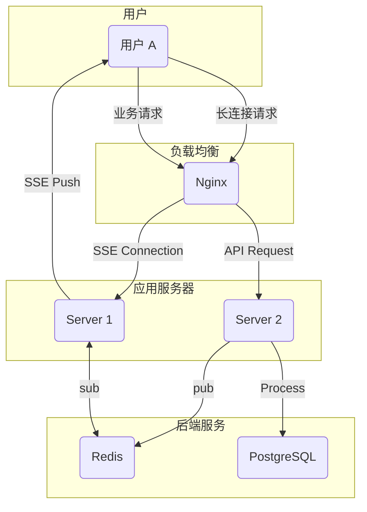
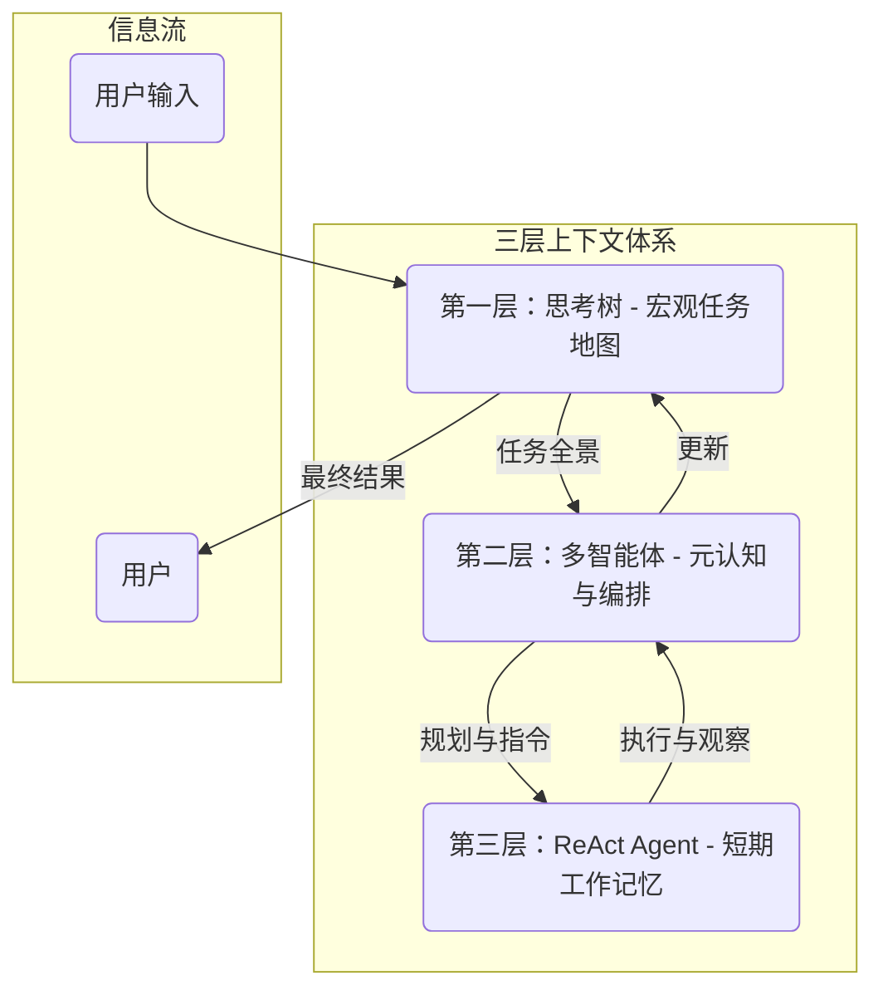

# 关键技术攻坚：SSE、上下文工程与流式解析的实践之路

> 本文是“AI 编程实践：从想法到产品”系列的第四篇，聚焦于在 ThinkingMap 开发过程中遇到的三大技术挑战：SSE 实时通信、上下文工程、以及流式 JSON 解析。文中不仅包含技术选型的思考、踩坑与解决方案，更沉淀了从“理想设计”到“务实落地”的妥协与智慧。

## SSE 实时通信：从理想到现实的距离

在 ThinkingMap 的核心体验中，“实时感”至关重要。我们希望用户能像观察一位思考者的大脑一样，实时看到 AI 的思维脉络如何一步步展开、推理、并形成结论。这个需求直接将我们引向了实时通信技术。

### 天真设想与残酷现实

“不就是服务器推数据给浏览器嘛，用 SSE 应该很简单吧？”——这是我们最初天真的想法。

相比于功能更强大但也更复杂的 WebSocket，Server-Sent Events (SSE) 以其简洁的单向通信模型、基于 HTTP 的易于实现和调试、以及浏览器原生支持的优势，成为了我们的首选。毕竟，ThinkingMap 的核心场景是服务端向客户端的单向信息流，SSE 似乎是量身定做的完美方案。

第一版的实现非常顺利，基于 Gin 框架，我们的每一次请求都是SSE服务，然后由前端来解析具体数据：接收思考过程、节点操作、消息通知、对话信息。然而这一方案在前端代码上具有很重的业务逻辑，和后端逻辑耦合严重。导致后期代码维护困难！

很快想到了新的解决方案，我们可以统一使用一个长连接，专门用于接收后端的各种消息，前端只需要按分类处理即可。每次的业务请求由后端处理具体数据解析，消息统一通过专用连接推送给长链接即可。

然而，这种“美好”止步于单机环境。当我们尝试将服务部署到多个实例时，噩梦开始了。

### 分布式环境下的挑战

一个典型的分布式部署场景如下：

问题显而易见：用户的 SSE 连接可能建立在 `Server 1` 上，但处理其请求的 API 调用却被负载均衡到了 `Server 2`。`Server 2` 完成了 AI 计算，想要把结果推送给用户，却发现与用户之间没有直接的连接。

为了解决这个问题，我们引入了 Redis 的发布/订阅 (Pub/Sub) 机制。思路很简单：`Server 2` 将需要推送的数据发布到 Redis 的一个特定频道，所有服务器实例都订阅这个频道。当 `Server 1` 收到消息后，检查该消息是否属于自己所连接的用户，如果是，则通过 SSE 连接将数据推送给用户。

理想很丰满，但现实再次给了我们一记重拳。引入 Redis Pub/Sub 带来了新的复杂性：

1.  **连接状态管理**：每个服务器实例都需要维护一个从“用户 ID”到“SSE 连接”的映射。当用户断开连接时，必须清理这个映射，否则会造成内存泄漏。
2.  **消息风暴**：当用户量和服务器实例增多时，一个用户的请求可能会导致消息在所有实例之间广播，造成不必要的网络开销和 CPU 消耗，这就是典型的“消息风暴”问题。
3.  **调试困难**：数据流经了 API 服务、Redis、SSE 服务等多个环节，任何一个环节出问题，排查起来会变得困难。

### 最终的技术妥协

在经历了无数次的调试和挣扎后，我们意识到，追求“完美”的分布式 SSE 方案在当前阶段是不现实的，并且也认识到产品设计之后考虑不够周到而带来的代价。我们必须在用户体验和技术实现复杂度之间做出权衡。

最终，我们选择了一个更务实的方案：**优先本地分发**。

我们修改了负载均衡策略，使用基于 IP 或用户 ID 的哈希，确保来自同一用户的 API 请求和 SSE 连接尽可能落在同一台服务器上。这样，绝大多数情况下，数据推送都可以在服务器内部直接完成，避免了跨实例通信的开销和复杂性。

只有在服务器实例发生故障、或进行滚动更新导致用户连接被迁移等少数情况下，我们才会启用 Redis Pub/Sub 作为备用方案，来处理跨实例的消息推送。

这个方案虽然不是最“优雅”的，但它极大地降低了系统的复杂性，提升了稳定性和可维护性，同时在绝大多数场景下保证了用户的实时体验。这次经历让我们深刻体会到，工程实践的核心往往不是追求技术的完美，而是在限制条件下找到最合适的解决方案。

## 上下文工程：为 AI Agent 构建“世界观”

如果说 SSE 解决的是“如何实时呈现”，那么上下文工程要解决的则是“呈现什么 ”的问题。仅仅优化单次的提示词（Prompt Engineering）是远远不够的，尤其是在处理需要多步骤、长周期的复杂任务时。我们需要为 AI Agent 构建一个动态、结构化、且与任务进程同步的“世界观”。

### 从“提示工程”到“上下文工程”的思维跃迁

提示工程的核心在于如何通过精炼的指令和示例，让大模型在一次交互中给出高质量的回答。它更像是一场“短跑比赛”，追求的是单次交互的最优解。

而上下文工程则是一场“马拉松”。它关注的不是某一次交互，而是整个任务生命周期中信息的流动、积累和剪枝。在 ThinkingMap 中，一个复杂问题的解决可能涉及数十次 AI 调用、多次用户干预、以及多种工具的使用。如果每次调用都是独立的，AI 就会像一个“金鱼”一样，只有七秒记忆，无法理解任务的全貌和历史。

因此，我们需要一个系统性的方法，来管理和组织这些跨越时间和步骤的上下文信息。这就是 ThinkingMap 的三层上下文体系。

### ThinkingMap 的三层上下文体系

为了让 AI Agent 既能“抬头看路”（理解宏观任务），又能“低头拉车”（执行具体步骤），我们设计了一个分层的上下文管理机制。

**第一层：思考树（Thinking Map）- 宏观任务的结构化上下文**

-   **核心职责**：为 Agent 提供任务的“全景地图”。
-   **实现方式**：整个 Thinking Map 的节点和边结构本身就是最顶层的上下文。它记录了从初始问题到当前状态的所有路径、分支、摘要和用户反馈。我们实现了一个 `ContextManager`，它可以在 AI 调用前，自动遍历这棵树，提取出与当前待处理节点相关的关键信息（如父节点摘要、兄弟节点结论、用户之前的批注等），并将其组装成宏观背景，注入到提示词中。

**第二层：多智能体系统（Multi-Agent）- 复杂任务的“元认知”与编排**

-   **核心职责**：对复杂任务进行规划、协作、反思和调整。
-   **实现方式**：当任务非常复杂，需要多个不同角色的 Agent（如意图理解 Agent、分解 Agent、结论 Agent）协作时，我们就需要第二层上下文。我们设计了一个 `EnhancedState`全局状态，它包含了全局的任务规划、资源分配、以及 Agent 之间的协作历史。一个“元认知 Agent”或“编排者”会读取这个 `EnhancedState`，决定下一步应该由哪个 Agent 来执行什么任务，并在所有 Agent 完成后进行总结和反思，动态调整全局规划。

**第三层：ReAct Agent - 执行循环中的“短期记忆”**

-   **核心职责**：管理 Agent 在“思考-行动-观察”迭代循环中的“工作记忆”。
-   **实现方式**：我们基于 ReAct (Reasoning and Acting) 范式构建了 Agent 的执行核心。每一个 Agent 实例在处理一个具体步骤时，都会维护一个 `AgentState` 对象。这个对象记录了它当前的思考链（Chain of Thought）、尝试过的行动（Action）、以及从环境中获得的观察（Observation）。这个 `AgentState` 就是 Agent 的短期记忆，帮助它在连续的几次尝试中保持逻辑的连贯性，直到当前步骤完成。

这三层上下文体系，如同一套完整的大脑系统，让 ThinkingMap 的 AI Agent 在面对复杂问题时，既能有条不紊地执行，又能灵活应对变化，最终完成富有深度的思考任务。

## 实时流式 JSON 解析：确保 AI 结构化输出的“最后一公里”

我们的 AI Agent 被设计为以结构化的 JSON 格式输出思考过程和结果。这对于前端动态、精确地渲染“思维树”至关重要。然而，大模型的输出是流式的，一个完整的 JSON 对象可能是逐字逐句生成的。如果等整个 JSON 完全生成后再解析，就会失去“实时感”，用户将长时间面对一个空白的加载界面。

### 为什么需要流式解析？

传统的 `JSON.parse()` 方法必须等待整个字符串接收完毕才能工作。在我们的场景中，这意味着：

-   **高延迟**：用户无法实时看到 AI 的思考过程，体验大打折扣。
-   **前端交互不稳定**：如果使用markdown，我们很难保证AI会按照我们的要求输出，最终导致前端展示部分结果。

我们需要一个能够在数据流式到达的同时，就进行增量解析，并实时回调出有效数据块的解析器。

### 自定义一个有限状态机（FSM）解析器

社区虽然有一些流式 JSON 解析的库，但大多较为庞大，或是不完全符合我们的需求（例如，我们需要增量解析，在value还未完成的情况下及时将结果推送出去）。因此，我们决定自定义一个轻量、高效的有限状态机（FSM）解析器。

设计目标很明确：

-   **轻量高效**：只包含核心功能，无任何多余依赖。
-   **增量解析**：可以逐字符 `Write(byte)`，并在内部维护解析状态。
-   **路径订阅**：支持通过类似 `$.nodes[*].title` 的语法，只在特定数据路径解析完成时触发回调。

我们的核心实现是 `StreamingJsonParser`，它内部维护一个状态机，逐字符读取 JSON 数据流，并根据当前的 state（如 `in_string`, `in_number`, `in_object` 等）和读到的字符，转换到下一个状态。当一个 value（如一个 string, number, 或一个完整的 object/array）被识别解析出来时，它会通知 `SimplePathMatcher`。

`SimplePathMatcher` 则负责维护用户订阅的路径。当 `StreamingJsonParser` 通知它某个路径的数据已经就绪时，它会检查该路径是否匹配任何订阅规则。如果匹配，就立即触发相应的回调函数，将解析出的数据块（例如一个节点的 title）实时发送给前端。

### 关键特性与实践

这个手写的解析器在 ThinkingMap 中发挥了巨大作用：

-   **精确订阅**：例如：“我只关心 `$.nodes[*].summary` 和 `$.edges[*].label`”。这样，只有当一个新的节点摘要或边的标签生成时，后端才会通过 SSE 推送消息，极大地减少了无效通信。
-   **实时与增量模式**：我们支持 `realtime` 和 `incremental` 两种模式。`realtime` 模式下，会在解析过程中实时回调上层；`incremental` 模式则会返回最新解析出的结果给到调用方。
-   **健壮性**：即使 AI 输出的 JSON 后半部分有瑕疵，前半部分已经解析并回调的数据也不会受影响，保证了前端体验的稳定性。

通过这个自研的流式解析器，我们打通了从 AI 结构化输出到前端实时渲染的“最后一公里”，让 ThinkingMap 的“思维生长”动画变得流畅而精确。

## 关键收获

回顾这三大技术攻坚战，我们收获的不仅仅是解决方案，更是宝贵的工程经验：

1.  **拥抱现实，务实妥协**：在分布式 SSE 的问题上，我们学会了放弃“完美”方案，转而寻求在当前资源和复杂度下最“合适”的方案。工程的核心是取舍的艺术。
2.  **系统思考，分层构建**：面对复杂的 AI 上下文管理，我们通过分层设计，将一个宏大的问题拆解为三个可管理、可组合的子问题，让复杂系统变得清晰有序。
3.  **深入底层，掌握核心**：在流式解析的问题上，我们通过手写一个核心组件，不仅完美满足了业务需求，更让我们对数据处理的底层机制有了更深刻的理解。

## 参考与关联文章

- 项目文档：《上下文工程》《SSE技术文档》《JSON实时解析》（均在项目 docs/ 目录）

> 从 SSE 的连接挑战，到上下文工程的宏大叙事，再到流式解析的精妙入微，ThinkingMap 的技术实现过程，本身就是一棵不断生长、充满探索与决策的“思维树”。