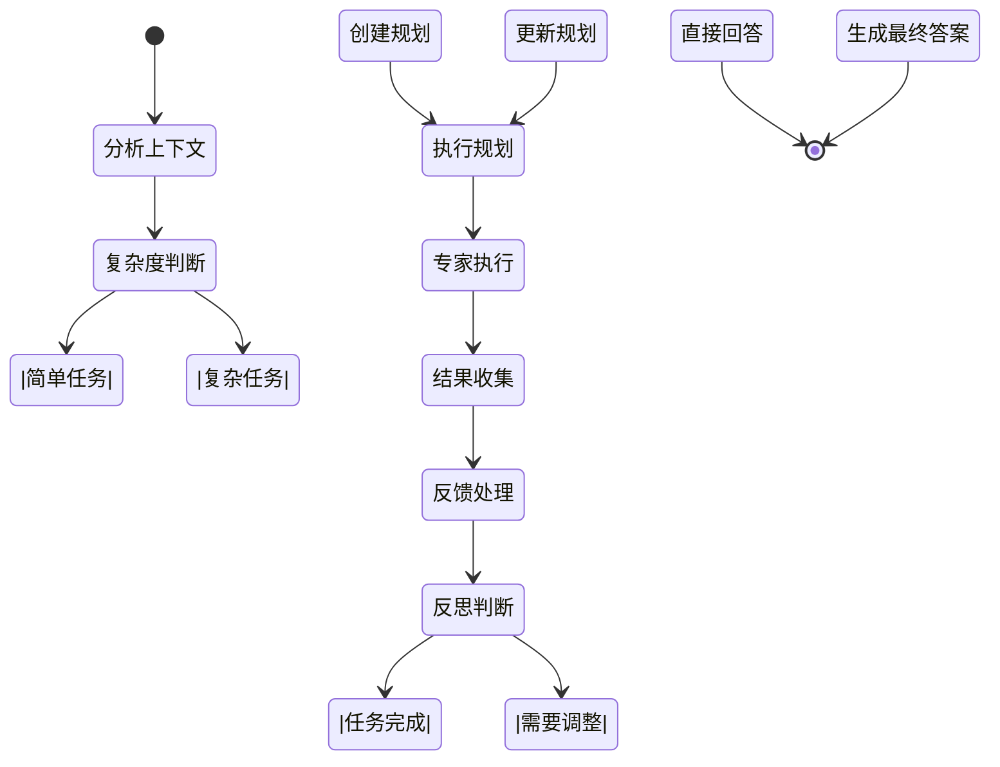

# 项目上下文工程设计

## 引言

在构建复杂的 AI Agent 系统时，上下文工程（Context Engineering）是决定其智能水平和问题解决能力的核心。精准、全面、结构化的上下文是 Agent 理解任务、进行推理和做出有效决策的基础。本项目采用了一种分层式的上下文管理策略，将复杂的上下文处理分解为三个协同工作的层次，确保 Agent 在宏观战略和微观执行层面都能获得所需的信息。

这三个层次分别是：
1.  **思考树（Thinking Map）**：负责宏观任务的结构化上下文编排。
2.  **ReAct Agent**：负责单个 Agent 执行循环中的迭代式上下文管理。
3.  **多智能体系统（Multi-Agent System）**：负责复杂任务的全局规划、协作与反思的元上下文管理。

本文档将详细阐述这三个层次的设计与实现。

## 层次一：思考树 - 结构化上下文编排

思考树的上下文管理由 `ContextManager`（位于 `server/internal/service/context_manager.go`）负责。其核心职责是基于思维导图的树状结构，为 Agent 执行特定节点的任务时，自动收集和组织一个全面的“世界观”。

### 1. 核心数据结构：`ContextInfo`

这是为单个节点任务构建的上下文信息的集合，包含了解决当前节点问题所需的所有背景知识：

```go
type ContextInfo struct {
    MapInfo             *model.ThinkingMap     // 整个导图的全局信息
    NodeInfo            *model.ThinkingNode    // 当前节点的详细信息
    AncestorsContext    []NodeContextInfo      // 祖先节点上下文（问题分解路径）
    DependencyContext   []NodeContextInfo      // 依赖节点上下文（前置条件）
    ChildrenContext     []NodeContextInfo      // 子节点上下文（已有的子任务）
    ConversationContext []ConversationMessage  // 与当前节点相关的对话历史
    UserContext         map[string]interface{} // 用户手动添加的额外上下文
}
```

### 2. 上下文收集机制

`ContextManager` 通过一系列方法，从不同维度收集信息：

-   `getAncestorsContext`: 递归获取从根节点到当前节点的完整路径，帮助 Agent 理解当前任务在整个问题分解体系中的位置。
-   `getDependencyContext`: 获取当前节点所依赖的其他节点的信息（通常是其结论），这些是完成当前任务的前置条件。
-   `getChildrenContext`: 获取当前节点已分解出的子节点，让 Agent 了解已有的探索方向。
-   `getConversationContext`: 获取与当前节点相关的用户对话历史，这些交互中往往包含隐性的需求和约束。

### 3. 上下文格式化：`FormatContextForAgent`

这是将结构化数据转化为 Agent 可理解的自然语言提示（Prompt）的关键步骤。`FormatContextForAgent` 函数将 `ContextInfo` 中的所有信息编译成一个详尽的 Markdown 格式的 Prompt，其结构如下：

1.  **任务背景**：定义 Agent 的角色和总体任务。
2.  **当前导图概览**：提供导图的标题、核心问题和最终目标。
3.  **当前节点任务**：明确指出当前需要解决的具体问题和目标。
4.  **问题分解路径（祖先节点）**：展示从宏观到微观的分析路径。
5.  **前置依赖信息（依赖节点）**：列出解决当前问题所需依赖的结论。
6.  **已有子问题分解（子节点）**：展示当前问题已有的分解情况。
7.  **对话历史**：附上相关的讨论，以供参考。

这一层确保了 Agent 在开始工作前，能获得关于任务最完整、最结构化的背景信息。

## 层次二：ReAct Agent - 执行循环上下文

在单个 Agent 的执行层面，我们采用 ReAct（Reasoning and Acting）模式。其上下文管理体现在 Agent 的“短期记忆”中，即在一个任务的执行循环内，如何记录和更新信息。这部分逻辑主要在 `server/internal/agent/base/react/handlers.go` 中实现。

### 1. 核心上下文：`AgentState`

`AgentState` 结构体（虽未在文件中直接定义，但可从逻辑中推断）是 ReAct 循环的核心，它维护了 Agent 的内部状态，其中最重要的部分是 `Messages` 列表。

-   `Messages`: 这是一个 `schema.Message` 类型的列表，按时间顺序记录了整个 ReAct 循环中的所有交互，包括：
    -   初始的用户输入
    -   Agent 的思考过程（Thought）
    -   Agent 发起的工具调用（Tool Calls）
    -   工具执行返回的结果（Tool Results）
    -   最终的回答

这个 `Messages` 列表构成了 Agent 的迭代式上下文。在每一步推理时，Agent 都会回顾这个列表，以了解“我刚刚做了什么”、“得到了什么结果”，以及“下一步应该做什么”。

### 2. 上下文处理流程

不同的 `Handler` 在 ReAct 循环的不同阶段对上下文进行操作：

-   `InitHandler`: 初始化状态，将用户最初的输入作为上下文的起点。
-   `ReasoningHandler`: 在进行推理前，组装发送给 LLM 的 Prompt（通常包含系统指令和 `Messages` 列表）；在接收到 LLM 的响应后，解析出其中的思考和工具调用，并将其追加到 `Messages` 上下文中。
-   `ToolHandler`: 在工具执行后，将工具的返回结果格式化为消息，并追加到 `Messages` 上下文中。
-   `CompleteHandler`: 在任务完成时，根据最终的 `AgentState` 生成最终答案。

这一层确保了 Agent 在执行具体任务时，能够进行连贯的、有状态的思考和行动。

## 层次三：多智能体系统 - 编排与元认知上下文

对于无法由单个 Agent 一次性解决的复杂任务，我们引入了更高层次的“多智能体系统”进行编排。其状态管理机制在 `server/internal/agent/base/multiagent/docs/03_state_management.md` 中有详细描述，这构成了系统的“元认知”上下文。

### 1. 核心数据结构：`EnhancedState`

`EnhancedState` 是整个复杂任务的全局状态机，它跟踪的不是单次工具调用，而是整个问题解决的生命周期。其关键字段包括：

-   `CurrentPlan` / `PlanHistory`: 任务的规划，包括分解后的步骤。这是执行的蓝图。
-   `ExecutionStatus` / `ExecutionHistory`: 跟踪整个计划的执行状态和历史记录。
-   `SpecialistResults`: 存储由不同“专家” Agent（可能是底层的 ReAct Agent）完成子任务后返回的结果。
-   `FeedbackHistory` / `ReflectionCount`: 记录反馈和反思过程，支持系统进行自我评估和计划调整。
-   `ShouldContinue` / `IsCompleted`: 控制任务循环和终止的标志。

### 2. 元上下文驱动的工作流

`EnhancedState` 驱动一个复杂的、包含反思的执行流程：



这个流程展示了元认知上下文的作用：

1.  **分析与规划**：系统首先分析任务复杂度，如果复杂，则创建一个 `TaskPlan` 并存入 `EnhancedState`。
2.  **执行与协作**：系统根据计划，调度一个或多个专家 Agent 执行子任务，并将结果收集到 `SpecialistResults`。
3.  **收集与反思**：系统在收集一轮结果后，会进入“反馈处理”和“反思判断”阶段。它会评估当前结果是否满足要求，计划是否需要调整。
4.  **迭代与终止**：如果需要调整，系统会更新 `CurrentPlan`，进入下一轮执行；如果任务完成，则生成最终答案并终止。

这一层通过维护一个全局的、高维度的上下文，赋予了系统规划、协作、监控和自我完善的能力。

## 结论：三位一体的上下文体系

本项目的上下文工程通过三个层次的紧密协作，构建了一个强大而灵活的 Agent 系统：

-   **思考树（`ContextManager`）** 如同一位**图书管理员**，负责整理和提供与任务相关的、结构化的背景资料（Case File）。
-   **多智能体系统（`EnhancedState`）** 如同一位**项目经理**，他拿到背景资料后，进行战略分析，制定详细的项目计划，并将任务分包给不同的专家。
-   **ReAct Agent（`AgentState`）** 如同一位**领域专家**，他接收具体的任务包，通过“思考-行动”的循环来解决问题，并向上汇报他的发现和成果。

这种分层设计使得系统既能处理宏观的、结构复杂的问题，又能处理微观的、需要迭代执行的任务，最终实现了高效、智能的问题解决能力。