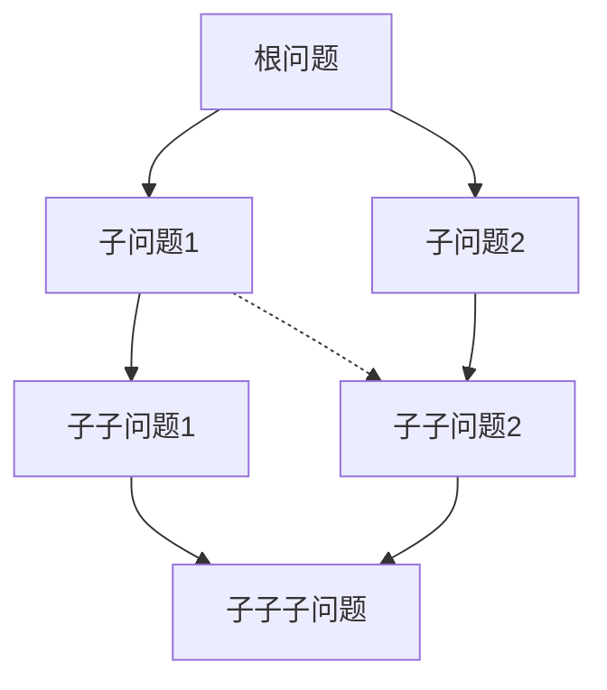

# ThinkingMap 前端：可视化与交互（ReactFlow）

## 1. 结构分层
- **WorkspacePage（页面级）**：负责整体布局、数据加载、权限校验、全局事件处理。
- **MapCanvas（画布层）**：承载 ReactFlow 实例，负责节点、边的渲染与交互。
- **Node/Edge 自定义组件**：根据节点类型/状态自定义外观与交互。
- **Toolbar/Topbar**：画布顶部操作栏（如返回、缩放、布局、导出等）。
- **ContextMenu/快捷操作**：节点/画布右键菜单。

## 2. 核心组件
- `<ReactFlowProvider>`：包裹画布，提供上下文。
- `<ReactFlow>`：主画布组件，配置节点、边、交互事件。
- `CustomNode`：自定义节点（含类型图标、状态标识、内容省略、动画等）。
- `CustomEdge`：自定义边（支持平滑曲线、动画、状态高亮）。
- `NodeActionButtons`：节点单击后弹出的操作按钮组（编辑、删除、加子节点等）。
- `MiniMap`、`Controls`、`Background`：辅助组件，提升可用性。

## 3. 数据流与状态管理
- 节点树、边数据存储于 Zustand store，支持高频实时更新。
- 画布交互（如拖拽、节点编辑）通过 action 分发到 store，并同步后端。
- SSE 事件驱动节点/边的增删改，自动刷新画布。
- 节点选中、面板联动状态存于局部 store。

## 4. 关键交互实现
- 节点拖拽/缩放/平移：ReactFlow 内置，支持自定义约束与动画。
- 节点单击：弹出操作按钮组，定位于节点上方，自动避让边界。
- 节点双击：高亮节点并展开右侧操作面板。
- 节点右键：弹出快捷菜单（如复制、粘贴、删除、导出等）。
- 画布空白处点击：取消节点选中，隐藏操作按钮组。
- 节点连接：支持拖拽创建父子关系，自动校验合法性。

## 5. 动画与性能优化
- 节点/边变更采用平滑动画（如新增、删除、状态切换）。
- 大量节点时采用虚拟化/分层渲染，提升性能。
- 事件节流/防抖，避免高频更新导致卡顿。
- 只在必要时重渲染节点（如状态/内容变化）。

## 6. 与操作面板的联动
- 节点选中/双击时，右侧操作面板自动切换到对应节点详情。
- 面板内编辑节点信息，保存后实时同步到画布。
- 节点执行/拆解/结论生成等操作，触发节点状态和内容的实时更新。

## 7. 与后端的同步
- 画布初始化时拉取节点树和边数据。
- 所有节点/边的增删改操作均通过 API 同步后端。
- SSE 实时接收后端推送的节点/边变更事件，自动刷新画布。
- 支持断线重连和数据一致性校验。

## 8. 自定义节点实现细节
### 8.1 节点数据结构与后端映射
- 节点数据来源于后端 `thinking_nodes`、`node_details` 表，字段包括：
  - `id`：节点唯一标识
  - `parent_id`：父节点ID
  - `node_type`：节点类型（root/analysis/conclusion/custom等）
  - `question`：节点问题描述
  - `target`：目标描述
  - `conclusion`：结论内容（已完成时显示）
  - `status`：节点状态（0待执行/1执行中/2已完成/3错误等）
  - `position`：节点在画布上的坐标
  - `dependencies`：依赖信息
  - `context`：上下文信息（如父/子节点摘要）
  - `metadata`：扩展字段
- 详细信息（如上下文、拆解、结论Tab内容）通过 `node_details` 关联获取。

### 8.2 节点整体布局设计
- **外层容器**：圆角矩形/卡片，阴影、边框颜色根据状态变化
- **顶部区域**：
  - 类型图标 + 类型文字（如"分析"、"结论"）
  - 状态标识（灰/蓝/绿/红，带动画/图标）
- **主体内容**：
  - 问题概述（最多40字，超出省略号）
  - 目标概述（最多30字，超出省略号）
  - 结论内容（仅已完成时显示，最多50字，省略号）
- **底部区域**：
  - 依赖状态（如有未完成依赖，显示提示/图标）
  - 子节点数量/分支提示（可选）
- **交互按钮**：
  - 悬浮/选中时显示操作按钮组（编辑、删除、加子节点等）

### 8.3 节点状态与样式
- 待执行：灰色边框，静态图标
- 执行中：蓝色边框，loading动画
- 已完成：绿色边框，完成图标
- 错误：红色边框，警告/错误图标
- 状态切换带平滑过渡动画

### 8.4 交互与事件
- 单击节点：高亮并弹出操作按钮组
- 双击节点：展开右侧操作面板，节点高亮
- 右键节点：弹出快捷菜单
- 拖拽节点：更新位置并同步后端
- 拖拽连接：创建父子关系，自动校验
- 悬浮时显示完整内容tooltip

### 8.5 响应式与适配
- 节点宽度自适应内容，最小/最大宽度限制
- 支持多行内容自动截断与省略
- 适配不同缩放级别，保证主要信息可读

### 8.6 动画与性能
- 节点/边新增、删除、状态切换均有平滑动画
- 选中/高亮节点有明显视觉反馈
- 大量节点时仅渲染视窗内节点，提升性能

### 8.7 代码结构建议
- `CustomNode.tsx`：自定义节点主组件
- `NodeStatusIcon.tsx`：状态图标与动画
- `NodeActionButtons.tsx`：操作按钮组
- `NodeTooltip.tsx`：内容tooltip
- `nodeTypes.ts`：节点类型与样式配置

### 8.8 示例节点布局（伪代码）
```jsx
<div className={`node-card status-${status}`}> 
  <div className="node-header">
    <TypeIcon type={node_type} />
    <span>{typeText}</span>
    <NodeStatusIcon status={status} />
  </div>
  <div className="node-content">
    <div className="node-question" title={question}>{truncate(question, 40)}</div>
    <div className="node-target" title={target}>{truncate(target, 30)}</div>
    {status === 'completed' && <div className="node-conclusion" title={conclusion}>{truncate(conclusion, 50)}</div>}
  </div>
  <div className="node-footer">
    {hasUnmetDependencies && <DependencyIcon />}
    <span>{childCount}分支</span>
  </div>
  {selected && <NodeActionButtons ... />}
</div>
```

### 8.9 样式建议
- 使用 Tailwind CSS utility class 实现配色、圆角、阴影、动画等
- 关键内容（问题、目标、结论）采用不同字号/颜色区分
- 状态色彩与后端/产品文档保持一致
> 可视化区的设计应兼顾性能、交互体验和可扩展性。 

### 8.10 布局
你的需求是：  
- 首页根节点是用户提出的问题  
- 问题可以拆分为多个子问题（子节点），子节点之间有依赖关系（DAG）  
- 子节点还可以继续拆分，形成多层级的子图  
- 既要表达层级（树状结构），又要表达依赖（DAG）  

这种结构常见于“分层有向无环图（Layered DAG）”的可视化。合理布局要兼顾：  
1. **层级清晰**（主线是树状/分层结构，便于理解主问题-子问题关系）  
2. **依赖关系可见**（跨层/跨分支的依赖箭头不混乱）  
3. **可扩展性**（节点多时依然可读、可交互）  

#### 推荐布局思路

##### 1. 主体采用“分层树状布局”
- 根节点在顶部/左侧（常见为竖直或水平树）
- 每一层是对上层问题的拆解，子节点在下一层横向排列
- 这样主线结构一目了然，用户能直观看到“问题-子问题-子子问题”的分解过程

##### 2. 依赖关系用“有向边”连接
- 子节点之间的依赖用箭头连接，允许跨层/跨分支
- 依赖边样式建议与主线边区分（如虚线、半透明、不同颜色）
- 箭头避免与主线重叠，必要时可做曲线/弯折

##### 3. 层级与依赖兼容的布局算法
- 推荐使用**Sugiyama分层布局算法**（Layered DAG Layout），它专为有向无环图的分层可视化设计
  - 先分层（主树结构），再优化节点顺序，最后路由边以减少交叉
- ReactFlow、Cytoscape.js、Dagre等库都支持类似布局

##### 4. 子图折叠/展开
- 支持节点折叠/展开，避免一次性展示全部内容导致混乱
- 只展开用户关注的分支，提升可读性和性能

##### 5. 交互与可视化建议
- 鼠标悬浮/点击依赖边时高亮相关节点
- 支持拖拽节点调整位置，自动吸附到合理层级
- 大量节点时采用虚拟化/分组渲染

---

#### 视觉示意（竖直分层）


- 实线为主树结构，虚线/弯曲线为依赖关系

---

#### 参考实现
- **ReactFlow**：支持自定义布局，可结合 dagre-layout 实现分层DAG
- **Cytoscape.js**：内置多种DAG布局算法
- **d3-dag**：专注于DAG的分层布局

---

#### 总结
- 主体用分层树状布局，表达“拆解”关系
- 依赖用有向边，表达“依赖”关系
- 采用分层DAG布局算法，兼顾层级与依赖
- 支持折叠/展开、交互高亮，提升可读性和体验

如果你需要具体的ReactFlow布局代码或配置示例，可以进一步说明你的技术栈和需求细节！