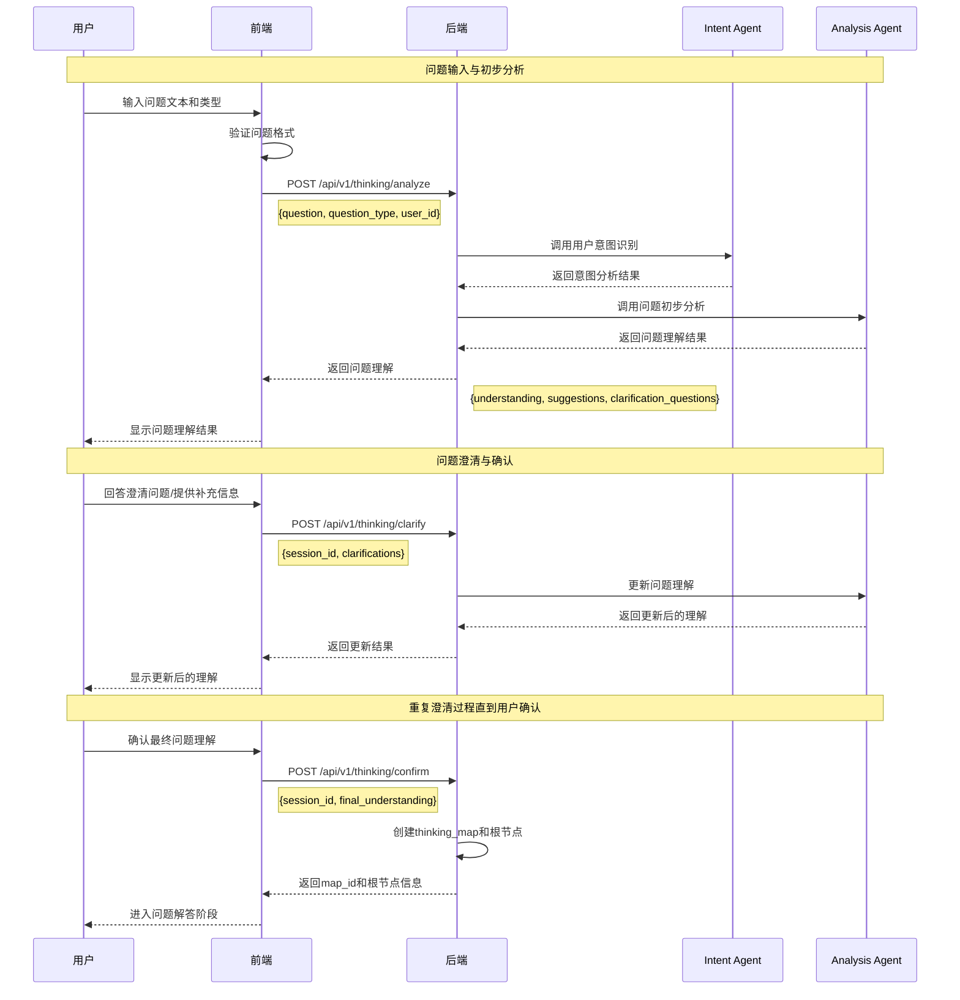
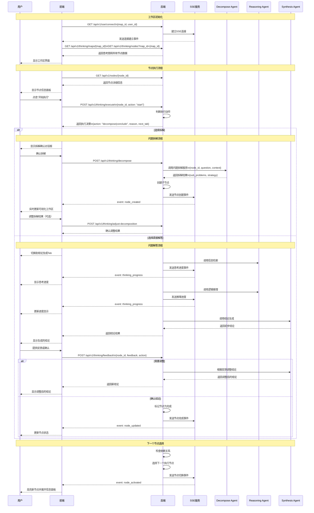
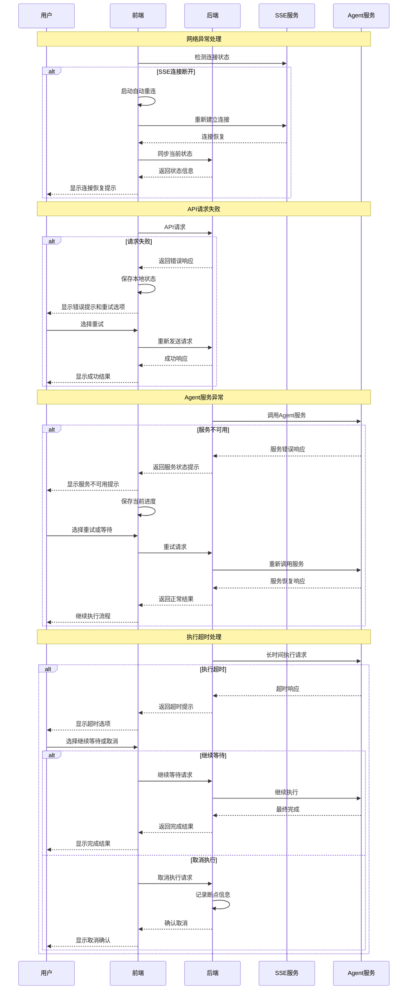
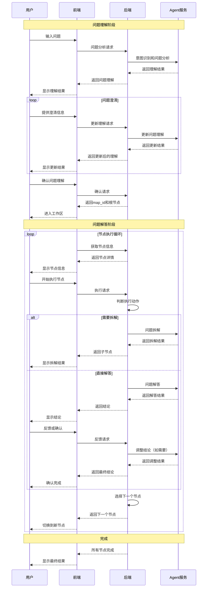
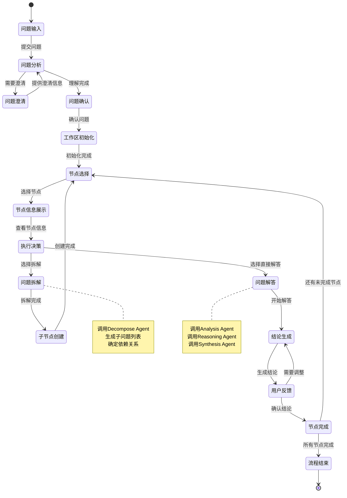

# ThinkingMap 交互时序图

## 1. 问题理解阶段时序图

## 2. 问题解答阶段时序图

## 3. 异常处理时序图

## 4. 完整交互流程概览

## 5. 关键状态转换图

这些时序图完整展示了ThinkingMap的交互流程，包括：

1. **问题理解阶段**：从问题输入到最终确认的完整流程
2. **问题解答阶段**：节点执行、拆解、解答的详细过程
3. **异常处理**：网络异常、服务异常、超时等情况的处理
4. **完整流程概览**：整个系统的宏观交互流程
5. **状态转换**：各个阶段之间的状态转换关系

每个时序图都基于交互流程文档中的具体实现细节，确保了技术实现的准确性和完整性。 