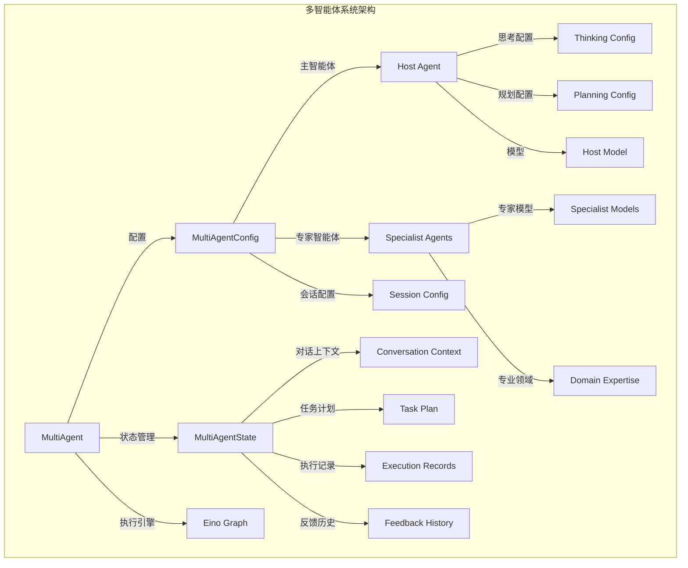
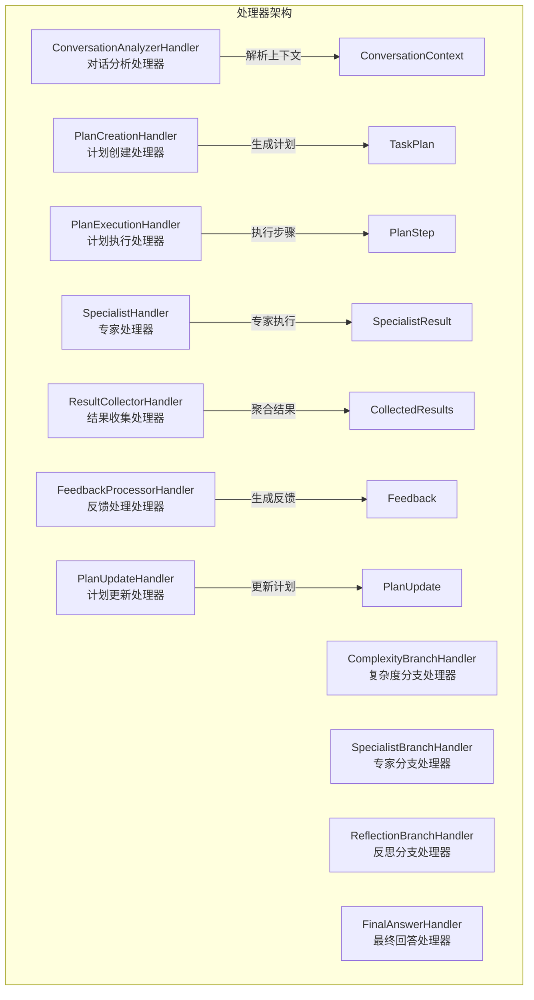
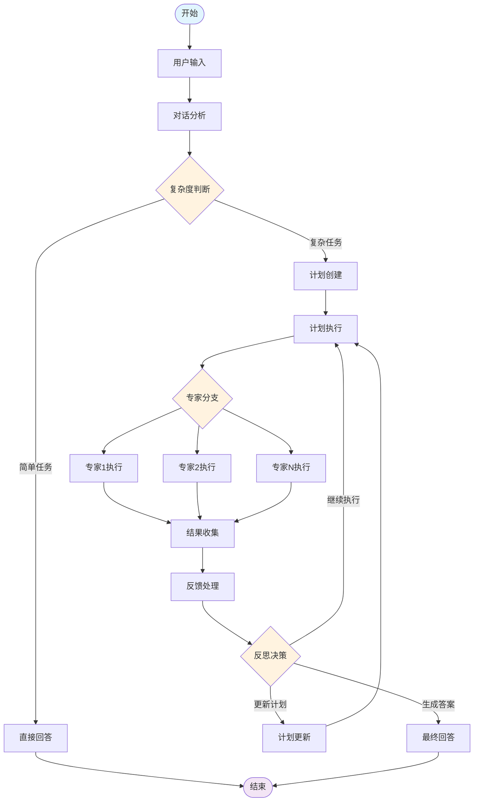
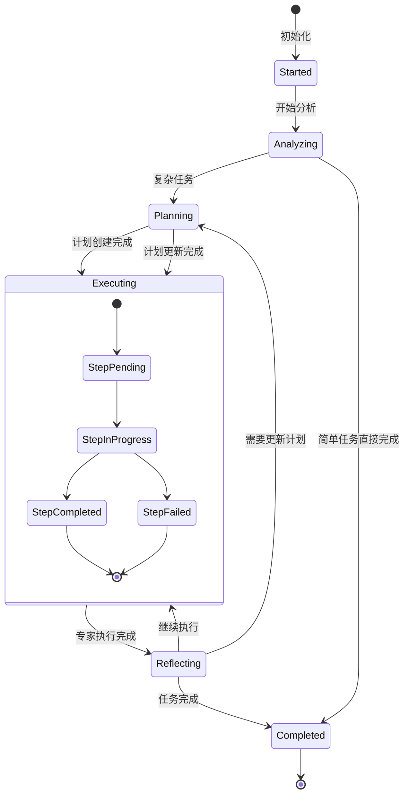
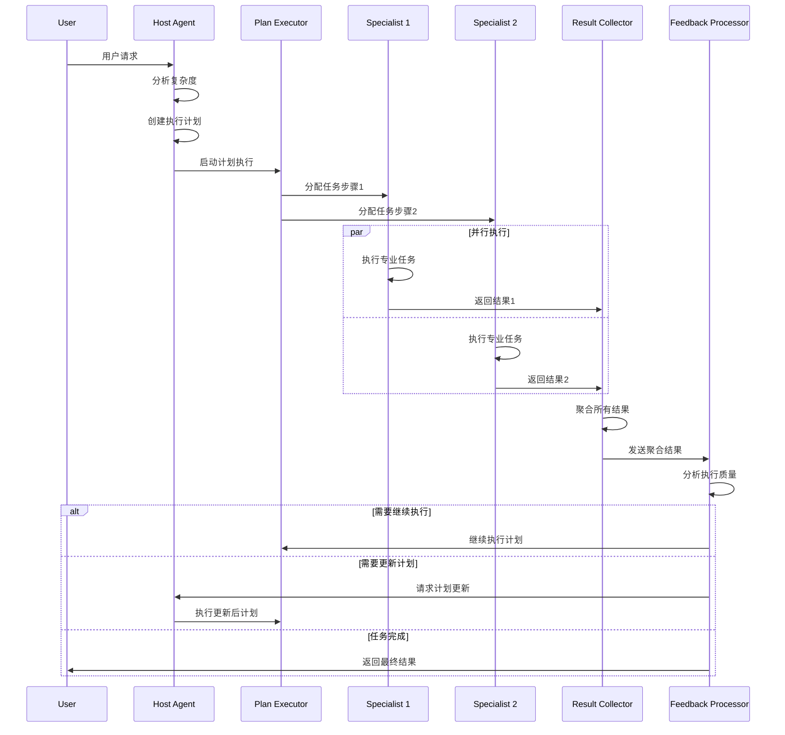

# 多智能体系统架构文档

## 概述

基于 CloudWeGo/Eino 框架的增强多智能体系统，提供了高级的思考、规划和协作能力。该系统通过智能的任务分解、专家协作和持续反馈机制，能够处理复杂的多步骤任务。

## 核心文件分析

### 1. 类型定义 (types.go)

#### 枚举类型
- **TaskComplexity**: 任务复杂度枚举（Simple, Moderate, Complex, VeryComplex, Unknown）
- **ActionType**: 智能体行动类型（Think, Plan, Execute, Reflect, Update, Complete）
- **StepStatus**: 计划步骤状态（Pending, InProgress, Completed, Failed, Skipped）
- **ExecutionStatus**: 执行状态（Started, Analyzing, Planning, Executing, Reflecting, Completed, Failed）

#### 核心结构体
- **ConversationContext**: 对话上下文，包含用户意图、关键主题、复杂度分析
- **ExecutionRecord**: 执行记录，追踪每个步骤的执行历史
- **PlanStep**: 计划步骤，定义任务的具体执行单元
- **TaskPlan**: 任务计划，包含完整的执行步骤序列
- **MultiAgent**: 多智能体系统的主要实例

### 2. 配置管理 (config.go)

#### 配置结构
- **ThinkingConfig**: 思考配置（最大步骤、超时、深度思考、复杂度分析）
- **PlanningConfig**: 规划配置（最大步骤、超时、动态规划、依赖分析）
- **Host**: 主智能体配置（模型、系统提示、思考和规划配置）
- **Specialist**: 专家智能体配置（名称、用途、模型、系统提示）
- **SessionConfig**: 会话配置（历史长度、上下文窗口）

### 3. 状态管理 (state.go)

**MultiAgentState** 是系统的核心状态管理器，包含：
- 回合数和时间管理
- 对话上下文和原始消息
- 当前任务计划和执行状态
- 专家结果和收集结果
- 反馈历史和反射记录
- 执行历史和元数据

## 架构组件

### 核心组件架构



### 图节点组件

```mermaid
graph LR
    subgraph "执行图节点"
        CA[conversation_analyzer<br/>对话分析器]
        CB[complexity_branch<br/>复杂度分支]
        DA[direct_answer<br/>直接回答]
        PC[plan_creation<br/>计划创建]
        PE[plan_execution<br/>计划执行]
        SB[specialist_branch<br/>专家分支]
        RC[result_collector<br/>结果收集]
        FP[feedback_processor<br/>反馈处理]
        RB[reflection_branch<br/>反思分支]
        PU[plan_update<br/>计划更新]
        FA[final_answer<br/>最终回答]
        
        S1[Specialist 1]
        S2[Specialist 2]
        SN[Specialist N]
    end
```



### 处理器组件



## 执行流程

### 主要执行流程



### 状态管理流程



### 专家协作流程



## 技术特性

### 1. 智能思考能力
- **深度思考模式**: 支持多步骤思考过程，通过 `ThinkingConfig` 控制
- **复杂度分析**: 自动评估任务复杂度，决定执行路径
- **思考历史记录**: 完整的思考过程追踪和状态管理

### 2. 动态任务规划
- **自适应规划**: 根据任务复杂度动态生成执行计划
- **依赖分析**: 自动识别任务间的依赖关系
- **计划更新**: 支持执行过程中的计划调整和优化

### 3. 多智能体协作
- **专家智能体**: 支持多个专业领域的智能体
- **并行执行**: 支持多个智能体并行处理任务
- **结果聚合**: 智能聚合多个智能体的执行结果

### 4. 持续反馈机制
- **执行监控**: 实时监控任务执行状态
- **质量评估**: 对执行结果进行质量评估
- **自适应调整**: 根据反馈自动调整执行策略

### 5. 状态管理
- **会话管理**: 支持多轮对话和上下文保持
- **状态持久化**: 支持状态的序列化和恢复
- **执行历史**: 完整的执行过程记录

## 提示词框架

### 1. 对话分析提示词
```
分析对话并提取关键信息：
- 用户意图识别
- 关键主题提取
- 上下文摘要
- 复杂度评估
- 元数据收集
```

### 2. 计划创建提示词
```
创建详细执行计划：
- 任务分解
- 专家分配
- 依赖关系
- 优先级设置
- 参数配置
```

### 3. 专家执行提示词
```
专家任务执行：
- 专业领域定位
- 任务步骤描述
- 上下文信息
- 参数配置
- 结果要求
```

### 4. 反馈处理提示词
```
执行结果分析：
- 完成度评估
- 质量分析
- 问题识别
- 改进建议
- 下一步决策
```

### 5. 计划更新提示词
```
增量计划更新：
- 操作类型（添加/修改/删除/重排）
- 目标步骤
- 更新原因
- 依赖调整
- 元数据更新
```

## 工具集成

### 1. 专家智能体接口
```go
type Specialist struct {
    Name         string
    IntendedUse  string
    ChatModel    schema.ChatModel
    Invokable    schema.InvokableLambda
    Streamable   schema.StreamableLambda
    SystemPrompt string
}
```

### 2. 执行模式
- **ChatModel 模式**: 使用聊天模型进行对话式处理
- **Invokable 模式**: 使用可调用 Lambda 进行函数式处理
- **Streamable 模式**: 使用流式 Lambda 进行实时处理

### 3. 状态处理器
```go
type StatePreHandler[I any] func(ctx context.Context, input I, state *MultiAgentState) (I, error)
type StatePostHandler[O any] func(ctx context.Context, output O, state *MultiAgentState) (O, error)
```

## 配置选项

### 1. 基础配置
```go
config := &MultiAgentConfig{
    Name:        "多智能体系统",
    Description: "智能协作系统",
    Host: Host{
        Model:        chatModel,
        SystemPrompt: "系统提示词",
        Thinking: ThinkingConfig{
            MaxSteps:           5,
            Timeout:            time.Minute * 2,
            EnableDeepThink:    true,
            ComplexityAnalysis: true,
        },
        Planning: PlanningConfig{
            MaxSteps:           10,
            Timeout:            time.Minute * 5,
            EnableDynamicPlan:  true,
            DependencyAnalysis: true,
        },
    },
    Specialists: []*Specialist{...},
    Session: SessionConfig{
        HistoryLength: 100,
        ContextWindow: 4096,
    },
}
```

### 2. 专家配置
```go
specialist := &Specialist{
    Name:         "代码专家",
    IntendedUse:  "处理编程相关任务",
    ChatModel:    codeModel,
    SystemPrompt: "你是一个专业的程序员...",
}
```

## 使用示例

### 1. 创建和执行
```go
// 创建多智能体系统
ctx := context.Background()
agent, err := NewMultiAgent(ctx, config)
if err != nil {
    return err
}

// 准备输入
input := []*schema.Message{{
    Role:    schema.User,
    Content: "请帮我分析一下如何优化Go语言Web服务的性能",
}}

// 执行生成
result, err := agent.Generate(ctx, input)
if err != nil {
    return err
}

fmt.Println("结果:", result.Content)
```

### 2. 流式处理
```go
// 流式执行
stream, err := agent.Stream(ctx, input)
if err != nil {
    return err
}

for {
    chunk, err := stream.Recv()
    if err != nil {
        break
    }
    fmt.Print(chunk.Content)
}
```

### 3. 消息处理器
```go
// 添加消息处理器
options := []base.AgentOption{
    WithConversationAnalyzer(myHandler),
    WithPlanCreationHandler(planHandler),
    WithSpecialistHandler("代码专家", codeHandler),
}

agent, err := NewMultiAgent(ctx, config, options...)
```

## 错误处理

### 1. 配置验证
- 主智能体模型验证
- 专家智能体配置验证
- 超时和步骤限制验证
- 会话配置验证

### 2. 执行错误处理
- 步骤执行失败处理
- 超时处理
- 模型调用错误处理
- 状态不一致处理

### 3. 恢复机制
- 状态回滚
- 重试机制
- 降级处理
- 错误上报

## 性能优化

### 1. 并行执行
- 专家智能体并行处理
- 异步状态更新
- 流式结果处理

### 2. 缓存策略
- 计划缓存
- 结果缓存
- 上下文缓存

### 3. 资源管理
- 连接池管理
- 内存优化
- 超时控制

## 扩展性

### 1. 自定义专家
- 实现专家接口
- 配置专业领域
- 集成外部服务

### 2. 自定义处理器
- 实现处理器接口
- 扩展状态管理
- 自定义决策逻辑

### 3. 插件机制
- 消息处理插件
- 状态管理插件
- 执行监控插件

## 最佳实践

### 1. 配置管理
- 使用环境变量管理敏感配置
- 分环境配置管理
- 配置验证和默认值

### 2. 错误处理
- 完善的错误分类和处理
- 适当的重试和降级策略
- 详细的错误日志记录

### 3. 性能监控
- 执行时间监控
- 资源使用监控
- 成功率统计

### 4. 测试策略
- 单元测试覆盖
- 集成测试验证
- 性能基准测试

---

*本文档基于 CloudWeGo/Eino 框架的多智能体系统实现，提供了完整的架构分析和使用指南。*