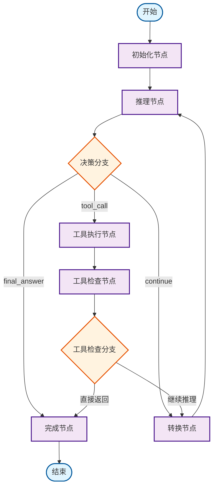
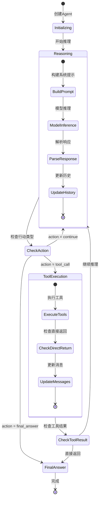

# React Agent 架构文档

## 概述

React Agent 是基于 CloudWeGo/Eino 框架实现的智能代理系统，采用 ReAct (Reasoning and Acting) 模式，能够通过结构化推理过程来解决复杂问题。该系统将推理和行动相结合，通过迭代的思考-行动循环来完成任务。

## 核心架构组件

### 1. 核心结构体

#### ReactAgent
```go
type ReactAgent struct {
    runnable         compose.Runnable[[]*schema.Message, *schema.Message]
    graph            *compose.Graph[[]*schema.Message, *schema.Message]
    graphAddNodeOpts []compose.GraphAddNodeOpt
    agentOptions     []base.AgentOption
    config           ReactAgentConfig
}
```

#### ReactAgentConfig
配置结构体包含以下关键配置：
- `ToolCallingModel`: 支持工具调用的聊天模型
- `ReasoningPrompt`: 推理提示词模板
- `IsSupportStructuredOutput`: 是否支持结构化输出
- `ToolsConfig`: 工具配置
- `MessageModifier`: 消息预处理器
- `MaxStep`: 最大推理迭代次数
- `ToolReturnDirectly`: 直接返回结果的工具映射

#### AgentState
全局状态管理结构：
```go
type AgentState struct {
    Messages                 []*schema.Message `json:"messages"`
    ReasoningHistory         []Reasoning       `json:"reasoning_history"`
    Iteration                int               `json:"iteration"`
    MaxIterations            int               `json:"max_iterations"`
    Completed                bool              `json:"completed"`
    FinalAnswer              string            `json:"final_answer"`
    ReturnDirectlyToolCallID string            `json:"return_directly_tool_call_id"`
}
```

#### Reasoning
推理结果结构：
```go
type Reasoning struct {
    Thought     string            `json:"thought"`
    Action      string            `json:"action"`
    ToolCalls   []schema.ToolCall `json:"tool_call,omitempty"`
    FinalAnswer string            `json:"final_answer,omitempty"`
    Confidence  float64           `json:"confidence"`
}
```

### 2. 图节点组件

React Agent 使用 Eino 的图执行引擎，包含以下核心节点：

#### 节点类型
- **init**: 初始化节点，设置初始状态
- **reasoning**: 推理节点，执行结构化推理过程
- **tools**: 工具执行节点，调用外部工具
- **tools_checker**: 工具检查节点，判断是否需要直接返回
- **to_reasoning**: 转换节点，将消息列表转换为推理输入
- **complete**: 完成节点，生成最终响应

#### 处理器组件

##### InitHandler
- 初始化 AgentState
- 设置消息历史和迭代计数器

##### ReasoningHandler
- **PreHandler**: 构建系统提示词，准备推理输入
- **PostHandler**: 解析推理响应，更新状态历史

##### ToolHandler
- **PostHandler**: 处理工具执行结果，检查直接返回条件

##### CompleteHandler
- **PostHandler**: 生成最终响应消息

### 3. 分支决策组件

#### DecisionBranch
基于推理结果决定下一步行动：
- `tool_call` → 路由到工具节点
- `final_answer` → 路由到完成节点
- `continue` → 继续推理循环

#### ToolsCheckerBranch
检查工具执行后的状态：
- 如果工具标记为直接返回且已完成 → 路由到完成节点
- 否则 → 继续推理循环

## 执行流程图



## 状态管理流程



## 推理框架

### 推理格式
Agent 使用结构化的 JSON 格式进行推理：

```json
{
  "thought": "详细的推理过程，包括问题分析、策略制定等",
  "action": "continue|tool_call|final_answer",
  "final_answer": "仅在action为final_answer时提供",
  "confidence": 0.8
}
```

### 行动选项
- **continue**: 需要继续思考或分析，信息不足以做决定
- **tool_call**: 需要调用工具获取信息或执行操作
- **final_answer**: 有足够信息提供最终答案

## 工具集成

### 工具接口
工具必须实现 `tool.BaseTool` 接口：
```go
type BaseTool interface {
    Info(ctx context.Context) (*schema.ToolInfo, error)
}
```

### 工具执行
支持两种执行模式：
- **InvokableTool**: 同步执行
- **StreamableTool**: 流式执行

### 直接返回机制
某些工具可以配置为直接返回结果，无需进一步推理：
```go
ToolReturnDirectly: map[string]bool{
    "weather_tool": true,
    "calculator": false,
}
```

## 配置选项

### 基础配置
```go
config := &ReactAgentConfig{
    ToolCallingModel: chatModel,
    MaxStep: 10,
    DebugMode: false,
    ToolsConfig: compose.ToolsNodeConfig{
        Tools: []tool.BaseTool{...},
    },
}
```

### 高级选项
- `WithToolOptions`: 配置工具选项
- `WithChatModelOptions`: 配置聊天模型选项
- `WithToolList`: 指定工具列表
- `WithMessageHandler`: 设置消息处理器

## 使用示例

### 创建 Agent
```go
ctx := context.Background()

// 创建聊天模型
chatModel := openai.NewChatModel(...)

// 配置 Agent
config := ReactAgentConfig{
    ToolCallingModel: chatModel,
    MaxStep: 10,
    ToolsConfig: compose.ToolsNodeConfig{
        Tools: []tool.BaseTool{
            &CalculatorTool{},
            &SearchTool{},
        },
    },
}

// 创建 Agent
agent, err := NewAgent(ctx, config)
if err != nil {
    log.Fatal(err)
}
```

### 执行推理
```go
// 同步执行
messages := []*schema.Message{
    {Role: schema.User, Content: "帮我计算 10+5 的结果"},
}

result, err := agent.Generate(ctx, messages)
if err != nil {
    log.Fatal(err)
}

fmt.Println(result.Content)
```

### 流式执行
```go
// 流式执行
stream, err := agent.Stream(ctx, messages)
if err != nil {
    log.Fatal(err)
}

for {
    msg, err := stream.Recv()
    if err != nil {
        break
    }
    fmt.Print(msg.Content)
}
```

## 错误处理

### 配置验证
- 检查必需配置项
- 验证模型和工具配置
- 设置默认值

### 执行错误
- 推理响应解析错误
- 工具执行错误
- 最大迭代次数限制

### 状态恢复
- 状态一致性检查
- 错误状态恢复机制

## 性能优化

### 缓存策略
- 工具信息缓存
- 推理结果缓存

### 并发控制
- 工具并发执行
- 状态同步机制

### 资源管理
- 内存使用优化
- 连接池管理

## 扩展性

### 自定义节点
可以通过 `GraphOptions` 添加自定义节点：
```go
config.GraphOptions = []compose.GraphAddNodeOpt{
    // 自定义节点配置
}
```

### 自定义处理器
可以实现自定义的消息处理器：
```go
type CustomMessageHandler struct{}

func (h *CustomMessageHandler) OnMessage(ctx context.Context, message *schema.Message) (context.Context, error) {
    // 自定义处理逻辑
    return ctx, nil
}
```

### 插件机制
支持通过 Agent 选项扩展功能：
```go
agent, err := NewAgent(ctx, config,
    WithMessageHandler(customHandler),
    WithToolOptions(toolOpts...),
)
```

## 最佳实践

### 工具设计
1. 工具功能单一且明确
2. 提供详细的工具描述
3. 合理设置参数验证
4. 实现适当的错误处理

### 推理优化
1. 设置合理的最大迭代次数
2. 使用结构化的推理提示词
3. 合理配置直接返回工具
4. 监控推理质量和效率

### 状态管理
1. 及时清理无用状态
2. 实现状态持久化（如需要）
3. 监控状态大小和复杂度

### 错误处理
1. 实现全面的错误捕获
2. 提供有意义的错误信息
3. 实现优雅的降级机制
4. 记录详细的执行日志

## 总结

React Agent 是一个功能强大且灵活的智能代理框架，通过结构化的推理过程和工具集成，能够处理复杂的多步骤任务。其基于 Eino 框架的图执行引擎提供了良好的可扩展性和性能保障，适合构建各种智能应用场景。