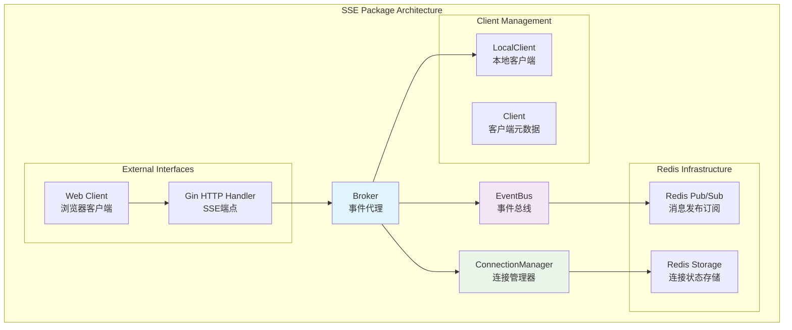
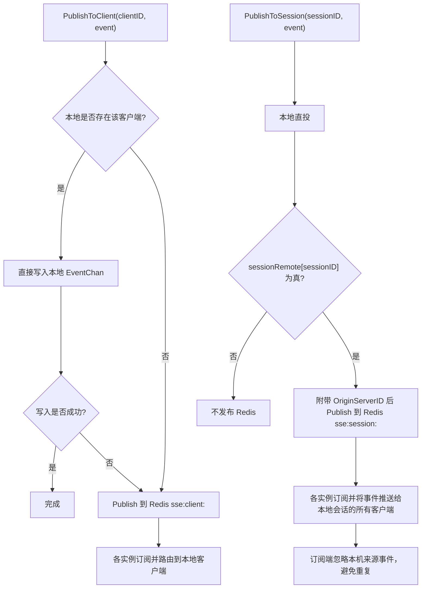
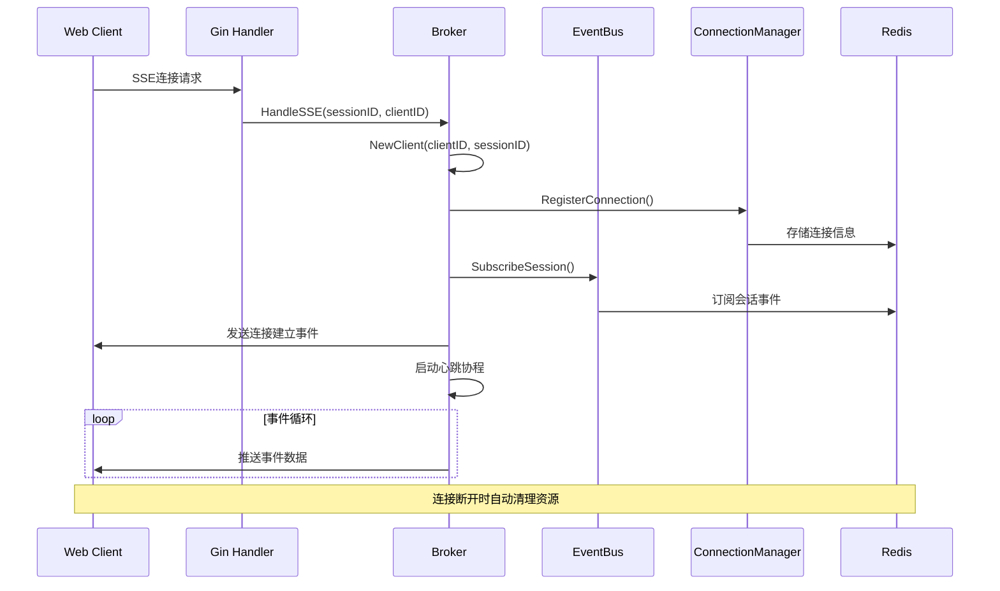
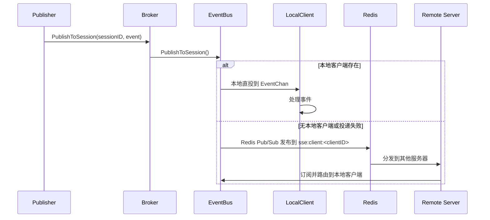
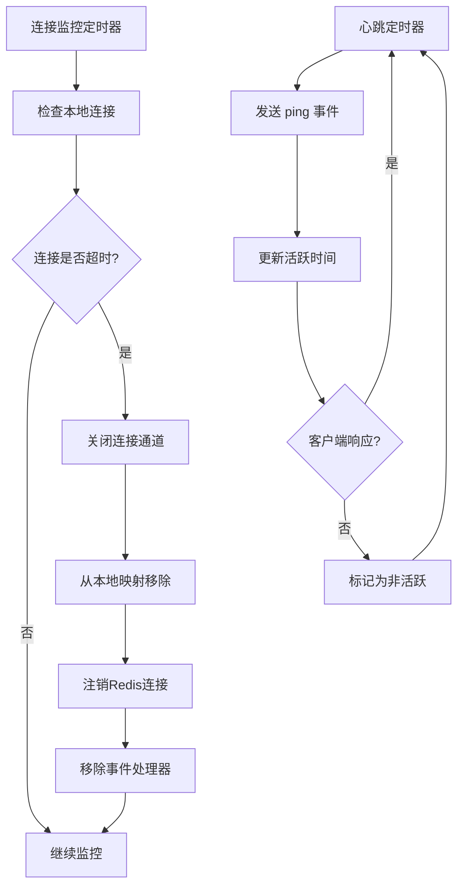

# SSE (Server-Sent Events) 技术文档

## 概述

SSE包实现一个分布式服务器推送事件系统，支持跨服务器实例的实时消息分发。系统以“本地优先、远程保障”的策略构建：
- 客户端级事件优先本地直投，失败时回退到Redis分发
- 会话级事件本地直投；仅当存在远程客户端时，按需通过Redis广播，并在订阅端根据来源进行去重

## 核心组件架构



## 组件详细说明

### 1. Broker (事件代理)

**职责**: 作为SSE系统的核心协调器，管理客户端连接生命周期和事件分发。

**核心功能**:
- 客户端连接管理（创建、移除、监控）
- SSE HTTP请求处理
- 事件分发协调
- 心跳机制维护
- 连接超时清理

**关键方法**:
```go
// 创建新客户端连接
func (b *Broker) NewClient(clientID, sessionID string) *LocalClient

// 处理SSE HTTP请求
func (b *Broker) HandleSSE(c *gin.Context, sessionID, clientID string)

// 发布事件到会话
func (b *Broker) PublishToSession(sessionID string, event Event) error

// 发布事件到特定客户端
func (b *Broker) PublishToClient(clientID string, event Event) error
```

### 2. EventBus (事件总线)

**职责**: 统一事件路由与跨实例分发。维护Redis订阅与会话远程状态缓存，利用本地客户端提供者进行投递，无需事件处理器回调。

**核心特性**:
- **客户端级事件**: 本地直投失败回退Redis；各实例订阅 `sse:client:<clientID>`，仅在本地存在该客户端时转发
- **会话级事件（本地优先 + 按需远程）**: 先本地直投；若会话存在远程客户端，广播到 `sse:session:<sessionID>`；各实例订阅并将事件推送给本地同会话的客户端；对来自本机的事件进行去重
- **订阅键统一**: 内部统一使用 `client:<clientID>` 与 `session:<sessionID>` 作为订阅键，映射到Redis频道
- **远程存在缓存**: 订阅时获取 `sse:session_servers:<sessionID>` 初始化 `sessionRemote`
- **远程状态实时更新**: 订阅 `sse:session_servers_updates:<sessionID>`，根据连接注册/注销的更新消息实时维护 `sessionRemote`

**分发策略**:


### 3. ConnectionManager (连接管理器)

**职责**: 管理客户端连接的状态和元数据，支持分布式连接跟踪。

**存储结构**:
- `sse:connection:{clientID}`: 单个连接详细信息
- `sse:session_conn:{sessionID}`: 会话中的所有连接ID集合
- `sse:server_conn:{serverID}`: 服务器实例的所有连接ID集合
 - `sse:session_servers:{sessionID}`: 会话活跃的服务器ID集合（初始化远程状态）
 - `sse:session_servers_updates:{sessionID}`: 会话服务器集合更新发布频道（实时维护远程状态）

**连接状态**:
```go
type ConnectionState string

const (
    Connected    ConnectionState = "connected"     // 已连接
    Disconnected ConnectionState = "disconnected"  // 已断开
    Reconnecting ConnectionState = "reconnecting"  // 重连中
)
```

### 4. Client 数据结构

#### Client (客户端元数据)
```go
type Client struct {
    ClientID  string `json:"client_id"`  // 客户端唯一标识
    SessionID string `json:"session_id"` // 会话ID
    UserID    string `json:"user_id"`    // 用户ID（可选）
    CreatedAt int64  `json:"created_at"` // 创建时间
}
```

#### LocalClient (本地客户端)
```go
type LocalClient struct {
    *Client
    EventChan    chan Event // 事件通道（缓冲区大小：10240）
    Done         chan bool  // 完成信号通道
    LastActiveAt int64      // 最后活跃时间
}
```

#### Event (事件结构)
```go
type Event struct {
    ID    string      `json:"id"`
    Type  string      `json:"type"`
    Data  interface{} `json:"data"`
    Retry uint64      `json:"retry,omitempty"`
    OriginServerID string `json:"origin_server_id,omitempty"` // 发布源服务器ID，用于订阅端去重
}
```

## 核心流程

### 1. 客户端连接建立流程



### 2. 事件发布与分发流程



### 3. 连接监控与清理流程



## 性能优化策略

### 1. 本地优先分发
- **客户端级事件**: 本地直投，失败时回退到Redis分发
- **会话级事件**: 本地直投，按需广播Redis（基于 `sessionRemote` 缓存）
- **远程状态维护**: 订阅期初始化远程状态，实时订阅 `sse:session_servers_updates` 更新，避免发布路径Redis查询
- **缓冲区管理**: EventChan 使用 10240 缓冲，兼顾性能与内存

### 2. 连接池化
- **Redis连接复用**: 使用Redis连接池减少连接建立开销
- **批量操作**: 使用Redis Pipeline进行批量操作

### 3. 内存管理
- **定时清理**: 定期清理超时连接，防止内存泄漏
- **通道关闭**: 连接断开时及时关闭相关通道

## 配置参数

```go
type BrokerConfig struct {
    PingInterval  time.Duration // 心跳间隔（默认：30秒）
    ClientTimeout time.Duration // 客户端超时时间（默认：5分钟）
    ServerID      string        // 服务器实例ID
    EventChanSize int          // 事件通道缓冲区大小（默认：10240）
}

type RedisConfig struct {
    ConnectionTTL time.Duration // 连接信息TTL（默认：5分钟）
}
```

## 错误处理

### 1. 连接错误
- **注册失败**: 连接注册失败时返回nil，阻止无效连接
- **超时处理**: 自动清理超时连接，释放资源

### 2. 事件分发错误
- **缓冲区满/通道关闭**: 客户端级本地直投失败时回退到 Redis（带安全发送与panic保护）
- **序列化错误**: JSON序列化失败时记录错误并跳过

### 3. Redis错误
- **连接断开**: Redis连接断开时自动重连
- **订阅失败**: 订阅失败时记录错误并重试

## 使用示例

### 1. 初始化SSE系统

```go
// 创建Redis客户端
redisClient := redis.NewClient(&redis.Options{
    Addr: "localhost:6379",
})

// 创建连接管理器
connManager := NewRedisConnectionManager(redisClient, "server-1")

// 创建事件总线
eventBus := NewRedisEventBus(redisClient, connManager, "server-1")

// 创建Broker
broker := NewBroker(
    eventBus,
    connManager,
    "server-1",
    30*time.Second, // 心跳间隔
    5*time.Minute,  // 客户端超时
)
```

### 2. 设置SSE端点

```go
func setupSSERoutes(r *gin.Engine, broker *Broker) {
    r.GET("/sse/:sessionID/:clientID", func(c *gin.Context) {
        sessionID := c.Param("sessionID")
        clientID := c.Param("clientID")
        broker.HandleSSE(c, sessionID, clientID)
    })
}
```

### 3. 发布事件

```go
// 发布到会话（本地直投 + 按需广播）
event := Event{
    Type: "message",
    Data: map[string]interface{}{
        "content": "Hello, World!",
        "timestamp": time.Now(),
    },
}

err := broker.PublishToSession("session-123", event)
if err != nil {
    log.Printf("发布事件失败: %v", err)
}

// 发布到特定客户端（本地直投，失败回退）
err = broker.PublishToClient("client-456", event)
if err != nil {
    log.Printf("发布事件失败: %v", err)
}
```

## 监控指标

建议监控以下关键指标：

1. **连接指标**
   - 活跃连接数
   - 连接建立/断开速率
   - 连接超时数量

2. **事件指标**
   - 事件发布速率
   - 事件分发延迟
   - 事件丢失数量

3. **性能指标**
   - 本地投递成功率
   - Redis操作延迟
   - 内存使用情况

## 扩展性考虑

1. **水平扩展**: 通过Redis实现多服务器实例间的事件分发
2. **负载均衡**: 客户端可以连接到任意服务器实例
3. **故障转移**: 服务器实例故障时，客户端可以重连到其他实例
4. **数据一致性**: 通过Redis确保连接状态的一致性

## 安全考虑

1. **认证授权**: 在HandleSSE中添加用户认证逻辑
2. **速率限制**: 防止客户端过度连接或发送过多事件
3. **数据验证**: 验证事件数据的合法性
4. **CORS配置**: 正确配置跨域访问策略

## 总结

SSE包提供了一个高性能、可扩展的服务器推送事件系统，通过本地优化和Redis分布式架构，实现了高效的实时消息分发。系统设计考虑了性能、可靠性和可扩展性，适用于需要实时通信的Web应用场景。