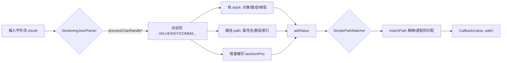
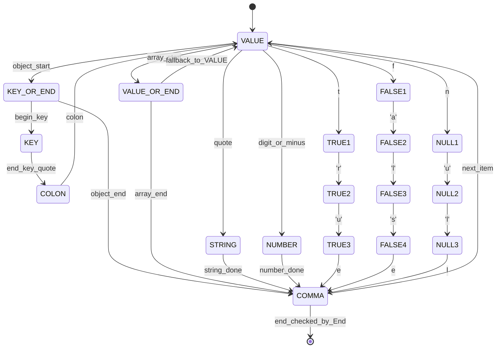
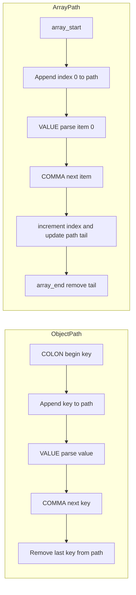
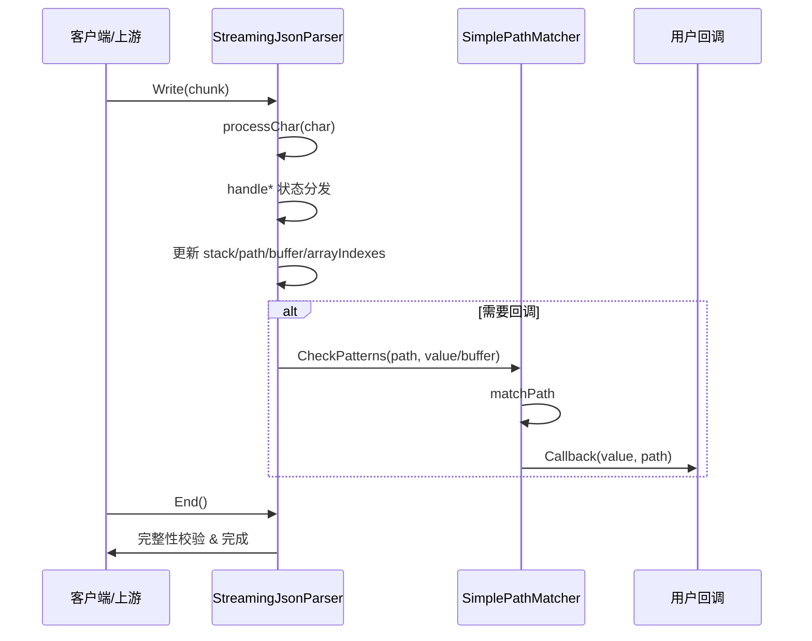

# ThinkingMap 流式 JSON 解析器实现原理

本文档介绍 `server/internal/pkg/utils/stream_json_parser.go` 中流式 JSON 解析器的设计目标、核心组件、状态机实现、路径匹配机制，以及增量与实时回调的工作方式。并通过 Mermaid 图解说明整体架构与解析流程，最后附上使用示例与扩展建议。

## 背景与目标

- 面向流式 JSON 数据（例如模型输出的 SSE/流式响应）的增量解析。
- 在解析过程中按“路径”触发回调，支持对象属性与数组索引匹配、通配符匹配。
- 提供两种输出模式：
  - `realtime=true`：解析过程中实时回调。
  - `incremental=true`：对字符串值仅发送新增内容，避免重复传递完整值。
- 简化依赖，采用手写有限状态机解析器以控制内存与时序。

## 架构总览



## 核心组件

### SimplePathMatcher（简化路径匹配）

- 作用：注册路径模式与回调，在解析器产出值时判断当前 `path` 是否匹配并触发回调。
- 关键方法：
  - `On(pattern string, callback PathMatcherCallback)`：注册模式与回调。
  - `parsePath(string) []interface{}`：将 `$.a[0].b[*]` 解析为 `["a", 0, "b", "*"]`（省略根 `$`）。
  - `CheckPatterns(path []interface{}, value interface{})`：遍历已注册模式，若 `matchPath` 通过则回调。
  - `matchPath(path, pattern []interface{}) bool`：长度必须一致；字符串严格相等；整数匹配数组索引；`*` 为通配符。

### StreamingJsonParser（流式解析器）

- 解析策略：逐字符处理，使用有限状态机维护解析上下文。
- 重要字段：
  - `state`：当前状态（`VALUE`, `KEY_OR_END`, `KEY`, `COLON`, `COMMA`, `VALUE_OR_END`, `NUMBER`, `TRUE*`, `FALSE*`, `NULL*`）。
  - `stack`：当前构建中的对象/数组或根值；用于承载解析结果。
  - `path`：当前值的路径片段数组，例如 `["message", "content"]` 或 `["items", 3]`。
  - `arrayIndexes`：维护当前数组层级的索引计数，与 `path` 同步更新。
  - `buffer`：暂存字符串、数字与关键字字符。
  - `realtime` / `incremental`：控制回调时机与字符串增量输出。
  - `lastSentPos`：按路径记录上次发送的位置，仅用于字符串增量。
- 关键流程：
  - `Write(chunk string)`：逐字符调用 `processChar`。
  - `processChar`：按 `state` 分发到对应 `handle*` 方法。
  - `addValue(value interface{})`：将值写入当前容器并触发路径匹配回调。
  - `endObject` / `endArray`：出栈并维护 `path` 与 `arrayIndexes`。
  - `End()`：校验解析结构完整（根值必须唯一），返回错误或完成。

## 状态机实现



### 字符串与转义处理

- 在 `isInString=true` 时，支持常见转义 `\n`, `\t`, `\r`, `\\`, `\"`, `\/`, `\b`, `\f`。
- 非支持转义字符将原样保留为 `"\x"`。
- 若 `realtime=true` 且处于 `VALUE` 的字符串解析中：
  - `incremental=true`：仅将 `buffer` 新增部分触发回调（根据 `pathKey` 在 `lastSentPos` 的位置）。
  - `incremental=false`：按字符串累计内容触发回调。
- 字符串结束时：
  - 若之前已发送增量内容，则避免再次发送完整值（防止重复）。

## 路径维护与数组索引



- `path` 由属性名与数组索引构成，例如 `["choices", 0, "delta"]`。
- 结束对象时：若 `path` 最末不是整数（非数组索引），则移除一个路径片段。
- 结束数组时：移除当前数组层级的索引并从 `path` 中弹出末尾片段。

## 增量与实时模式

- `realtime=true`：在值尚未最终确定（例如字符串尚未闭合）时，依据当前 `buffer` 触发匹配回调。
- `incremental=true`：仅针对字符串值启用增量；使用 `getPathKey()` 为路径生成唯一键，配合 `lastSentPos[pathKey]` 控制发送区间。最终闭合时避免重复发送完整值。
- 非字符串值（数字、布尔、null、对象、数组）不做增量处理，完成后通过 `addValue` 一次性触发。

## 解析与回调时序



## 使用示例

```go
matcher := utils.NewSimplePathMatcher()
// 监听对象属性与数组项中的字符串增量
matcher.On("$.choices[0].delta", func(value interface{}, path []interface{}) {
    fmt.Printf("path=%v, value=%v\n", path, value)
})
matcher.On("$.items[*].name", func(value interface{}, path []interface{}) {
    // * 通配符匹配任意数组索引
})

// 实时 + 增量：适合模型逐字输出的场景
parser := utils.NewStreamingJsonParser(matcher, true, true)

// 逐块写入（例如从网络流拿到的片段）
_ = parser.Write("{\"choices\":[{\"delta\":\"")
_ = parser.Write("Hel") // 增量触发回调："Hel"
_ = parser.Write("lo\"}]}\n") // 增量触发回调："lo"，结束后不再发送整串

// 完结并获取结果（可选）
_ = parser.End()
result := parser.GetResult() // 得到完整解析树
```

## 错误处理与健壮性

- 格式错误：在各 `handle*` 状态下对非法字符抛出错误（例如 `unexpected character ...`）。
- 数字解析：使用 `strconv.ParseFloat`；非法数字抛错并带出原始 `buffer`。
- 完整性：`End()` 校验 `stack` 长度必须为 1（仅一个根值）。

## 性能与内存考量

- 手写状态机避免引入完整 JSON 库，适合流式场景与增量输出。
- `buffer` 仅在需要时增长；字符串增量通过位置记录减少重复回调数据。
- `stack` 与 `path` 使用切片维护，避免过度复制；对象与数组入栈/出栈开销较低。

## 常见问题（FAQ）

- 为什么字符串会多次触发回调？
  - 当 `realtime=true` 时，为了实现边解析边回调的体验；配合 `incremental=true` 可只发送新增部分。
- 通配符 `*` 如何工作？
  - `matchPath` 在对应位置仅检查长度，遇 `*` 直接视为匹配；适合数组内任意索引的值监听。
- 数组与对象的 `path` 更新规则？
  - 对象：进入 `COLON` 后在 `path` 追加当前键；完成该键值后，在 `COMMA` 清理路径。
  - 数组：进入 `[` 后在 `path` 追加当前索引；逢 `,` 索引自增并更新 `path` 末尾；在 `]` 清理路径。
- 增量为什么只支持字符串？
  - 字符串是最典型的逐字/逐段增长的值，其它类型完成后值即确定，增量意义不大。

## 局限与改进建议

- 字符串转义未覆盖 `\uXXXX` Unicode 转义序列；可按需扩展。
- `matchPath` 是“长度必须一致”的精确匹配；可以考虑前缀匹配或更完整的 JsonPath 支持。
- 目前增量仅支持字符串；如需支持对象/数组的增量结构更新，需要定义更复杂的差异协议。
- 错误定位可增强（记录行列号），便于定位输入问题。

## API 速览

- `NewSimplePathMatcher()`: 创建路径匹配器。
- `On(pattern, callback)`: 注册匹配与回调。
- `NewStreamingJsonParser(matcher, realtime, incremental)`: 创建解析器。
- `Write(chunk)`: 逐字符写入数据块。
- `End()`: 校验并结束解析过程。
- `GetResult()`: 获取完整解析结果（根值）。
- `Reset()`: 重置解析器状态，并清空内部栈与缓存。

---

以上为流式 JSON 解析器的实现原理与使用方式。该实现适用于需要对模型或外部系统的流式 JSON 输出进行边解析、边分发的场景，并通过路径匹配与增量输出实现高效、低延迟的数据消费。