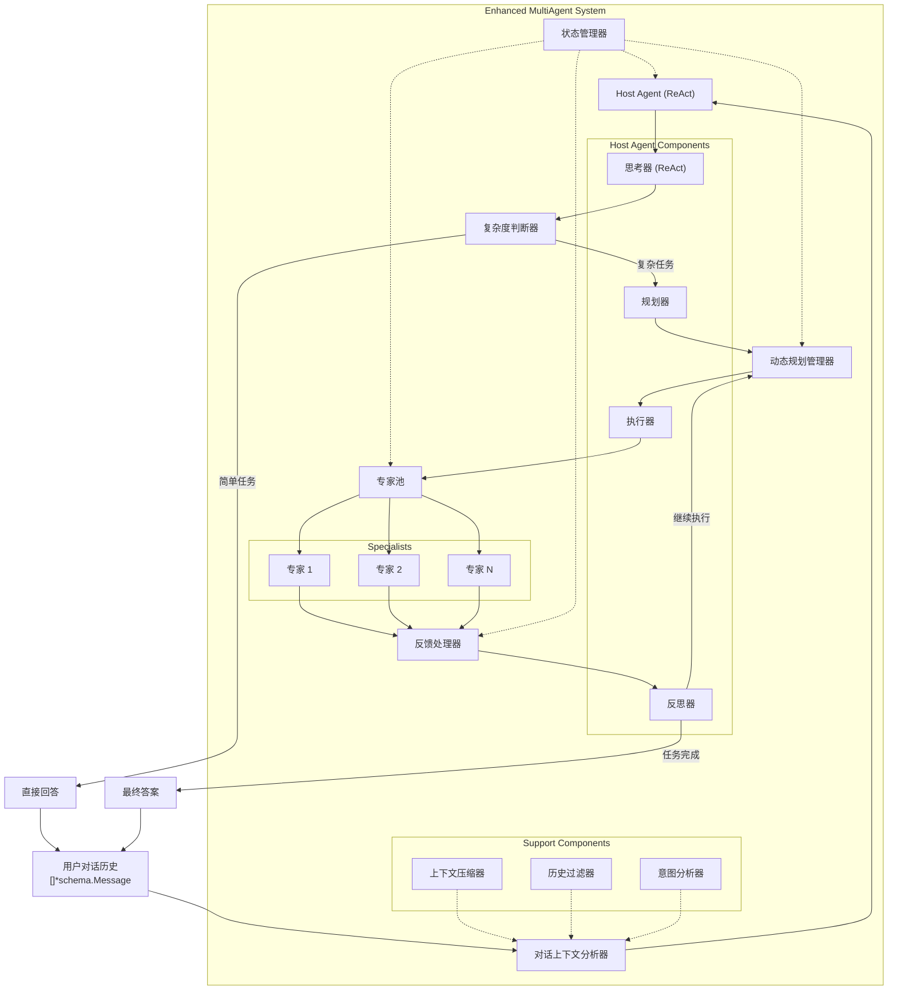
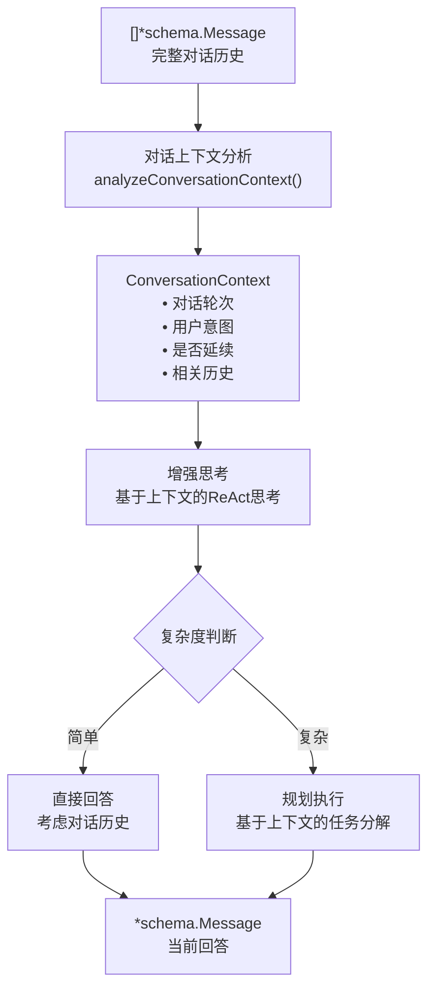

# Eino Enhanced MultiAgent 系统架构设计

## 核心架构

### 系统组件



### 数据流架构

```mermaid
flowchart TD
    START(["开始"]) --> INPUT["对话历史输入<br/>[]*schema.Message<br/><br/>包含完整对话历史<br/>每次调用状态重新初始化"]
    
    INPUT --> CONTEXT_ANALYZE["对话上下文分析<br/>analyzeConversationContext<br/><br/>状态更新:<br/>• ConversationContext 设置<br/>• 对话轮次分析<br/>• 意图识别<br/>• 历史关联性判断"]
    
    CONTEXT_ANALYZE --> HOST_THINK["Host Think Node<br/>输入: []*schema.Message<br/>输出: *schema.Message<br/><br/>状态更新:<br/>• OriginalMessages 保存<br/>• CurrentThinkingResult 设置<br/>• ThinkingHistory 追加<br/>• 基于对话上下文的ReAct思考"]
    
    HOST_THINK --> COMPLEXITY_BRANCH{"复杂度判断分支<br/>ComplexityBranch<br/><br/>状态读取:<br/>• CurrentThinkingResult.Complexity<br/>• ConversationContext.IsContinuation"}
    
    COMPLEXITY_BRANCH -->|简单任务| DIRECT_ANSWER["Direct Answer Node<br/>输入: *schema.Message<br/>输出: *schema.Message<br/><br/>状态更新:<br/>• IsSimpleTask = true<br/>• IsCompleted = true<br/>• FinalAnswer 设置<br/>• 考虑对话历史的直接回答"]
    
    COMPLEXITY_BRANCH -->|复杂任务| PLAN_CREATE["Plan Creation Node<br/>输入: *schema.Message<br/>输出: *schema.Message<br/><br/>状态更新:<br/>• CurrentPlan 创建<br/>• Version = 1<br/>• IsSimpleTask = false<br/>• 基于上下文的任务分解"]
    
    PLAN_CREATE --> PLAN_EXECUTE["Plan Execution Node<br/>输入: *schema.Message<br/>输出: *schema.Message<br/><br/>状态更新:<br/>• CurrentExecution 设置<br/>• PlanStep.Status = Executing<br/>• CurrentPlan.CurrentStep 更新<br/>• 传递对话上下文"]
    
    PLAN_EXECUTE --> SPECIALIST_BRANCH{"Specialist Branch<br/>MultiBranch<br/><br/>状态读取:<br/>• CurrentExecution.PlanStep<br/>• AssignedTo 专家选择<br/>• 对话上下文相关的专家匹配"}
    
    SPECIALIST_BRANCH --> SPEC1["Specialist 1<br/>输入: *schema.Message<br/>输出: *schema.Message<br/><br/>状态更新:<br/>• CurrentSpecialistResults[name] 设置<br/>• 执行时长记录<br/>• 置信度评估<br/>• 上下文感知的专家执行"]
    SPECIALIST_BRANCH --> SPEC2["Specialist 2<br/>输入: *schema.Message<br/>输出: *schema.Message<br/><br/>状态更新:<br/>• CurrentSpecialistResults[name] 设置<br/>• 执行时长记录<br/>• 置信度评估<br/>• 上下文感知的专家执行"]
    SPECIALIST_BRANCH --> SPECN["Specialist N<br/>输入: *schema.Message<br/>输出: *schema.Message<br/><br/>状态更新:<br/>• CurrentSpecialistResults[name] 设置<br/>• 执行时长记录<br/>• 置信度评估<br/>• 上下文感知的专家执行"]
    
    SPEC1 --> RESULT_COLLECT["Result Collector<br/>输入: *schema.Message<br/>输出: *schema.Message<br/><br/>状态更新:<br/>• CurrentCollectedResults 设置<br/>• ExecutionHistory 追加<br/>• CurrentRound 记录<br/>• 结果汇总和质量评估"]
    SPEC2 --> RESULT_COLLECT
    SPECN --> RESULT_COLLECT
    
    RESULT_COLLECT --> FEEDBACK_PROCESS["Feedback Processor<br/>输入: *schema.Message<br/>输出: *schema.Message<br/><br/>状态更新:<br/>• CurrentFeedbackResult 设置<br/>• ShouldContinue 判断<br/>• SuggestedAction 确定<br/>• 对话连贯性评估"]
    
    FEEDBACK_PROCESS --> REFLECT_BRANCH{"Reflection Branch<br/>StreamBranch<br/><br/>状态读取:<br/>• CurrentFeedbackResult.ShouldContinue<br/>• 最大轮次检查<br/>• 对话完整性评估"}
    
    REFLECT_BRANCH -->|需要继续| PLAN_UPDATE["Plan Update Node<br/>输入: *schema.Message<br/>输出: *schema.Message<br/><br/>状态更新:<br/>• CurrentPlan.Version++<br/>• UpdateHistory 追加<br/>• CurrentRound++<br/>• Steps 动态调整<br/>• 基于反馈的规划优化"]
    REFLECT_BRANCH -->|任务完成| FINAL_ANSWER["Final Answer Node<br/>输入: *schema.Message<br/>输出: *schema.Message<br/><br/>状态更新:<br/>• IsCompleted = true<br/>• FinalAnswer 设置<br/>• 对话历史整合的最终回答"]
    
    PLAN_UPDATE --> PLAN_EXECUTE
    
    DIRECT_ANSWER --> END(["结束"])
    FINAL_ANSWER --> END
    
    style CONTEXT_ANALYZE fill:#e3f2fd
    style HOST_THINK fill:#e1f5fe
    style PLAN_CREATE fill:#f3e5f5
    style PLAN_EXECUTE fill:#e8f5e8
    style FEEDBACK_PROCESS fill:#fff3e0
    style COMPLEXITY_BRANCH fill:#ffebee
    style SPECIALIST_BRANCH fill:#f1f8e9
    style REFLECT_BRANCH fill:#fce4ec
    style PLAN_UPDATE fill:#e8f5e8
    style DIRECT_ANSWER fill:#f1f8e9
    style FINAL_ANSWER fill:#e8f5e8
```



## 对话场景设计调整

### 核心设计
#### 1. 接口签名

```go
// 对话场景：历史消息输入
func (agent *EnhancedMultiAgent) Invoke(ctx context.Context, input []*schema.Message) (*schema.Message, error)
```

#### 2. 状态生命周期管理

- **无状态原则**: 每次调用都重新初始化`EnhancedState`
- **历史感知**: 通过输入的`[]*schema.Message`获取完整对话历史
- **上下文分析**: 新增`ConversationContext`分析对话上下文
- **会话追踪**: 通过`SessionID`进行日志追踪，但不保持状态

#### 3. 对话上下文处理流程



#### 4. 关键函数新增

```go
// 对话上下文分析
func analyzeConversationContext(messages []*schema.Message) *ConversationContext

// 对话感知的思考提示构建
func buildConversationalThinkingPrompt(messages []*schema.Message, ctx *ConversationContext, state *EnhancedState) *schema.Message

// 上下文相关性过滤
func filterRelevantHistory(messages []*schema.Message, currentQuery string) []*schema.Message

// 对话历史压缩
func compressConversationHistory(messages []*schema.Message, maxLength int) []*schema.Message
```

### 对话场景特殊处理

#### 1. 首次对话 vs 延续对话

- **首次对话**: `ConversationContext.IsFirstTurn = true`，专注于理解用户需求
- **延续对话**: `ConversationContext.IsContinuation = true`，需要理解上下文关联

#### 2. 上下文窗口管理

- **智能截断**: 保留最相关的历史消息
- **上下文压缩**: 对长对话进行摘要压缩
- **关键信息保持**: 确保重要上下文不丢失

#### 3. 意图理解增强

- **意图分析**: 分析用户当前问题的意图
- **关联检测**: 检测与历史对话的关联性
- **澄清机制**: 当意图不明确时主动澄清

### 性能优化考虑

#### 1. 上下文处理优化

- **并行分析**: 对话上下文分析与思考过程并行
- **缓存机制**: 对重复的上下文分析结果进行缓存
- **增量处理**: 对新增消息进行增量分析

#### 2. 内存管理

- **及时清理**: 每次调用结束后清理状态
- **大对话处理**: 对超长对话历史进行分段处理
- **内存监控**: 监控内存使用情况，防止内存泄漏

## TaskPlan 动态更新机制

### 规划的动态特性

增强版MultiAgent系统的核心特性之一是**动态任务规划**。与传统的静态规划不同，本系统的TaskPlan具有以下动态特性：

#### 1. 动态步骤管理
- **步骤添加**: 根据执行过程中发现的新需求，动态添加新的执行步骤
- **步骤修改**: 根据执行反馈调整现有步骤的描述、优先级或分配
- **步骤删除**: 移除不再需要或已过时的步骤
- **步骤重排**: 根据依赖关系和优先级重新排序步骤

#### 2. 版本控制机制
```go
// 规划更新示例
func updatePlanDynamically(currentPlan *TaskPlan, feedback *FeedbackResult) *TaskPlan {
    newPlan := currentPlan.Clone()
    newPlan.Version++
    
    // 根据反馈类型进行不同的更新操作
    switch feedback.SuggestedAction {
    case ActionTypeAddStep:
        newStep := createStepFromFeedback(feedback)
        newPlan.Steps = append(newPlan.Steps, newStep)
        newPlan.TotalSteps++
        
    case ActionTypeModifyStep:
        modifyExistingStep(newPlan, feedback)
        
    case ActionTypeReorderSteps:
        reorderSteps(newPlan, feedback)
    }
    
    // 记录更新历史
    update := &PlanUpdate{
        Version:     newPlan.Version,
        UpdateType:  getUpdateType(feedback),
        Description: feedback.PlanUpdateSuggestion,
        Timestamp:   time.Now(),
        Changes:     extractChanges(currentPlan, newPlan),
    }
    newPlan.UpdateHistory = append(newPlan.UpdateHistory, update)
    
    return newPlan
}
```

#### 3. 依赖关系处理
- **前置依赖**: 确保步骤按正确顺序执行
- **并行执行**: 识别可并行执行的独立步骤
- **条件执行**: 根据前序步骤结果决定是否执行某些步骤

#### 4. 智能规划调整
- **失败恢复**: 当某个步骤失败时，自动调整后续规划
- **效率优化**: 根据执行效果动态优化步骤顺序和分配
- **资源适配**: 根据可用专家能力调整任务分配