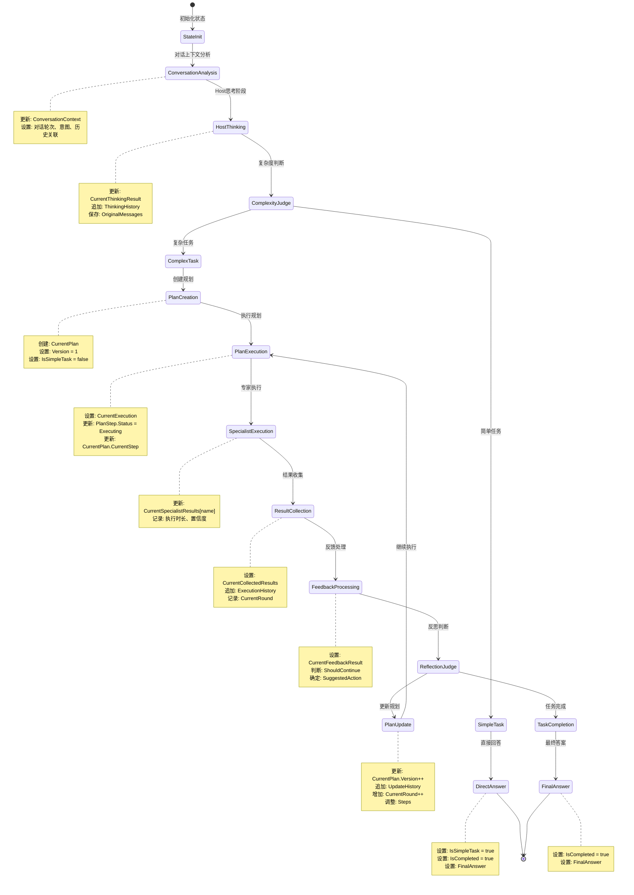

# Eino Enhanced MultiAgent 状态管理详解

## 全局状态 EnhancedState 的数据流转

### 状态结构概览

```go
type EnhancedState struct {
    // 基础信息
    SessionID           string                 `json:"session_id"`
    StartTime          time.Time              `json:"start_time"`
    LastUpdateTime     time.Time              `json:"last_update_time"`
    
    // 对话上下文 (新增)
    ConversationContext *ConversationContext   `json:"conversation_context"`
    
    // 原始输入
    OriginalMessages   []*schema.Message      `json:"original_messages"`
    
    // 思考阶段
    CurrentThinkingResult *ThinkingResult     `json:"current_thinking_result"`
    ThinkingHistory      []*ThinkingResult    `json:"thinking_history"`
    
    // 任务规划
    CurrentPlan         *TaskPlan             `json:"current_plan"`
    PlanHistory         []*TaskPlan           `json:"plan_history"`
    
    // 执行状态
    CurrentExecution    *ExecutionContext     `json:"current_execution"`
    ExecutionHistory    []*ExecutionRecord    `json:"execution_history"`
    
    // 专家结果
    CurrentSpecialistResults map[string]*SpecialistResult `json:"current_specialist_results"`
    
    // 结果收集
    CurrentCollectedResults *CollectedResults  `json:"current_collected_results"`
    
    // 反馈处理
    CurrentFeedbackResult *FeedbackResult     `json:"current_feedback_result"`
    
    // 执行控制
    CurrentRound        int                   `json:"current_round"`
    MaxRounds          int                   `json:"max_rounds"`
    IsCompleted        bool                  `json:"is_completed"`
    IsSimpleTask       bool                  `json:"is_simple_task"`
    
    // 最终结果
    FinalAnswer        *schema.Message       `json:"final_answer"`
    
    // 元数据
    Metadata           map[string]interface{} `json:"metadata"`
}
```

### 状态流转图



## 关键状态转换点

### 1. 对话上下文分析阶段

```go
// StatePreHandler: 对话上下文分析
func (h *ConversationAnalysisHandler) PreHandle(ctx context.Context, state *EnhancedState, input []*schema.Message) error {
    // 分析对话上下文
    conversationCtx := analyzeConversationContext(input)
    
    // 更新状态
    state.ConversationContext = conversationCtx
    state.OriginalMessages = input
    state.LastUpdateTime = time.Now()
    
    return nil
}
```

### 2. Host思考阶段

```go
// StatePreHandler: 准备思考输入
func (h *HostThinkHandler) PreHandle(ctx context.Context, state *EnhancedState, input []*schema.Message) error {
    // 构建思考提示，包含对话上下文
    thinkingPrompt := buildConversationalThinkingPrompt(state.OriginalMessages, state.ConversationContext, state)
    
    // 更新输入消息
    return updateInputMessage(input, thinkingPrompt)
}

// StatePostHandler: 处理思考结果
func (h *HostThinkHandler) PostHandle(ctx context.Context, state *EnhancedState, output *schema.Message) error {
    // 解析思考结果
    thinkingResult, err := parseThinkingResult(output)
    if err != nil {
        return err
    }
    
    // 更新状态
    state.CurrentThinkingResult = thinkingResult
    state.ThinkingHistory = append(state.ThinkingHistory, thinkingResult)
    state.LastUpdateTime = time.Now()
    
    return nil
}
```

### 3. 复杂度判断分支

```go
// 复杂度判断逻辑
func (b *ComplexityBranch) Decide(ctx context.Context, state *EnhancedState) (string, error) {
    if state.CurrentThinkingResult == nil {
        return "", errors.New("thinking result not available")
    }
    
    // 基于思考结果和对话上下文判断复杂度
    complexity := state.CurrentThinkingResult.Complexity
    isContinuation := state.ConversationContext.IsContinuation
    
    // 延续对话可能需要更复杂的处理
    if isContinuation && complexity >= TaskComplexityMedium {
        return "complex", nil
    }
    
    if complexity >= TaskComplexityHigh {
        return "complex", nil
    }
    
    return "simple", nil
}
```

### 4. 规划创建阶段

```go
// StatePostHandler: 处理规划创建结果
func (h *PlanCreationHandler) PostHandle(ctx context.Context, state *EnhancedState, output *schema.Message) error {
    // 解析规划结果
    plan, err := parsePlanFromMessage(output)
    if err != nil {
        return err
    }
    
    // 设置规划版本和状态
    plan.Version = 1
    plan.CreatedAt = time.Now()
    plan.Status = PlanStatusActive
    
    // 基于对话上下文调整规划
    if state.ConversationContext.IsContinuation {
        adjustPlanForContinuation(plan, state.ConversationContext)
    }
    
    // 更新状态
    state.CurrentPlan = plan
    state.IsSimpleTask = false
    state.LastUpdateTime = time.Now()
    
    return nil
}
```

### 5. 专家执行阶段

```go
// StatePreHandler: 准备专家执行
func (h *SpecialistHandler) PreHandle(ctx context.Context, state *EnhancedState, input []*schema.Message) error {
    if state.CurrentExecution == nil {
        return errors.New("execution context not available")
    }
    
    // 构建专家执行提示，包含对话上下文
    specialistPrompt := buildSpecialistPrompt(
        state.CurrentExecution.PlanStep,
        state.ConversationContext,
        state.OriginalMessages,
    )
    
    return updateInputMessage(input, specialistPrompt)
}

// StatePostHandler: 处理专家结果
func (h *SpecialistHandler) PostHandle(ctx context.Context, state *EnhancedState, output *schema.Message) error {
    specialistName := h.GetSpecialistName()
    
    // 解析专家结果
    result, err := parseSpecialistResult(output, specialistName)
    if err != nil {
        return err
    }
    
    // 更新状态
    if state.CurrentSpecialistResults == nil {
        state.CurrentSpecialistResults = make(map[string]*SpecialistResult)
    }
    state.CurrentSpecialistResults[specialistName] = result
    state.LastUpdateTime = time.Now()
    
    return nil
}
```

### 6. 反馈处理阶段

```go
// StatePostHandler: 处理反馈结果
func (h *FeedbackHandler) PostHandle(ctx context.Context, state *EnhancedState, output *schema.Message) error {
    // 解析反馈结果
    feedback, err := parseFeedbackResult(output)
    if err != nil {
        return err
    }
    
    // 基于对话上下文调整反馈判断
    if state.ConversationContext.IsContinuation {
        adjustFeedbackForContinuation(feedback, state.ConversationContext)
    }
    
    // 更新状态
    state.CurrentFeedbackResult = feedback
    state.LastUpdateTime = time.Now()
    
    return nil
}
```

### 7. 规划更新阶段

```go
// StatePostHandler: 处理规划更新
func (h *PlanUpdateHandler) PostHandle(ctx context.Context, state *EnhancedState, output *schema.Message) error {
    if state.CurrentPlan == nil || state.CurrentFeedbackResult == nil {
        return errors.New("plan or feedback not available")
    }
    
    // 动态更新规划
    updatedPlan := updatePlanDynamically(state.CurrentPlan, state.CurrentFeedbackResult)
    
    // 保存历史版本
    state.PlanHistory = append(state.PlanHistory, state.CurrentPlan)
    
    // 更新当前规划
    state.CurrentPlan = updatedPlan
    state.CurrentRound++
    state.LastUpdateTime = time.Now()
    
    return nil
}
```

## 状态一致性保证

### 1. 原子性更新

```go
// 原子性状态更新
func (s *EnhancedState) AtomicUpdate(updateFunc func(*EnhancedState) error) error {
    s.mu.Lock()
    defer s.mu.Unlock()
    
    // 创建状态快照
    snapshot := s.Clone()
    
    // 执行更新
    if err := updateFunc(s); err != nil {
        // 回滚到快照
        *s = *snapshot
        return err
    }
    
    // 更新时间戳
    s.LastUpdateTime = time.Now()
    return nil
}
```

### 2. 版本控制

```go
// 状态版本控制
type StateVersion struct {
    Version   int       `json:"version"`
    Timestamp time.Time `json:"timestamp"`
    Checksum  string    `json:"checksum"`
}

func (s *EnhancedState) GetVersion() *StateVersion {
    return &StateVersion{
        Version:   s.calculateVersion(),
        Timestamp: s.LastUpdateTime,
        Checksum:  s.calculateChecksum(),
    }
}
```

### 3. 历史追踪

```go
// 状态变更历史
type StateChange struct {
    Field     string      `json:"field"`
    OldValue  interface{} `json:"old_value"`
    NewValue  interface{} `json:"new_value"`
    Timestamp time.Time   `json:"timestamp"`
}

func (s *EnhancedState) TrackChange(field string, oldValue, newValue interface{}) {
    change := &StateChange{
        Field:     field,
        OldValue:  oldValue,
        NewValue:  newValue,
        Timestamp: time.Now(),
    }
    
    if s.Metadata["changes"] == nil {
        s.Metadata["changes"] = []*StateChange{}
    }
    
    changes := s.Metadata["changes"].([]*StateChange)
    s.Metadata["changes"] = append(changes, change)
}
```

## 状态序列化支持

### 1. JSON序列化

```go
// 状态序列化
func (s *EnhancedState) MarshalJSON() ([]byte, error) {
    type Alias EnhancedState
    return json.Marshal(&struct {
        *Alias
        SerializedAt time.Time `json:"serialized_at"`
    }{
        Alias:        (*Alias)(s),
        SerializedAt: time.Now(),
    })
}

// 状态反序列化
func (s *EnhancedState) UnmarshalJSON(data []byte) error {
    type Alias EnhancedState
    aux := &struct {
        *Alias
        SerializedAt time.Time `json:"serialized_at"`
    }{
        Alias: (*Alias)(s),
    }
    
    if err := json.Unmarshal(data, &aux); err != nil {
        return err
    }
    
    return s.validateState()
}
```

### 2. 状态验证

```go
// 状态完整性验证
func (s *EnhancedState) validateState() error {
    if s.SessionID == "" {
        return errors.New("session ID is required")
    }
    
    if s.StartTime.IsZero() {
        return errors.New("start time is required")
    }
    
    // 验证状态一致性
    if s.IsCompleted && s.FinalAnswer == nil {
        return errors.New("completed task must have final answer")
    }
    
    if s.CurrentPlan != nil && s.IsSimpleTask {
        return errors.New("simple task should not have plan")
    }
    
    return nil
}
```

### 3. 状态压缩

```go
// 状态压缩（用于长期存储）
func (s *EnhancedState) Compress() (*CompressedState, error) {
    compressed := &CompressedState{
        SessionID:    s.SessionID,
        StartTime:    s.StartTime,
        IsCompleted:  s.IsCompleted,
        FinalAnswer:  s.FinalAnswer,
    }
    
    // 压缩历史数据
    if len(s.ThinkingHistory) > 0 {
        compressed.ThinkingSummary = summarizeThinkingHistory(s.ThinkingHistory)
    }
    
    if len(s.ExecutionHistory) > 0 {
        compressed.ExecutionSummary = summarizeExecutionHistory(s.ExecutionHistory)
    }
    
    return compressed, nil
}
```