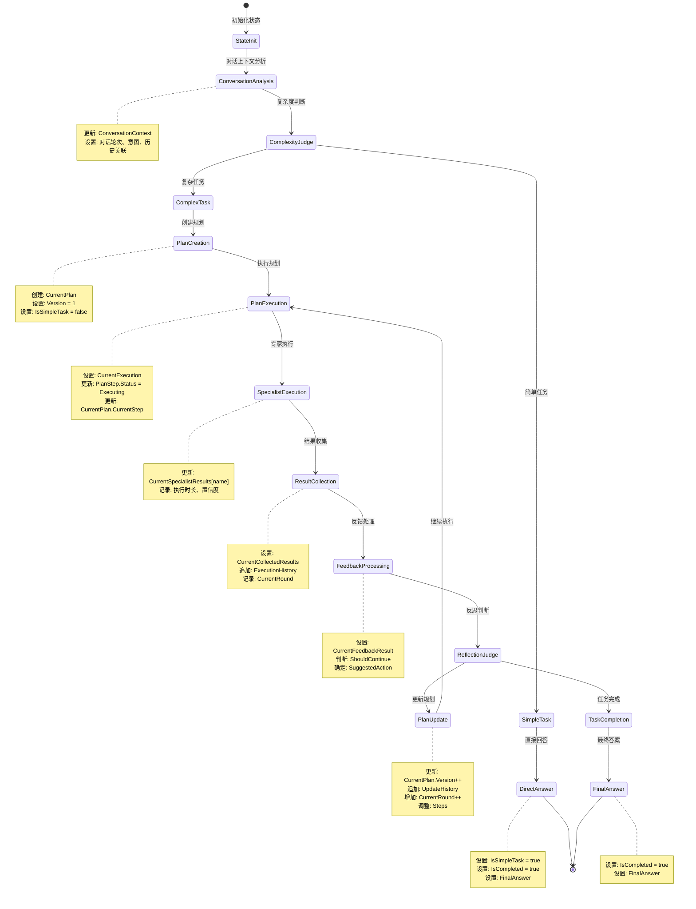

# Eino Enhanced MultiAgent 状态管理详解

## 全局状态 EnhancedState 的数据流转

### 状态结构概览

```go
type EnhancedState struct {
    // 基础信息
    RoundNumber int       `json:"round_number"`
    StartTime   time.Time `json:"start_time"`

    // 对话上下文
    ConversationContext *ConversationContext `json:"conversation_context,omitempty"`
    OriginalMessages    []*schema.Message    `json:"original_messages"`

    // 任务规划
    CurrentPlan *TaskPlan   `json:"current_plan,omitempty"`
    PlanHistory []*TaskPlan `json:"plan_history,omitempty"`

    // 执行状态
    ExecutionStatus  ExecutionStatus    `json:"execution_status"`
    CurrentStep      string             `json:"current_step,omitempty"`
    ExecutionHistory []*ExecutionRecord `json:"execution_history,omitempty"`

    // 专家结果
    SpecialistResults map[string]*StepResult `json:"specialist_results,omitempty"`

    // 收集结果
    CollectedResults []*schema.Message `json:"collected_results,omitempty"`
    FinalResult      *schema.Message   `json:"final_result,omitempty"`

    // 反馈和反思
    FeedbackHistory []map[string]any `json:"feedback_history,omitempty"`
    ReflectionCount int              `json:"reflection_count"`

    // 执行控制
    MaxRounds      int  `json:"max_rounds"`
    ShouldContinue bool `json:"should_continue"`
    IsCompleted    bool `json:"is_completed"`

    // 最终答案
    FinalAnswer *schema.Message `json:"final_answer,omitempty"`

    // 元数据
    Metadata map[string]any `json:"metadata,omitempty"`
}
```

### 状态流转图



## ExecutionStatus 枚举定义

```go
type ExecutionStatus string

const (
    ExecutionStatusPending    ExecutionStatus = "pending"
    ExecutionStatusAnalyzing  ExecutionStatus = "analyzing"
    ExecutionStatusPlanning   ExecutionStatus = "planning"
    ExecutionStatusExecuting  ExecutionStatus = "executing"
    ExecutionStatusCollecting ExecutionStatus = "collecting"
    ExecutionStatusCompleted  ExecutionStatus = "completed"
    ExecutionStatusFailed     ExecutionStatus = "failed"
)
```

## 状态转换详细描述

### 1. INPUT → CONTEXT_ANALYZE
- **触发条件**: 接收到用户输入
- **状态更新**: 
  - 保存 `OriginalMessages`
  - 设置 `ExecutionStatus = ExecutionStatusAnalyzing`
  - 设置 `CurrentStep = "context_analysis"`
- **数据流**: 用户消息 → 上下文分析器

### 2. CONTEXT_ANALYZE → COMPLEXITY_BRANCH
- **触发条件**: 上下文分析完成
- **状态更新**:
  - 更新 `ConversationContext`
  - 设置 `ExecutionStatus = ExecutionStatusPlanning`
- **数据流**: 分析结果 → 复杂度判断

### 3. COMPLEXITY_BRANCH → DIRECT_ANSWER/PLAN_CREATE
- **触发条件**: 复杂度判断完成
- **分支逻辑**:
  - 简单任务: → DIRECT_ANSWER
  - 复杂任务: → PLAN_CREATE
- **状态更新**: 设置执行路径

### 4. PLAN_CREATE → PLAN_EXECUTE
- **触发条件**: 初始计划创建完成
- **状态更新**:
  - 设置 `CurrentPlan`
  - 更新 `PlanHistory`
  - 设置 `ExecutionStatus = ExecutionStatusExecuting`
- **数据流**: 计划 → 计划执行器

### 5. PLAN_EXECUTE → SPECIALIST_WORK
- **触发条件**: 计划执行开始
- **状态更新**:
  - 设置 `ExecutionStatus = ExecutionStatusExecuting`
  - 设置 `CurrentStep = "execution"`
- **数据流**: 执行步骤 → 专家系统

### 6. SPECIALIST_WORK → COLLECT_RESULTS
- **触发条件**: 专家工作完成
- **状态更新**:
  - 更新 `SpecialistResults`
  - 添加 `ExecutionHistory`
- **数据流**: 专家结果 → 结果收集器

### 7. COLLECT_RESULTS → FEEDBACK_PROCESS
- **触发条件**: 结果收集完成
- **状态更新**:
  - 更新 `CollectedResults`
  - 设置 `ExecutionStatus = ExecutionStatusCollecting`
- **数据流**: 收集结果 → 反馈处理器

### 8. FEEDBACK_PROCESS → PLAN_EXECUTE/PLAN_UPDATE/FINAL_ANSWER
- **触发条件**: 反馈处理完成
- **分支逻辑**:
  - 执行完成: → FINAL_ANSWER
  - 未完成且不需要更新计划: → PLAN_EXECUTE
  - 未完成但需要更新计划: → PLAN_UPDATE
- **状态更新**:
  - 更新 `FeedbackHistory`
  - 增加 `ReflectionCount`
  - 根据分支设置相应的 `ExecutionStatus`

### 9. DIRECT_ANSWER/FINAL_ANSWER → END
- **触发条件**: 答案生成完成
- **状态更新**:
  - 设置 `FinalAnswer`
  - 标记 `IsCompleted = true`
  - 设置 `ExecutionStatus = ExecutionStatusCompleted`
- **数据流**: 最终答案 → 用户

## 关键状态转换点

### 1. 复杂度判断点 (CONTEXT_ANALYZE → COMPLEXITY_BRANCH)
这是系统的第一个重要决策点：
- **判断依据**: `ConversationContext.Complexity`
- **分支条件**: 
  - `simple` → 直接回答
  - `complex` → 进入规划阶段
- **状态影响**: 决定后续执行路径

### 2. 反馈决策点 (FEEDBACK_PROCESS → PLAN_UPDATE/FINAL_ANSWER)
这是系统的循环控制点：
- **判断依据**: 
  - 任务完成度
  - 结果质量
  - 轮次限制
- **分支条件**:
  - 需要改进 → 返回规划更新
  - 满足要求 → 生成最终答案
- **状态影响**: 控制迭代次数和质量

### 3. 轮次控制点
每个主要阶段都会检查：
- `RoundNumber` vs `MaxRounds`
- `ShouldContinue` 标志
- 强制退出条件
- 资源消耗控制

## 统一状态更新方法

### 1. 基础字段更新
```go
// 更新轮次
func (s *EnhancedState) NextRound() {
    s.RoundNumber++
}

// 设置执行状态
func (s *EnhancedState) SetExecutionStatus(status ExecutionStatus) {
    s.ExecutionStatus = status
}

// 设置当前步骤
func (s *EnhancedState) SetCurrentStep(step string) {
    s.CurrentStep = step
}

// 设置是否继续
func (s *EnhancedState) SetShouldContinue(should bool) {
    s.ShouldContinue = should
}

// 设置完成状态
func (s *EnhancedState) SetCompleted(completed bool) {
    s.IsCompleted = completed
}
```

### 2. 对话上下文更新
```go
// 更新对话上下文
func (s *EnhancedState) UpdateConversationContext(ctx *ConversationContext) {
    s.ConversationContext = ctx
}
```

### 3. 计划管理
```go
// 设置当前计划
func (s *EnhancedState) SetCurrentPlan(plan *TaskPlan) {
    if s.CurrentPlan != nil {
        s.PlanHistory = append(s.PlanHistory, s.CurrentPlan)
    }
    s.CurrentPlan = plan
}

// 更新计划历史
func (s *EnhancedState) AddPlanToHistory(plan *TaskPlan) {
    s.PlanHistory = append(s.PlanHistory, plan)
}
```

### 4. 执行记录管理
```go
// 添加执行记录
func (s *EnhancedState) AddExecutionRecord(record *ExecutionRecord) {
    s.ExecutionHistory = append(s.ExecutionHistory, record)
}

// 添加思考记录
func (s *EnhancedState) AddThinkingRecord(record *ExecutionRecord) {
    s.ThinkingHistory = append(s.ThinkingHistory, record)
}
```

### 5. 专家结果管理
```go
// 更新专家结果
func (s *EnhancedState) UpdateSpecialistResult(specialist string, result *StepResult) {
    if s.SpecialistResults == nil {
        s.SpecialistResults = make(map[string]*StepResult)
    }
    s.SpecialistResults[specialist] = result
}

// 清空专家结果
func (s *EnhancedState) ClearSpecialistResults() {
    s.SpecialistResults = make(map[string]*StepResult)
}
```

### 6. 结果收集管理
```go
// 添加收集结果
func (s *EnhancedState) AddCollectedResult(result *schema.Message) {
    s.CollectedResults = append(s.CollectedResults, result)
}

// 设置最终结果
func (s *EnhancedState) SetFinalResult(result *schema.Message) {
    s.FinalResult = result
}

// 设置最终答案
func (s *EnhancedState) SetFinalAnswer(answer *schema.Message) {
    s.FinalAnswer = answer
}
```

### 7. 反馈管理
```go
// 添加反馈记录
func (s *EnhancedState) AddFeedbackRecord(feedback map[string]any) {
    s.FeedbackHistory = append(s.FeedbackHistory, feedback)
}

// 增加反思次数
func (s *EnhancedState) IncrementReflectionCount() {
    s.ReflectionCount++
}
```

### 8. 元数据管理
```go
// 设置元数据
func (s *EnhancedState) SetMetadata(key string, value any) {
    if s.Metadata == nil {
        s.Metadata = make(map[string]any)
    }
    s.Metadata[key] = value
}

// 获取元数据
func (s *EnhancedState) GetMetadata(key string) (any, bool) {
    if s.Metadata == nil {
        return nil, false
    }
    value, exists := s.Metadata[key]
    return value, exists
}
```

## 各阶段状态更新

### 1. 上下文分析阶段
**进入阶段时更新：**
- `SetExecutionStatus(ExecutionStatusAnalyzing)`
- `SetCurrentStep("context_analysis")`

**完成阶段时更新：**
- `UpdateConversationContext(ctx)`
- `SetExecutionStatus(ExecutionStatusPlanning)`

### 2. 复杂度判断阶段
**完成判断时更新：**
- 根据判断结果设置后续流程路径
- 简单任务：`SetExecutionStatus(ExecutionStatusExecuting)`
- 复杂任务：保持 `ExecutionStatusPlanning`

### 3. 计划创建阶段
**进入阶段时更新：**
- `SetCurrentStep("planning")`

**完成阶段时更新：**
- `SetCurrentPlan(plan)`
- `SetExecutionStatus(ExecutionStatusExecuting)`
- `SetCurrentStep("execution")`

### 4. 计划执行阶段
**进入阶段时更新：**
- `SetCurrentStep("execution")`
- `ClearSpecialistResults()` (清空上轮结果)

**执行过程中更新：**
- `UpdateSpecialistResult(specialist, result)` (每个专家完成时)
- `AddExecutionRecord(record)` (记录执行过程)

### 5. 结果收集阶段
**进入阶段时更新：**
- `SetExecutionStatus(ExecutionStatusCollecting)`
- `SetCurrentStep("collecting")`

**收集过程中更新：**
- `AddCollectedResult(result)` (收集各专家结果)
- `SetFinalResult(result)` (设置本轮最终结果)

### 6. 反馈处理阶段
**完成反馈时更新：**
- `AddFeedbackRecord(feedback)`
- `IncrementReflectionCount()`
- 根据反馈结果设置下一步：
  - 完成：`SetExecutionStatus(ExecutionStatusCompleted)`, `SetCompleted(true)`, `SetFinalAnswer(answer)`
  - 继续执行：`SetExecutionStatus(ExecutionStatusExecuting)`
  - 更新计划：`SetExecutionStatus(ExecutionStatusPlanning)`

### 7. 计划更新阶段
**更新计划时：**
- `AddPlanToHistory(s.CurrentPlan)` (保存当前计划到历史)
- `SetCurrentPlan(updatedPlan)` (设置新计划)
- `NextRound()` (增加轮次)
- `SetExecutionStatus(ExecutionStatusExecuting)` (准备执行新计划)

### 8. 直接回答阶段
**生成答案时更新：**
- `SetFinalAnswer(answer)`
- `SetExecutionStatus(ExecutionStatusCompleted)`
- `SetCompleted(true)`
- `SetShouldContinue(false)`

### 9. 最终完成阶段
**任务完成时更新：**
- `SetFinalAnswer(answer)`
- `SetExecutionStatus(ExecutionStatusCompleted)`
- `SetCompleted(true)`
- `SetShouldContinue(false)`
- `SetMetadata("completion_time", time.Now())`

## 状态序列化支持

### 1. JSON序列化

```go
// 状态序列化
func (s *EnhancedState) MarshalJSON() ([]byte, error) {
    type Alias EnhancedState
    return json.Marshal(&struct {
        *Alias
        SerializedAt time.Time `json:"serialized_at"`
    }{
        Alias:        (*Alias)(s),
        SerializedAt: time.Now(),
    })
}

// 状态反序列化
func (s *EnhancedState) UnmarshalJSON(data []byte) error {
    type Alias EnhancedState
    aux := &struct {
        *Alias
        SerializedAt time.Time `json:"serialized_at"`
    }{
        Alias: (*Alias)(s),
    }
    
    if err := json.Unmarshal(data, &aux); err != nil {
        return err
    }
    
    return s.validateState()
}
```

### 2. 状态验证

```go
// 状态完整性验证
func (s *EnhancedState) validateState() error {
    if s.SessionID == "" {
        return errors.New("session ID is required")
    }
    
    if s.StartTime.IsZero() {
        return errors.New("start time is required")
    }
    
    // 验证状态一致性
    if s.IsCompleted && s.FinalAnswer == nil {
        return errors.New("completed task must have final answer")
    }
    
    if s.CurrentPlan != nil && s.IsSimpleTask {
        return errors.New("simple task should not have plan")
    }
    
    return nil
}
```

### 3. 状态压缩

```go
// 状态压缩（用于长期存储）
func (s *EnhancedState) Compress() (*CompressedState, error) {
    compressed := &CompressedState{
        SessionID:    s.SessionID,
        StartTime:    s.StartTime,
        IsCompleted:  s.IsCompleted,
        FinalAnswer:  s.FinalAnswer,
    }
    
    // 压缩历史数据
    if len(s.ThinkingHistory) > 0 {
        compressed.ThinkingSummary = summarizeThinkingHistory(s.ThinkingHistory)
    }
    
    if len(s.ExecutionHistory) > 0 {
        compressed.ExecutionSummary = summarizeExecutionHistory(s.ExecutionHistory)
    }
    
    return compressed, nil
}
```