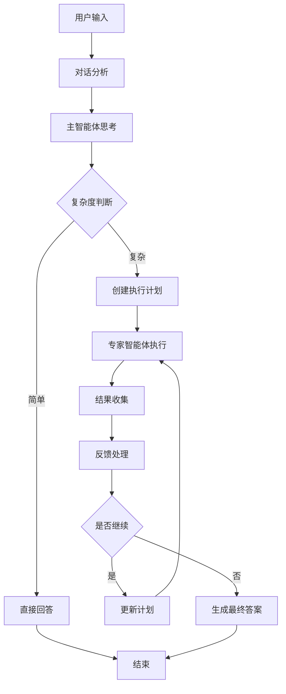

# Enhanced Multi-Agent System

基于CloudWeGo/Eino框架的增强多智能体系统，提供了高级的思考、规划和协作能力。

## 功能特性

### 🧠 智能思考能力
- **深度思考模式**：支持多步骤思考过程
- **复杂度分析**：自动评估任务复杂度
- **思考历史记录**：完整的思考过程追踪

### 📋 任务规划能力
- **动态规划**：根据任务复杂度动态生成执行计划
- **依赖分析**：自动识别任务间的依赖关系
- **计划更新**：支持执行过程中的计划调整

### 👥 多智能体协作
- **专家智能体**：支持多个专业领域的智能体
- **并行执行**：支持多个智能体并行处理任务
- **结果聚合**：智能聚合多个智能体的执行结果

### 🔄 持续反馈机制
- **执行监控**：实时监控任务执行状态
- **质量评估**：对执行结果进行质量评估
- **自适应调整**：根据反馈自动调整执行策略

### 📊 状态管理
- **会话管理**：支持多轮对话和上下文保持
- **状态持久化**：支持状态的序列化和恢复
- **执行历史**：完整的执行过程记录

## 架构设计

### 核心组件

1. **主智能体 (Host Agent)**
   - 负责整体协调和决策
   - 执行思考和规划过程
   - 管理专家智能体的调度

2. **专家智能体 (Specialist Agents)**
   - 专门处理特定领域的任务
   - 支持并行执行
   - 提供专业的解决方案

3. **状态管理器 (State Manager)**
   - 维护系统的全局状态
   - 支持状态的序列化和恢复
   - 提供状态查询和更新接口

4. **执行引擎 (Execution Engine)**
   - 基于Eino框架的图执行引擎
   - 支持复杂的工作流编排
   - 提供错误处理和重试机制

### 执行流程



## 使用方法

### 基本使用

```go
package main

import (
    "context"
    "fmt"
    "github.com/cloudwego/eino/flow/agent/multiagent/enhanced"
    "github.com/cloudwego/eino/schema"
)

func main() {
    // 使用默认配置
    config := enhanced.GetDefaultConfig()
    
    // 创建增强多智能体系统
    ctx := context.Background()
    agent, err := enhanced.NewEnhancedMultiAgent(ctx, config)
    if err != nil {
        panic(err)
    }
    
    // 准备输入消息
    input := []*schema.Message{
        {
            Role:    schema.User,
            Content: "请帮我分析一下如何优化Go语言Web服务的性能",
        },
    }
    
    // 执行
    result, err := agent.Generate(ctx, input)
    if err != nil {
        panic(err)
    }
    
    fmt.Println("结果:", result.Content)
}
```

### 流式处理

```go
// 流式执行
stream, err := agent.Stream(ctx, input)
if err != nil {
    panic(err)
}

for {
    chunk, err := stream.Recv()
    if err != nil {
        if err.Error() == "EOF" {
            break
        }
        panic(err)
    }
    fmt.Print(chunk.Content)
}
```

### 自定义配置

```go
// 创建自定义配置
config := &enhanced.EnhancedMultiAgentConfig{
    Name: "我的多智能体系统",
    Host: enhanced.EnhancedHost{
        Model: enhanced.ModelConfig{
            Provider: "openai",
            Model:    "gpt-4",
            Parameters: map[string]any{
                "temperature": 0.7,
                "max_tokens":  2048,
            },
        },
        SystemPrompt: "你是一个智能助手...",
        Thinking: enhanced.ThinkingConfig{
            MaxSteps:           5,
            Timeout:            time.Minute * 2,
            EnableDeepThink:    true,
            ComplexityAnalysis: true,
        },
    },
    Specialists: []*enhanced.EnhancedSpecialist{
        {
            Name:        "代码专家",
            IntendedUse: "处理编程相关任务",
            Model: enhanced.ModelConfig{
                Provider: "openai",
                Model:    "gpt-4",
            },
            SystemPrompt: "你是一个专业的程序员...",
        },
    },
}

// 使用默认值填充其他配置
defaultConfig := enhanced.GetDefaultConfig()
config.Session = defaultConfig.Session
config.Performance = defaultConfig.Performance
config.Logging = defaultConfig.Logging
config.ExecutionControl = defaultConfig.ExecutionControl
config.System = defaultConfig.System
```

## 配置说明

### 主智能体配置 (EnhancedHost)

- `Model`: 模型配置，包括提供商、模型名称和参数
- `SystemPrompt`: 系统提示词
- `Thinking`: 思考配置，控制思考过程的行为
- `Planning`: 规划配置，控制任务规划的行为

### 专家智能体配置 (EnhancedSpecialist)

- `Name`: 专家名称
- `IntendedUse`: 预期用途描述
- `Model`: 模型配置
- `SystemPrompt`: 专家的系统提示词
- `Concurrency`: 并发数量
- `Timeout`: 执行超时时间

### 会话配置 (SessionConfig)

- `HistoryLength`: 历史记录长度
- `ContextWindow`: 上下文窗口大小
- `ContextProcessing`: 上下文处理配置

### 性能配置 (PerformanceConfig)

- `Concurrency`: 并发控制配置
- `MemoryManagement`: 内存管理配置
- `Caching`: 缓存配置
- `Monitoring`: 监控配置

## 扩展开发

### 自定义处理器

可以通过实现相应的接口来自定义处理器：

```go
// 自定义对话分析器
type CustomConversationAnalyzer struct {
    // 自定义字段
}

func (c *CustomConversationAnalyzer) PreHandler(ctx context.Context, input any, state *enhanced.EnhancedState) (any, error) {
    // 自定义预处理逻辑
    return input, nil
}

func (c *CustomConversationAnalyzer) PostHandler(ctx context.Context, output any, state *enhanced.EnhancedState) error {
    // 自定义后处理逻辑
    return nil
}
```

### 自定义回调

```go
// 实现自定义回调
type CustomCallback struct {}

func (c *CustomCallback) OnSystemStart(ctx context.Context, state *enhanced.EnhancedState) error {
    fmt.Println("系统启动")
    return nil
}

func (c *CustomCallback) OnSystemEnd(ctx context.Context, state *enhanced.EnhancedState) error {
    fmt.Println("系统结束")
    return nil
}

// 更多回调方法...
```

## 最佳实践

### 1. 合理配置专家智能体

- 根据业务需求配置专门的专家智能体
- 为每个专家设置合适的系统提示词
- 控制专家的并发数量以平衡性能和资源消耗

### 2. 优化思考和规划配置

- 根据任务复杂度调整思考步数
- 设置合理的超时时间
- 启用复杂度分析以提高决策质量

### 3. 监控和日志

- 启用详细的日志记录
- 监控系统性能指标
- 定期分析执行历史以优化配置

### 4. 错误处理

- 设置合理的重试策略
- 实现优雅的降级机制
- 记录和分析错误模式

## 性能优化

### 1. 并发控制

- 合理设置专家智能体的并发数量
- 使用连接池管理模型API连接
- 实现请求去重和缓存机制

### 2. 内存管理

- 定期清理历史记录
- 使用流式处理减少内存占用
- 实现状态的增量更新

### 3. 网络优化

- 使用HTTP/2连接复用
- 实现智能重试和熔断机制
- 优化请求批处理

## 故障排除

### 常见问题

1. **编译错误**
   - 检查Go版本是否符合要求
   - 确保所有依赖包已正确安装

2. **运行时错误**
   - 检查模型API配置是否正确
   - 验证网络连接是否正常

3. **性能问题**
   - 检查并发配置是否合理
   - 监控内存和CPU使用情况

### 调试技巧

- 启用调试模式获取详细日志
- 使用性能分析工具定位瓶颈
- 分析执行历史找出问题模式

## 贡献指南

欢迎贡献代码和建议！请遵循以下步骤：

1. Fork 项目
2. 创建功能分支
3. 提交更改
4. 创建 Pull Request

## 许可证

本项目采用 Apache License 2.0 许可证。详见 [LICENSE](../../../LICENSE-APACHE) 文件。