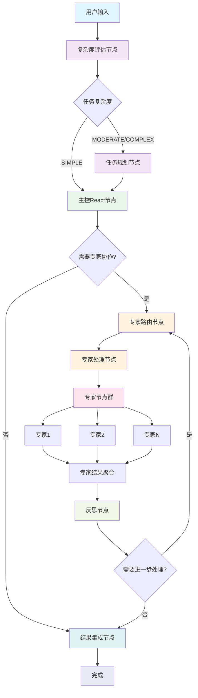
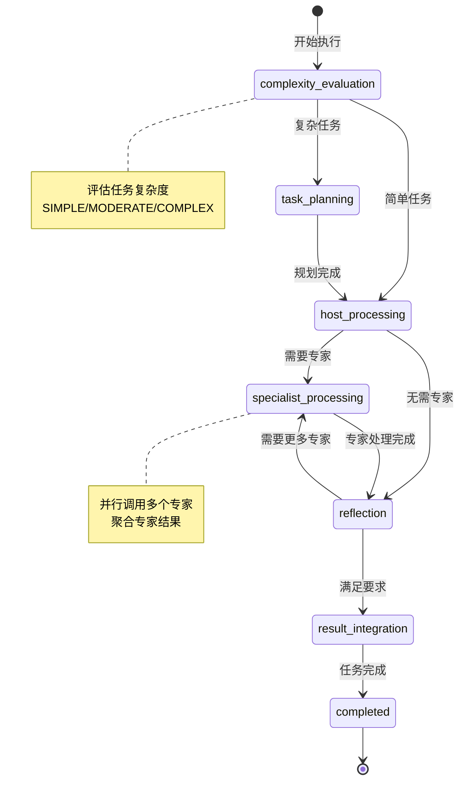

# Enhanced Multi-Agent System

基于CloudWeGo/Eino框架的增强版多智能体系统，提供智能任务分解、专家协作和自适应反思能力。

## 功能特性

### 🧠 智能任务复杂度评估
- 自动评估任务复杂度（SIMPLE/MODERATE/COMPLEX）
- 基于复杂度动态调整执行策略
- 支持自定义复杂度评估模型

### 📋 动态任务规划
- 基于任务复杂度制定详细执行计划
- 智能分解复杂任务为可执行步骤
- 自动识别所需专家类型

### 🤖 主控React智能体
- 集成CloudWeGo/Eino React Agent
- 支持工具调用和推理链
- 处理简单到中等复杂度任务

### 👥 专家智能体协作
- 支持多个专业领域专家
- 智能专家路由和调度
- 专家结果聚合和整合

### 🔄 自适应反思机制
- 多轮反思和策略调整
- 基于执行结果优化后续步骤
- 可配置最大反思次数

### 📊 完整的执行监控
- 阶段转换回调
- 专家调用追踪
- 详细的执行历史记录

## 系统架构

### 整体流程图



### 执行阶段状态图



## 快速开始

### 基本使用

```go
package main

import (
    "context"
    "fmt"
    "log"
    
    "github.com/cloudwego/eino/components/model"
    "github.com/cloudwego/eino/flow/agent/enhanced_multiagent"
    "github.com/cloudwego/eino/flow/agent/react"
    "github.com/cloudwego/eino/schema"
)

func main() {
    ctx := context.Background()
    
    // 创建模型实例（这里使用你的实际模型）
    chatModel := yourChatModelInstance
    toolCallingModel := yourToolCallingModelInstance
    
    // 配置主控React智能体
    reactConfig := &react.AgentConfig{
        Model: toolCallingModel,
        MaxStep: 10,
        // 其他React配置...
    }
    
    // 配置专家智能体
    specialists := []*enhanced_multiagent.SpecialistConfig{
        {
            Name: "数据分析专家",
            Description: "专门处理数据分析、统计和可视化任务",
            ChatModel: chatModel,
            ToolCallingModel: toolCallingModel,
            SystemPrompt: "你是一个数据分析专家...",
        },
        {
            Name: "代码开发专家",
            Description: "专门处理编程、代码审查和技术问题",
            ChatModel: chatModel,
            ToolCallingModel: toolCallingModel,
            SystemPrompt: "你是一个代码开发专家...",
        },
    }
    
    // 创建增强版多智能体配置
    config := &enhanced_multiagent.EnhancedMultiAgentConfig{
        HostReactConfig: reactConfig,
        Specialists: specialists,
        PlanningModel: chatModel,
        ComplexityEvaluationModel: chatModel,
        ReflectionModel: chatModel,
        MaxReflections: 3,
        MaxSteps: 20,
        GraphName: "MyEnhancedMultiAgent",
    }
    
    // 创建增强版多智能体系统
    agent, err := enhanced_multiagent.NewEnhancedMultiAgent(ctx, config)
    if err != nil {
        log.Fatal(err)
    }
    
    // 执行任务
    input := []*schema.Message{
        {
            Role: schema.User,
            Content: "请分析我们公司最近三个月的销售数据，并生成一个Python脚本来可视化趋势",
        },
    }
    
    result, err := agent.Generate(ctx, input)
    if err != nil {
        log.Fatal(err)
    }
    
    fmt.Printf("执行结果: %s\n", result.Content)
}
```

### 流式生成

```go
// 使用流式生成获取实时结果
stream, err := agent.Stream(ctx, input)
if err != nil {
    log.Fatal(err)
}

for {
    result, err := stream.Recv()
    if err != nil {
        if err == io.EOF {
            break
        }
        log.Fatal(err)
    }
    
    fmt.Printf("流式结果: %s\n", result.Content)
}
```

### 自定义回调监控

```go
type MyCallback struct{}

func (c *MyCallback) OnTaskPlanning(ctx context.Context, task string, plan string) error {
    fmt.Printf("任务规划: %s -> %s\n", task, plan)
    return nil
}

func (c *MyCallback) OnComplexityEvaluation(ctx context.Context, task string, complexity string) error {
    fmt.Printf("复杂度评估: %s -> %s\n", task, complexity)
    return nil
}

func (c *MyCallback) OnSpecialistCall(ctx context.Context, specialistName string, input *schema.Message) error {
    fmt.Printf("调用专家: %s\n", specialistName)
    return nil
}

func (c *MyCallback) OnSpecialistResponse(ctx context.Context, specialistName string, response *schema.Message) error {
    fmt.Printf("专家响应: %s -> %s\n", specialistName, response.Content)
    return nil
}

func (c *MyCallback) OnReflection(ctx context.Context, reflectionInput string, reflectionOutput string) error {
    fmt.Printf("反思过程: %s -> %s\n", reflectionInput, reflectionOutput)
    return nil
}

func (c *MyCallback) OnPhaseTransition(ctx context.Context, fromPhase string, toPhase string) error {
    fmt.Printf("阶段转换: %s -> %s\n", fromPhase, toPhase)
    return nil
}

// 在配置中使用回调
config.Callback = &MyCallback{}
```

## 配置选项

### EnhancedMultiAgentConfig

| 字段 | 类型 | 必需 | 描述 |
|------|------|------|------|
| HostReactConfig | *react.AgentConfig | ✅ | 主控React智能体配置 |
| Specialists | []*SpecialistConfig | ❌ | 专家智能体配置列表 |
| PlanningModel | model.ChatModel | ❌ | 任务规划模型 |
| ComplexityEvaluationModel | model.ChatModel | ❌ | 复杂度评估模型 |
| ReflectionModel | model.ChatModel | ❌ | 反思模型 |
| MaxReflections | int | ❌ | 最大反思次数（默认3） |
| MaxSteps | int | ❌ | 最大执行步数（默认20） |
| GraphName | string | ❌ | 图名称 |
| Callback | EnhancedMultiAgentCallback | ❌ | 执行回调接口 |

### SpecialistConfig

| 字段 | 类型 | 必需 | 描述 |
|------|------|------|------|
| Name | string | ✅ | 专家名称 |
| Description | string | ✅ | 专家描述 |
| ChatModel | model.ChatModel | ❌ | 聊天模型 |
| ToolCallingModel | model.ToolCallingChatModel | ❌ | 工具调用模型 |
| ToolsConfig | *compose.ToolsNodeConfig | ❌ | 工具配置 |
| SystemPrompt | string | ❌ | 系统提示词 |
| Streamable | bool | ❌ | 是否支持流式输出 |

## 执行阶段

系统执行过程包含以下阶段：

1. **复杂度评估** (`complexity_evaluation`)
   - 分析输入任务的复杂程度
   - 决定后续执行策略

2. **任务规划** (`task_planning`)
   - 制定详细的执行计划
   - 识别所需资源和专家

3. **主控处理** (`host_processing`)
   - React智能体处理任务
   - 执行推理和工具调用

4. **专家处理** (`specialist_processing`)
   - 调用相关专家智能体
   - 并行或串行处理专业任务

5. **反思** (`reflection`)
   - 分析执行结果
   - 决定是否需要进一步处理

6. **结果集成** (`result_integration`)
   - 整合所有结果
   - 生成最终输出

7. **完成** (`completed`)
   - 任务执行完成

## 最佳实践

### 1. 专家配置
- 为每个专家提供清晰的名称和描述
- 使用专门的系统提示词定义专家角色
- 根据专家需求配置合适的工具

### 2. 模型选择
- 复杂度评估使用轻量级模型
- 专家处理使用专业化模型
- 反思阶段使用推理能力强的模型

### 3. 性能优化
- 合理设置MaxSteps避免无限循环
- 使用流式生成提升用户体验
- 实现回调监控系统状态

### 4. 错误处理
- 实现完整的错误处理逻辑
- 使用回调记录执行日志
- 设置合理的超时时间

## 许可证

本项目遵循Apache 2.0许可证。详见[LICENSE](../../../LICENSE-APACHE)文件。