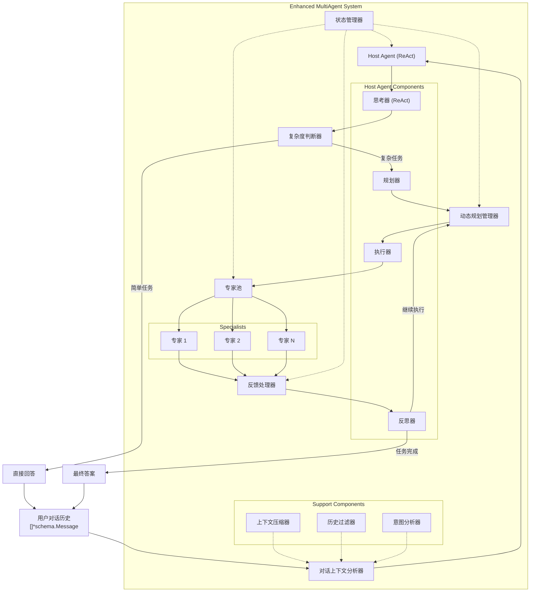
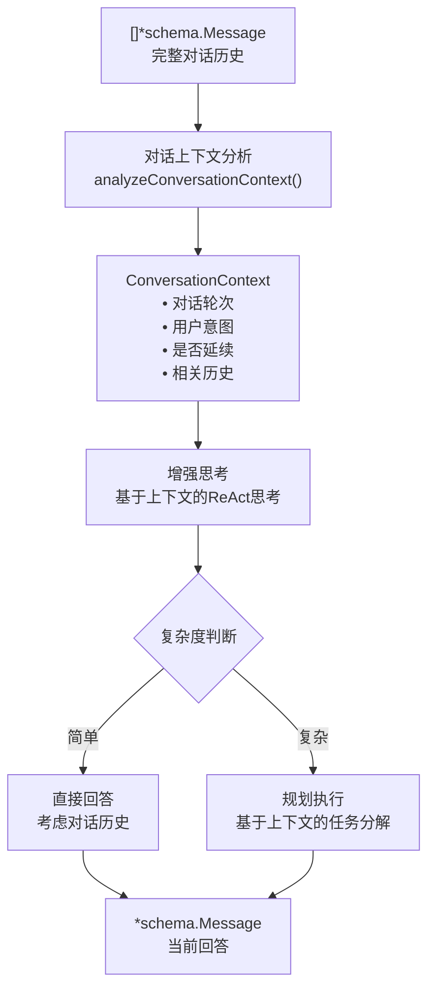

# Eino Enhanced MultiAgent 系统设计文档

## 概述

本文档描述了基于 Eino 框架的增强版多智能体系统设计。该系统在现有 Host 模式基础上，引入了 ReAct 思考模式、任务规划能力和持续反馈机制，实现了更智能的任务分解和执行。

## 使用场景

本系统专门设计用于**对话场景**，具有以下特点：

1. **对话驱动**: 用户首次提出问题，agent系统根据情况进行解答（直接解答或拆解分步规划解答）
2. **历史感知**: 用户可以继续进行对话，系统能够理解和处理历史对话上下文
3. **无状态设计**: 每次调用agent时，全局状态都会重新初始化，不依赖之前的执行状态
4. **消息传递**: 入参为`[]*schema.Message`（包含历史对话），出参为`*schema.Message`（当前回答）
5. **上下文管理**: 历史对话由上层逻辑组织并传入，agent专注于基于完整对话历史生成回答

## 设计目标

1. **智能主控**: 主控 Agent 采用 ReAct 模式，具备思考、规划和反馈能力
2. **任务规划**: 对复杂任务进行分解和规划，使用 Markdown 格式维护规划状态
3. **持续优化**: 根据专家执行结果持续更新规划和策略
4. **类型安全**: 严格遵循 Eino 框架的类型对齐原则
5. **可观测性**: 完整的回调机制支持监控和调试

## 核心架构

### 系统组件



### 数据流架构

```mermaid
flowchart TD
    START(["开始"]) --> INPUT["对话历史输入<br/>[]*schema.Message<br/><br/>包含完整对话历史<br/>每次调用状态重新初始化"]
    
    INPUT --> CONTEXT_ANALYZE["对话上下文分析<br/>analyzeConversationContext<br/><br/>状态更新:<br/>• ConversationContext 设置<br/>• 对话轮次分析<br/>• 意图识别<br/>• 历史关联性判断"]
    
    CONTEXT_ANALYZE --> HOST_THINK["Host Think Node<br/>输入: []*schema.Message<br/>输出: *schema.Message<br/><br/>状态更新:<br/>• OriginalMessages 保存<br/>• CurrentThinkingResult 设置<br/>• ThinkingHistory 追加<br/>• 基于对话上下文的ReAct思考"]
    
    HOST_THINK --> COMPLEXITY_BRANCH{"复杂度判断分支<br/>ComplexityBranch<br/><br/>状态读取:<br/>• CurrentThinkingResult.Complexity<br/>• ConversationContext.IsContinuation"}
    
    COMPLEXITY_BRANCH -->|简单任务| DIRECT_ANSWER["Direct Answer Node<br/>输入: *schema.Message<br/>输出: *schema.Message<br/><br/>状态更新:<br/>• IsSimpleTask = true<br/>• IsCompleted = true<br/>• FinalAnswer 设置<br/>• 考虑对话历史的直接回答"]
    
    COMPLEXITY_BRANCH -->|复杂任务| PLAN_CREATE["Plan Creation Node<br/>输入: *schema.Message<br/>输出: *schema.Message<br/><br/>状态更新:<br/>• CurrentPlan 创建<br/>• Version = 1<br/>• IsSimpleTask = false<br/>• 基于上下文的任务分解"]
    
    PLAN_CREATE --> PLAN_EXECUTE["Plan Execution Node<br/>输入: *schema.Message<br/>输出: *schema.Message<br/><br/>状态更新:<br/>• CurrentExecution 设置<br/>• PlanStep.Status = Executing<br/>• CurrentPlan.CurrentStep 更新<br/>• 传递对话上下文"]
    
    PLAN_EXECUTE --> SPECIALIST_BRANCH{"Specialist Branch<br/>MultiBranch<br/><br/>状态读取:<br/>• CurrentExecution.PlanStep<br/>• AssignedTo 专家选择<br/>• 对话上下文相关的专家匹配"}
    
    SPECIALIST_BRANCH --> SPEC1["Specialist 1<br/>输入: *schema.Message<br/>输出: *schema.Message<br/><br/>状态更新:<br/>• CurrentSpecialistResults[name] 设置<br/>• 执行时长记录<br/>• 置信度评估<br/>• 上下文感知的专家执行"]
    SPECIALIST_BRANCH --> SPEC2["Specialist 2<br/>输入: *schema.Message<br/>输出: *schema.Message<br/><br/>状态更新:<br/>• CurrentSpecialistResults[name] 设置<br/>• 执行时长记录<br/>• 置信度评估<br/>• 上下文感知的专家执行"]
    SPECIALIST_BRANCH --> SPECN["Specialist N<br/>输入: *schema.Message<br/>输出: *schema.Message<br/><br/>状态更新:<br/>• CurrentSpecialistResults[name] 设置<br/>• 执行时长记录<br/>• 置信度评估<br/>• 上下文感知的专家执行"]
    
    SPEC1 --> RESULT_COLLECT["Result Collector<br/>输入: *schema.Message<br/>输出: *schema.Message<br/><br/>状态更新:<br/>• CurrentCollectedResults 设置<br/>• ExecutionHistory 追加<br/>• CurrentRound 记录<br/>• 结果汇总和质量评估"]
    SPEC2 --> RESULT_COLLECT
    SPECN --> RESULT_COLLECT
    
    RESULT_COLLECT --> FEEDBACK_PROCESS["Feedback Processor<br/>输入: *schema.Message<br/>输出: *schema.Message<br/><br/>状态更新:<br/>• CurrentFeedbackResult 设置<br/>• ShouldContinue 判断<br/>• SuggestedAction 确定<br/>• 对话连贯性评估"]
    
    FEEDBACK_PROCESS --> REFLECT_BRANCH{"Reflection Branch<br/>StreamBranch<br/><br/>状态读取:<br/>• CurrentFeedbackResult.ShouldContinue<br/>• 最大轮次检查<br/>• 对话完整性评估"}
    
    REFLECT_BRANCH -->|需要继续| PLAN_UPDATE["Plan Update Node<br/>输入: *schema.Message<br/>输出: *schema.Message<br/><br/>状态更新:<br/>• CurrentPlan.Version++<br/>• UpdateHistory 追加<br/>• CurrentRound++<br/>• Steps 动态调整<br/>• 基于反馈的规划优化"]
    REFLECT_BRANCH -->|任务完成| FINAL_ANSWER["Final Answer Node<br/>输入: *schema.Message<br/>输出: *schema.Message<br/><br/>状态更新:<br/>• IsCompleted = true<br/>• FinalAnswer 设置<br/>• 对话历史整合的最终回答"]
    
    PLAN_UPDATE --> PLAN_EXECUTE
    
    DIRECT_ANSWER --> END(["结束"])
    FINAL_ANSWER --> END
    
    style CONTEXT_ANALYZE fill:#e3f2fd
    style HOST_THINK fill:#e1f5fe
    style PLAN_CREATE fill:#f3e5f5
    style PLAN_EXECUTE fill:#e8f5e8
    style FEEDBACK_PROCESS fill:#fff3e0
    style COMPLEXITY_BRANCH fill:#ffebee
    style SPECIALIST_BRANCH fill:#f1f8e9
    style REFLECT_BRANCH fill:#fce4ec
    style PLAN_UPDATE fill:#e8f5e8
    style DIRECT_ANSWER fill:#f1f8e9
    style FINAL_ANSWER fill:#e8f5e8
```



### 状态管理详解

#### 全局状态 EnhancedState 的数据流转

在增强版多智能体系统中，`EnhancedState` 作为全局状态管理器，贯穿整个执行流程。每个节点都会读取和更新特定的状态字段，确保数据的一致性和可追溯性。

##### 状态字段更新时序

```mermaid
gantt
    title 增强版多智能体系统状态字段更新时序图
    dateFormat X
    axisFormat %s
    
    section 初始化阶段
    OriginalMessages        :active, init1, 0, 1
    SessionID              :active, init2, 0, 1
    CallTimestamp          :active, init3, 0, 1
    
    section 对话分析阶段
    ConversationContext    :active, conv1, 1, 2
    
    section 思考阶段
    CurrentThinkingResult  :active, think1, 2, 3
    ThinkingHistory        :active, think2, 2, 3
    
    section 复杂度判断阶段
    IsSimpleTask           :active, judge1, 3, 4
    
    section 规划阶段
    CurrentPlan            :active, plan1, 4, 5
    
    section 执行准备阶段
    CurrentExecution       :active, exec1, 5, 6
    CurrentRound           :active, exec2, 5, 6
    
    section 专家执行阶段
    CurrentSpecialistResults :active, spec1, 6, 7
    
    section 结果收集阶段
    CurrentCollectedResults :active, collect1, 7, 8
    ExecutionHistory       :active, collect2, 7, 8
    
    section 反馈处理阶段
    CurrentFeedbackResult  :active, feed1, 8, 9
    
    section 决策分支阶段
    ShouldContinue判断     :active, decision1, 9, 10
    
    section 规划更新阶段
    CurrentPlan(版本更新)   :active, update1, 10, 11
    CurrentRound(递增)     :active, update2, 10, 11
    
    section 完成阶段
    IsCompleted            :active, final1, 11, 12
    FinalAnswer            :active, final2, 11, 12
    
    section 清理阶段
    状态重置准备            :active, cleanup1, 12, 13
```



##### 关键状态转换点

1. **初始化阶段 (System Initialization)**
   - **更新**: 
     - `OriginalMessages` ← 输入的对话历史
     - `SessionID` ← 生成的会话ID
     - `CallTimestamp` ← 当前时间戳
     - `CurrentRound` ← 0
     - `MaxRounds` ← 配置值

2. **对话分析阶段 (Conversation Analysis)**
   - **读取**: `OriginalMessages`
   - **更新**:
     - `ConversationContext` ← 对话上下文分析结果
     - `ConversationContext.TurnCount` ← 对话轮次
     - `ConversationContext.IsFirstTurn` ← 是否首次对话
     - `ConversationContext.UserIntent` ← 用户意图
     - `ConversationContext.IsContinuation` ← 是否延续性对话

3. **思考阶段 (Host Think Node)**
   - **读取**: `OriginalMessages`, `ConversationContext`
   - **更新**: 
     - `CurrentThinkingResult` ← 基于对话上下文的思考结果
     - `ThinkingHistory` ← 追加当前思考记录
     - `CurrentThinkingResult.ConversationAnalysis` ← 对话分析结果

4. **复杂度判断 (Complexity Branch)**
   - **读取**: `CurrentThinkingResult.Complexity`, `ConversationContext.IsContinuation`
   - **分支逻辑**: 综合考虑任务复杂度和对话延续性

5. **直接回答 (Direct Answer Node)**
   - **读取**: `CurrentThinkingResult`, `ConversationContext`
   - **更新**:
     - `IsSimpleTask` ← true
     - `IsCompleted` ← true
     - `FinalAnswer` ← 考虑对话历史的直接答案

6. **规划创建 (Plan Creation Node)**
   - **读取**: `CurrentThinkingResult`, `ConversationContext`
   - **更新**:
     - `CurrentPlan` ← 基于上下文的任务规划
     - `CurrentPlan.Version` ← 1
     - `CurrentPlan.CreatedAt` ← 当前时间
     - `IsSimpleTask` ← false

7. **规划执行 (Plan Execution Node)**
   - **读取**: `CurrentPlan`, `ConversationContext`
   - **更新**:
     - `CurrentExecution` ← 包含对话上下文的执行上下文
     - `CurrentPlan.CurrentStep` ← 当前步骤ID
     - `PlanStep.Status` ← StepStatusExecuting
     - `PlanStep.UpdatedAt` ← 当前时间

8. **专家执行 (Specialist Nodes)**
   - **读取**: `CurrentExecution`, `ConversationContext`
   - **更新**:
     - `CurrentSpecialistResults[name]` ← 上下文感知的专家执行结果
     - `SpecialistResult.Duration` ← 执行时长
     - `SpecialistResult.Confidence` ← 置信度评估
     - `SpecialistResult.Status` ← 执行状态

9. **结果收集 (Result Collector)**
   - **读取**: `CurrentSpecialistResults`
   - **更新**:
     - `CurrentCollectedResults` ← 汇总的执行结果
     - `ExecutionHistory` ← 追加执行记录
     - `CurrentRound` ← 当前执行轮次
     - `CollectedResults.Summary` ← 结果摘要

10. **反馈处理 (Feedback Processor)**
    - **读取**: `CurrentCollectedResults`, `CurrentPlan`, `ConversationContext`
    - **更新**:
      - `CurrentFeedbackResult` ← 综合反馈分析结果
      - `CurrentFeedbackResult.ShouldContinue` ← 是否继续执行
      - `CurrentFeedbackResult.SuggestedAction` ← 建议的下一步行动

11. **规划更新 (Plan Update Node)**
    - **读取**: `CurrentFeedbackResult`, `CurrentPlan`
    - **更新**:
      - `CurrentPlan.Version` ← 版本号递增
      - `CurrentPlan.UpdateHistory` ← 追加更新记录
      - `CurrentRound` ← 轮次递增
      - `CurrentPlan.Steps` ← 动态调整步骤
      - `CurrentPlan.UpdatedAt` ← 当前时间

12. **最终答案 (Final Answer Node)**
    - **读取**: `CurrentFeedbackResult`, `ConversationContext`
    - **更新**:
      - `IsCompleted` ← true
      - `FinalAnswer` ← 整合对话历史的最终答案

13. **状态清理 (State Cleanup)**
    - **操作**: 为下次调用准备状态重置
    - **保留**: 仅保留必要的日志和追踪信息

##### 状态一致性保证

为确保状态的一致性和可靠性，系统采用以下机制：

1. **原子性更新**: 每个节点的状态更新都是原子性的，使用事务性操作
2. **版本控制**: 关键状态（如TaskPlan）具有版本号机制，支持回滚
3. **历史追踪**: 重要操作都会记录到历史列表中，包括时间戳和变更详情
4. **状态验证**: 在关键节点进行状态完整性检查和数据一致性验证
5. **错误恢复**: 支持从历史状态恢复执行，具备故障转移能力
6. **对话上下文保护**: 确保对话历史在整个执行过程中的完整性
7. **内存管理**: 及时清理临时状态，防止内存泄漏
8. **并发安全**: 支持多会话并发处理，状态隔离机制
9. **状态快照**: 在关键节点创建状态快照，支持调试和审计
10. **超时处理**: 设置合理的超时机制，防止状态长期占用

##### 状态序列化支持

```go
// 状态序列化接口
type StateSerializer interface {
    Serialize(state *EnhancedState) ([]byte, error)
    Deserialize(data []byte) (*EnhancedState, error)
}

// 支持状态持久化和恢复
func (s *EnhancedState) Checkpoint() *StateCheckpoint {
    return &StateCheckpoint{
        Timestamp: time.Now(),
        Round:     s.CurrentRound,
        State:     s.Clone(),
    }
}
```

## 核心类型定义

### 状态管理

```go
// EnhancedState 增强版多智能体系统的全局状态
// 注意：每次agent调用时，此状态都会重新初始化，不保留之前的执行状态
type EnhancedState struct {
    // 原始输入消息（完整对话历史）
    OriginalMessages []*schema.Message
    
    // 对话上下文分析结果
    ConversationContext *ConversationContext
    
    // 当前任务规划（Markdown格式）
    CurrentPlan *TaskPlan
    
    // 当前执行上下文
    CurrentExecution *ExecutionContext
    
    // 当前专家结果映射
    CurrentSpecialistResults map[string]*SpecialistResult
    
    // 当前收集的结果
    CurrentCollectedResults *CollectedResults
    
    // 当前反馈结果
    CurrentFeedbackResult *FeedbackResult
    
    // 当前思考结果
    CurrentThinkingResult *ThinkingResult
    
    // 执行历史（仅限当前调用）
    ExecutionHistory []*ExecutionRecord
    
    // 思考历史（仅限当前调用）
    ThinkingHistory []*ThinkingResult
    
    // 当前执行轮次
    CurrentRound int
    
    // 最大执行轮次
    MaxRounds int
    
    // 是否为简单任务
    IsSimpleTask bool
    
    // 任务完成状态
    IsCompleted bool
    
    // 最终答案
    FinalAnswer *schema.Message
    
    // 会话ID（用于日志追踪）
    SessionID string
    
    // 调用时间戳
    CallTimestamp time.Time
}

// ConversationContext 对话上下文分析结果
type ConversationContext struct {
    // 对话轮次数
    TurnCount int
    
    // 是否为首次对话
    IsFirstTurn bool
    
    // 是否为延续性问题
    IsContinuation bool
    
    // 最新用户消息
    LatestUserMessage *schema.Message
    
    // 最新助手回复
    LatestAssistantMessage *schema.Message
    
    // 对话主题
    ConversationTopic string
    
    // 用户意图分析
    UserIntent string
    
    // 意图置信度
    IntentConfidence float64
    
    // 情感色调分析
    EmotionalTone string
    
    // 关键实体提取
    KeyEntities []string
    
    // 复杂度提示
    ComplexityHint TaskComplexity
    
    // 相关历史上下文
    RelevantHistory []*schema.Message
    
    // 上下文摘要
    ContextSummary string
    
    // 分析时间戳
    AnalyzedAt time.Time
    
    // 扩展元数据
    Metadata map[string]interface{}
}

// ExecutionRecord 执行记录
type ExecutionRecord struct {
    Round       int
    PlanVersion int
    Results     *CollectedResults
    Feedback    *FeedbackResult
    Duration    time.Duration
    Timestamp   time.Time
    Status      ExecutionStatus
    Metadata    map[string]interface{}
}

// 枚举类型定义
type TaskComplexity int

const (
    TaskComplexitySimple TaskComplexity = iota
    TaskComplexityModerate
    TaskComplexityComplex
)

type ActionType int

const (
    ActionTypeDirectAnswer ActionType = iota
    ActionTypeCreatePlan
    ActionTypeExecuteStep
    ActionTypeReflect
    ActionTypeUpdatePlan
)

type StepStatus int

const (
    StepStatusPending StepStatus = iota
    StepStatusExecuting
    StepStatusCompleted
    StepStatusFailed
    StepStatusSkipped
    StepStatusBlocked
)

type ExecutionStatus int

const (
    ExecutionStatusRunning ExecutionStatus = iota
    ExecutionStatusCompleted
    ExecutionStatusFailed
    ExecutionStatusTimeout
    ExecutionStatusCancelled
)

type PlanUpdateType int

const (
    PlanUpdateTypeAddStep PlanUpdateType = iota
    PlanUpdateTypeModifyStep
    PlanUpdateTypeDeleteStep
    PlanUpdateTypeReorderSteps
    PlanUpdateTypeChangeStrategy
)

type ExecutionStatus int

const (
    ExecutionStatusSuccess ExecutionStatus = iota
    ExecutionStatusFailed
    ExecutionStatusPartial
)

type PlanUpdateType int

const (
    PlanUpdateTypeAddStep PlanUpdateType = iota
    PlanUpdateTypeModifyStep
    PlanUpdateTypeRemoveStep
    PlanUpdateTypeReorderSteps
    PlanUpdateTypeModifyPlan
)

// TaskPlan 任务规划结构
type TaskPlan struct {
    // 规划内容（Markdown格式）
    Content string
    
    // 当前步骤
    CurrentStep int
    
    // 总步骤数（动态更新）
    TotalSteps int
    
    // 已完成的步骤
    CompletedSteps []int
    
    // 步骤详情（支持动态添加、修改、删除）
    Steps []*PlanStep
    
    // 规划版本号（每次更新递增）
    Version int
    
    // 是否允许动态调整
    AllowDynamicUpdate bool
    
    // 创建时间
    CreatedAt time.Time
    
    // 最后更新时间
    UpdatedAt time.Time
    
    // 更新历史
    UpdateHistory []*PlanUpdate
}

// PlanUpdate 规划更新记录
type PlanUpdate struct {
    Version     int
    UpdateType  PlanUpdateType // add_step, modify_step, remove_step, reorder_steps
    Description string
    Timestamp   time.Time
    Changes     map[string]interface{}
}

// PlanStep 规划步骤
type PlanStep struct {
    ID          int
    Description string
    Status      StepStatus // pending, executing, completed, failed, skipped
    AssignedTo  string     // 分配给哪个specialist
    Result      string     // 执行结果
    Feedback    string     // 反馈信息
    Priority    int        // 步骤优先级
    Dependencies []int     // 依赖的步骤ID
    EstimatedDuration time.Duration // 预估执行时间
    ActualDuration    time.Duration // 实际执行时间
    RetryCount  int        // 重试次数
    MaxRetries  int        // 最大重试次数
    CreatedAt   time.Time  // 步骤创建时间
    UpdatedAt   time.Time  // 步骤更新时间
}

// ThinkingResult 思考结果
type ThinkingResult struct {
    // 思考内容
    Thought string
    
    // 任务复杂度评估
    Complexity TaskComplexity // simple, moderate, complex
    
    // 推理过程
    Reasoning string
    
    // 下一步行动
    NextAction ActionType // direct_answer, create_plan, execute_step, reflect
    
    // 原始消息
    OriginalMessages []*schema.Message
    
    // 对话上下文分析
    ConversationAnalysis *ConversationContext
    
    // 是否需要参考历史对话
    NeedsHistoryContext bool
    
    // 回答策略
    ResponseStrategy string // direct, planned, clarification
    
    // 关键洞察
    KeyInsights []string
    
    // 风险评估
    RiskAssessment string
    
    // 置信度评估
    Confidence float64
    
    // 思考耗时
    Duration time.Duration
    
    // 时间戳
    Timestamp time.Time
    
    // 扩展元数据
    Metadata map[string]interface{}
}

// ExecutionContext 执行上下文
type ExecutionContext struct {
    // 当前任务描述
    TaskDescription string
    
    // 相关的规划步骤
    PlanStep *PlanStep
    
    // 历史消息
    Messages []*schema.Message
    
    // 执行参数
    Parameters map[string]interface{}
    
    // 期望输出格式
    ExpectedFormat string
}

// SpecialistResult 专家执行结果
type SpecialistResult struct {
    // 专家名称
    SpecialistName string
    
    // 执行结果
    Result *schema.Message
    
    // 执行状态
    Status ExecutionStatus // success, failed, partial
    
    // 错误信息
    Error string
    
    // 执行时长
    Duration time.Duration
    
    // 置信度
    Confidence float64
    
    // 开始时间
    StartTime time.Time
    
    // 结束时间
    EndTime time.Time
    
    // 重试次数
    RetryCount int
    
    // 质量评分
    QualityScore float64
    
    // 相关性评分
    RelevanceScore float64
    
    // 扩展元数据
    Metadata map[string]interface{}
}

// CollectedResults 收集的结果
type CollectedResults struct {
    // 所有专家结果
    Results map[string]*SpecialistResult
    
    // 成功的结果
    SuccessfulResults []*SpecialistResult
    
    // 失败的结果
    FailedResults []*SpecialistResult
    
    // 部分成功的结果
    PartialResults []*SpecialistResult
    
    // 汇总信息
    Summary string
    
    // 整体质量评分
    OverallQuality float64
    
    // 结果一致性评分
    ConsistencyScore float64
    
    // 收集时间
    CollectedAt time.Time
    
    // 总执行时长
    TotalDuration time.Duration
    
    // 扩展元数据
    Metadata map[string]interface{}
}

// FeedbackResult 反馈结果
type FeedbackResult struct {
    // 反馈内容
    Feedback string
    
    // 是否需要继续执行
    ShouldContinue bool
    
    // 建议的下一步行动
    SuggestedAction ActionType
    
    // 规划更新建议
    PlanUpdateSuggestion string
    
    // 最终答案（如果任务完成）
    FinalAnswer *schema.Message
    
    // 收集的结果
    CollectedResults *CollectedResults
    
    // 对话连贯性评估
    ConversationCoherence float64
    
    // 用户满意度预测
    UserSatisfactionPrediction float64
    
    // 改进建议
    ImprovementSuggestions []string
    
    // 风险警告
    RiskWarnings []string
    
    // 反馈生成时间
    GeneratedAt time.Time
    
    // 扩展元数据
    Metadata map[string]interface{}
}
```

### 配置类型

```go
// EnhancedMultiAgentConfig 增强版多智能体配置
type EnhancedMultiAgentConfig struct {
    // 主控Agent配置
    Host EnhancedHost
    
    // 专家Agent列表
    Specialists []*EnhancedSpecialist
    
    // 系统名称
    Name string
    
    // 最大执行轮次
    MaxRounds int
    
    // 复杂度判断阈值
    ComplexityThreshold float64
    
    // 规划模板
    PlanTemplate string
    
    // 对话思考提示模板
    ConversationalThinkingPromptTemplate string
    
    // 对话上下文分析提示模板
    ContextAnalysisPromptTemplate string
    
    // 反思提示模板
    ReflectionPromptTemplate string
    
    // 流式工具调用检查器
    StreamToolCallChecker func(ctx context.Context, modelOutput *schema.StreamReader[*schema.Message]) (bool, error)
    
    // 回调处理器
    Callbacks []EnhancedMultiAgentCallback
    
    // 会话配置
    SessionConfig SessionConfig
}

// SessionConfig 会话配置
type SessionConfig struct {
    // 最大对话历史长度
    MaxHistoryLength int
    
    // 上下文窗口大小
    ContextWindowSize int
    
    // 是否启用上下文压缩
    EnableContextCompression bool
    
    // 上下文相关性阈值
    ContextRelevanceThreshold float64
}

// EnhancedHost 增强版主控Agent
type EnhancedHost struct {
    // 工具调用模型
    ToolCallingModel model.ToolCallingChatModel
    
    // 思考模型（可以与工具调用模型相同）
    ThinkingModel model.BaseChatModel
    
    // 系统提示
    SystemPrompt string
    
    // 思考提示模板
    ThinkingPrompt string
    
    // 规划提示模板
    PlanningPrompt string
    
    // 反思提示模板
    ReflectionPrompt string
}

// EnhancedSpecialist 增强版专家Agent
type EnhancedSpecialist struct {
    // 基础元信息
    AgentMeta
    
    // 聊天模型
    ChatModel model.BaseChatModel
    
    // 系统提示
    SystemPrompt string
    
    // 可调用组件
    Invokable compose.Invoke[[]*schema.Message, *schema.Message, agent.AgentOption]
    
    // 流式组件
    Streamable compose.Stream[[]*schema.Message, *schema.Message, agent.AgentOption]
    
    // 专家能力描述
    Capabilities []string
    
    // 输入预处理器
    InputProcessor func(ctx context.Context, input *ExecutionContext) ([]*schema.Message, error)
    
    // 输出后处理器
    OutputProcessor func(ctx context.Context, output *schema.Message) (*SpecialistResult, error)
}
```

## 对话场景设计调整

### 核心设计
#### 1. 接口签名

```go
// 对话场景：历史消息输入
func (agent *EnhancedMultiAgent) Invoke(ctx context.Context, input []*schema.Message) (*schema.Message, error)
```

#### 2. 状态生命周期管理

- **无状态原则**: 每次调用都重新初始化`EnhancedState`
- **历史感知**: 通过输入的`[]*schema.Message`获取完整对话历史
- **上下文分析**: 新增`ConversationContext`分析对话上下文
- **会话追踪**: 通过`SessionID`进行日志追踪，但不保持状态

#### 3. 对话上下文处理流程



#### 4. 关键函数新增

```go
// 对话上下文分析
func analyzeConversationContext(messages []*schema.Message) *ConversationContext

// 对话感知的思考提示构建
func buildConversationalThinkingPrompt(messages []*schema.Message, ctx *ConversationContext, state *EnhancedState) *schema.Message

// 上下文相关性过滤
func filterRelevantHistory(messages []*schema.Message, currentQuery string) []*schema.Message

// 对话历史压缩
func compressConversationHistory(messages []*schema.Message, maxLength int) []*schema.Message
```

### 对话场景特殊处理

#### 1. 首次对话 vs 延续对话

- **首次对话**: `ConversationContext.IsFirstTurn = true`，专注于理解用户需求
- **延续对话**: `ConversationContext.IsContinuation = true`，需要理解上下文关联

#### 2. 上下文窗口管理

- **智能截断**: 保留最相关的历史消息
- **上下文压缩**: 对长对话进行摘要压缩
- **关键信息保持**: 确保重要上下文不丢失

#### 3. 意图理解增强

- **意图分析**: 分析用户当前问题的意图
- **关联检测**: 检测与历史对话的关联性
- **澄清机制**: 当意图不明确时主动澄清

### 性能优化考虑

#### 1. 上下文处理优化

- **并行分析**: 对话上下文分析与思考过程并行
- **缓存机制**: 对重复的上下文分析结果进行缓存
- **增量处理**: 对新增消息进行增量分析

#### 2. 内存管理

- **及时清理**: 每次调用结束后清理状态
- **大对话处理**: 对超长对话历史进行分段处理
- **内存监控**: 监控内存使用情况，防止内存泄漏

## TaskPlan 动态更新机制

### 规划的动态特性

增强版MultiAgent系统的核心特性之一是**动态任务规划**。与传统的静态规划不同，本系统的TaskPlan具有以下动态特性：

#### 1. 动态步骤管理
- **步骤添加**: 根据执行过程中发现的新需求，动态添加新的执行步骤
- **步骤修改**: 根据执行反馈调整现有步骤的描述、优先级或分配
- **步骤删除**: 移除不再需要或已过时的步骤
- **步骤重排**: 根据依赖关系和优先级重新排序步骤

#### 2. 版本控制机制
```go
// 规划更新示例
func updatePlanDynamically(currentPlan *TaskPlan, feedback *FeedbackResult) *TaskPlan {
    newPlan := currentPlan.Clone()
    newPlan.Version++
    
    // 根据反馈类型进行不同的更新操作
    switch feedback.SuggestedAction {
    case ActionTypeAddStep:
        newStep := createStepFromFeedback(feedback)
        newPlan.Steps = append(newPlan.Steps, newStep)
        newPlan.TotalSteps++
        
    case ActionTypeModifyStep:
        modifyExistingStep(newPlan, feedback)
        
    case ActionTypeReorderSteps:
        reorderSteps(newPlan, feedback)
    }
    
    // 记录更新历史
    update := &PlanUpdate{
        Version:     newPlan.Version,
        UpdateType:  getUpdateType(feedback),
        Description: feedback.PlanUpdateSuggestion,
        Timestamp:   time.Now(),
        Changes:     extractChanges(currentPlan, newPlan),
    }
    newPlan.UpdateHistory = append(newPlan.UpdateHistory, update)
    
    return newPlan
}
```

#### 3. 依赖关系处理
- **前置依赖**: 确保步骤按正确顺序执行
- **并行执行**: 识别可并行执行的独立步骤
- **条件执行**: 根据前序步骤结果决定是否执行某些步骤

#### 4. 智能规划调整
- **失败恢复**: 当某个步骤失败时，自动调整后续规划
- **效率优化**: 根据执行效果动态优化步骤顺序和分配
- **资源适配**: 根据可用专家能力调整任务分配

## 节点设计与类型对齐

### 核心设计原则

1. **统一数据传递**: 所有节点间统一使用`*schema.Message`作为数据传递类型
2. **状态驱动**: 通过全局状态`EnhancedState`管理复杂的数据结构和业务逻辑
3. **处理器模式**: 使用`StatePreHandler`从状态中提取信息构建消息，使用`StatePostHandler`解析结果并保存到状态
4. **简化架构**: 避免过多的类型转换节点，保持图结构的简洁性

### 节点类型对齐策略

基于Eino框架的`StatePreHandler`和`StatePostHandler`类型一致性要求：

```go
type StatePreHandler[I, S any] func(ctx context.Context, input I, state S) (I, error)
type StatePostHandler[O, S any] func(ctx context.Context, output O, state S) (O, error)
```

我们的统一策略：
- **输入输出类型**: 所有节点统一使用`*schema.Message`
- **状态管理**: 复杂业务数据存储在`*EnhancedState`中
- **数据流转**: preHandler从state构建消息，postHandler解析消息并更新state

### 1. Host Think Node

根据Eino框架的类型对齐原则，每个节点的输入输出类型必须严格匹配。

**输入类型**: `[]*schema.Message`（对话历史）  
**输出类型**: `*schema.Message`  
**功能**: 分析对话历史，进行上下文理解、思考和复杂度评估

```go
// HostThinkNode 使用Eino图编排方式实现
func NewHostThinkNode(config *EnhancedHost) *compose.GraphNode {
    // 状态预处理器：分析对话历史并构建思考提示
    preHandler := func(ctx context.Context, input []*schema.Message, state *EnhancedState) ([]*schema.Message, error) {
        // 保存原始对话历史
        state.OriginalMessages = input
        state.CallTimestamp = time.Now()
        
        // 分析对话上下文
        conversationCtx := analyzeConversationContext(input)
        state.ConversationContext = conversationCtx
        
        // 构建思考提示，包含完整对话历史和上下文分析
        thinkingPrompt := buildConversationalThinkingPrompt(input, conversationCtx, state)
        return []*schema.Message{thinkingPrompt}, nil
    }
    
    // 状态后处理器：解析思考结果并更新状态
    postHandler := func(ctx context.Context, output *schema.Message, state *EnhancedState) (*schema.Message, error) {
        // 解析思考结果
        result := parseThinkingResult(output)
        result.OriginalMessages = state.OriginalMessages
        result.ConversationAnalysis = state.ConversationContext
        result.Timestamp = time.Now()
        
        // 更新状态
        state.ThinkingHistory = append(state.ThinkingHistory, result)
        state.CurrentThinking = result
        
        return output, nil
    }
    
    // 创建图节点
    return compose.NewGraphNode(
        config.ThinkingModel,
        compose.WithStatePreHandler(preHandler),
        compose.WithStatePostHandler(postHandler),
    )
}
```

### 2. Direct Answer Node

**输入类型**: `*schema.Message`  
**输出类型**: `*schema.Message`  
**功能**: 对简单任务直接生成答案

```go
// DirectAnswerNode 使用Eino图编排方式实现
func NewDirectAnswerNode(config *EnhancedHost) *compose.GraphNode {
    // 状态预处理器：从状态中构建直接回答提示
    preHandler := func(ctx context.Context, input *schema.Message, state *EnhancedState) (*schema.Message, error) {
        // 从状态中获取思考结果，构建直接回答提示
        directPrompt := buildDirectAnswerPrompt(state.CurrentThinking, state)
        return directPrompt, nil
    }
    
    // 状态后处理器：标记任务完成
    postHandler := func(ctx context.Context, output *schema.Message, state *EnhancedState) (*schema.Message, error) {
        // 标记为简单任务已完成
        state.IsSimpleTask = true
        state.IsCompleted = true
        state.FinalAnswer = output.Content
        
        return output, nil
    }
    
    return compose.NewGraphNode(
        config.ToolCallingModel,
        compose.WithStatePreHandler(preHandler),
        compose.WithStatePostHandler(postHandler),
    )
}
```

### 3. Complexity Branch

**输入类型**: `*schema.Message`  
**分支输出**: 
- `direct_answer` → Direct Answer Node
- `complex_task` → Plan Creation Node

```go
func complexityBranchCondition(ctx context.Context, sr *schema.StreamReader[*schema.Message], state *EnhancedState) (string, error) {
    defer sr.Close()
    
    _, err := sr.Recv()
    if err != nil {
        return "", err
    }
    
    // 从状态中获取思考结果进行分支判断
    if state.CurrentThinking != nil {
        switch state.CurrentThinking.Complexity {
        case TaskComplexitySimple:
            return "direct_answer", nil
        case TaskComplexityModerate, TaskComplexityComplex:
            return "complex_task", nil
        default:
            return "direct_answer", nil
        }
    }
    
    return "direct_answer", nil
}
```

### 4. Plan Creation Node

**输入类型**: `*schema.Message`  
**输出类型**: `*schema.Message`  
**功能**: 基于思考结果创建任务规划

```go
// PlanCreationNode 使用Eino图编排方式实现
func NewPlanCreationNode(config *EnhancedHost) *compose.GraphNode {
    // 状态预处理器：从状态中构建规划提示
    preHandler := func(ctx context.Context, input *schema.Message, state *EnhancedState) (*schema.Message, error) {
        // 从状态中获取思考结果，构建规划提示
        planningPrompt := buildPlanningPrompt(state.CurrentThinking, state)
        return planningPrompt, nil
    }
    
    // 状态后处理器：解析规划结果并更新状态
    postHandler := func(ctx context.Context, output *schema.Message, state *EnhancedState) (*schema.Message, error) {
        // 解析规划结果
        plan := parsePlanFromMarkdown(output.Content)
        plan.Version = 1
        plan.AllowDynamicUpdate = true
        plan.CreatedAt = time.Now()
        plan.UpdatedAt = time.Now()
        
        // 更新状态
        state.CurrentPlan = plan
        state.IsSimpleTask = false
        
        return output, nil
    }
    
    return compose.NewGraphNode(
        config.PlanningModel,
        compose.WithStatePreHandler(preHandler),
        compose.WithStatePostHandler(postHandler),
    )
}
```


### 5. Plan Execution Node

**输入类型**: `*schema.Message`  
**输出类型**: `*schema.Message`  
**功能**: 准备执行上下文，确定当前要执行的步骤

```go
// PlanExecutionNode 使用Eino图编排方式实现
func NewPlanExecutionNode() *compose.GraphNode {
    // Lambda函数处理规划执行逻辑
    executionLambda := func(ctx context.Context, input *schema.Message, state *EnhancedState) (*schema.Message, error) {
        // 从状态中获取当前规划
        if state.CurrentPlan == nil {
            return nil, fmt.Errorf("no current plan found in state")
        }
        
        // 找到下一个待执行的步骤
        nextStep := findNextExecutableStep(state.CurrentPlan)
        if nextStep == nil {
            return nil, fmt.Errorf("no executable step found")
        }
        
        // 构建执行上下文并保存到状态
        execCtx := &ExecutionContext{
            TaskDescription: nextStep.Description,
            PlanStep:       nextStep,
            Messages:       state.OriginalMessages,
            Parameters:     make(map[string]interface{}),
            ExpectedFormat: "markdown",
        }
        
        // 更新步骤状态
        nextStep.Status = StepStatusExecuting
        nextStep.UpdatedAt = time.Now()
        
        // 更新规划状态
        state.CurrentPlan.CurrentStep = nextStep.ID
        state.CurrentPlan.UpdatedAt = time.Now()
        state.CurrentExecution = execCtx
        
        return input, nil
    }
    
    return compose.NewLambdaNode(executionLambda)
}
```

### 6. Specialist Multi-Branch

**输入类型**: `*schema.Message`  
**分支逻辑**: 根据当前步骤的分配决定调用哪些专家

```go
func specialistBranchCondition(ctx context.Context, sr *schema.StreamReader[*schema.Message], state *EnhancedState) (map[string]bool, error) {
    defer sr.Close()
    
    _, err := sr.Recv()
    if err != nil {
        return nil, err
    }
    
    results := make(map[string]bool)
    
    // 从状态中获取当前执行上下文
    if state.CurrentExecution != nil && state.CurrentExecution.PlanStep != nil {
        // 根据规划步骤确定需要调用的专家
        if state.CurrentExecution.PlanStep.AssignedTo != "" {
            results[state.CurrentExecution.PlanStep.AssignedTo] = true
        } else {
            // 如果没有明确分配，根据任务描述智能选择
            selectedSpecialists := selectSpecialistsByTask(state.CurrentExecution.TaskDescription)
            for _, specialist := range selectedSpecialists {
                results[specialist] = true
            }
        }
    }
    
    return results, nil
}
```

### 7. Specialist Nodes

**输入类型**: `*schema.Message`  
**输出类型**: `*schema.Message`  
**功能**: 执行专家任务并返回结果

```go
// SpecialistNode 使用Eino图编排方式实现
func NewSpecialistNode(specialist *EnhancedSpecialist) *compose.GraphNode {
    // 状态预处理器：从状态中构建专家提示
    preHandler := func(ctx context.Context, input *schema.Message, state *EnhancedState) (*schema.Message, error) {
        // 从状态中获取执行上下文
        if state.CurrentExecution == nil {
            return nil, fmt.Errorf("no current execution context found")
        }
        
        var messages []*schema.Message
        if specialist.InputProcessor != nil {
            processedMessages, err := specialist.InputProcessor(ctx, state.CurrentExecution)
            if err != nil {
                return nil, err
            }
            messages = processedMessages
        } else {
            // 默认处理：构建专家提示
            messages = buildSpecialistPrompt(specialist, state.CurrentExecution)
        }
        
        // 返回第一条消息作为输入
        if len(messages) > 0 {
            return messages[0], nil
        }
        return input, nil
    }
    
    // 状态后处理器：转换模型输出为专家结果并保存到状态
    postHandler := func(ctx context.Context, output *schema.Message, state *EnhancedState) (*schema.Message, error) {
        result := &SpecialistResult{
            SpecialistName: specialist.Name,
            Result:         output,
            Status:         ExecutionStatusSuccess,
            Duration:       time.Since(time.Now()), // 实际应该记录开始时间
            Confidence:     1.0,
        }
        
        if specialist.OutputProcessor != nil {
            processedResult, err := specialist.OutputProcessor(ctx, output)
            if err != nil {
                return nil, err
            }
            result = processedResult
        }
        
        // 保存结果到状态
        if state.SpecialistResults == nil {
            state.SpecialistResults = make(map[string]*SpecialistResult)
        }
        state.SpecialistResults[specialist.Name] = result
        
        return output, nil
    }
    
    // 选择使用Invokable或ChatModel
    if specialist.Invokable != nil {
        return compose.NewGraphNode(
            specialist.Invokable,
            compose.WithStatePreHandler(preHandler),
            compose.WithStatePostHandler(postHandler),
        )
    } else {
        return compose.NewGraphNode(
            specialist.ChatModel,
            compose.WithStatePreHandler(preHandler),
            compose.WithStatePostHandler(postHandler),
        )
    }
}
```

### 8. Result Collector Node

**输入类型**: `*schema.Message`  
**输出类型**: `*schema.Message`  
**功能**: 收集所有专家的执行结果

```go
// ResultCollectorNode 使用Eino图编排方式实现
func NewResultCollectorNode() *compose.GraphNode {
    // Lambda函数处理结果收集逻辑
    collectorLambda := func(ctx context.Context, input *schema.Message, state *EnhancedState) (*schema.Message, error) {
        // 从状态中获取专家结果
        if state.SpecialistResults == nil {
            return nil, fmt.Errorf("no specialist results found in state")
        }
        
        // 构建收集结果
        collected := &CollectedResults{
            Results:           state.SpecialistResults,
            SuccessfulResults: make([]*SpecialistResult, 0),
            FailedResults:     make([]*SpecialistResult, 0),
        }
        
        // 分类结果
        for _, result := range state.SpecialistResults {
            if result.Status == ExecutionStatusSuccess {
                collected.SuccessfulResults = append(collected.SuccessfulResults, result)
            } else {
                collected.FailedResults = append(collected.FailedResults, result)
            }
        }
        
        // 生成汇总
        collected.Summary = generateResultSummary(collected)
        
        // 记录执行历史
        record := &ExecutionRecord{
            Round:     state.CurrentRound,
            Results:   collected,
            Timestamp: time.Now(),
        }
        state.ExecutionHistory = append(state.ExecutionHistory, record)
        state.CurrentCollectedResults = collected
        
        return input, nil
    }
    
    return compose.NewLambdaNode(collectorLambda)
}
```

### 9. Feedback Processor Node

**输入类型**: `*schema.Message`  
**输出类型**: `*schema.Message`  
**功能**: 分析执行结果，生成反馈

```go
// FeedbackProcessorNode 使用Eino图编排方式实现
func NewFeedbackProcessorNode(config *EnhancedHost) *compose.GraphNode {
    // 状态预处理器：从状态中构建反馈分析提示
    preHandler := func(ctx context.Context, input *schema.Message, state *EnhancedState) (*schema.Message, error) {
        // 从状态中获取收集的结果
        if state.CurrentCollectedResults == nil {
            return nil, fmt.Errorf("no collected results found in state")
        }
        
        // 构建反馈分析提示，包含执行结果和当前规划
        feedbackPrompt := buildFeedbackPrompt(state.CurrentCollectedResults, state)
        return feedbackPrompt, nil
    }
    
    // 状态后处理器：解析反馈结果并保存到状态
    postHandler := func(ctx context.Context, output *schema.Message, state *EnhancedState) (*schema.Message, error) {
        // 解析反馈结果
        feedback := parseFeedbackResult(output)
        
        // 关联收集的结果
        feedback.CollectedResults = state.CurrentCollectedResults
        
        // 判断是否需要继续执行
        feedback.ShouldContinue = shouldContinueExecution(feedback, state)
        
        // 保存反馈结果到状态
        state.CurrentFeedback = feedback
        
        return output, nil
    }
    
    return compose.NewGraphNode(
        config.FeedbackModel,
        compose.WithStatePreHandler(preHandler),
        compose.WithStatePostHandler(postHandler),
    )
}
```


### 10. Plan Update Node

**输入类型**: `*schema.Message`  
**输出类型**: `*schema.Message`  
**功能**: 根据反馈结果动态更新任务规划

```go
// PlanUpdateNode 使用Eino图编排方式实现
func NewPlanUpdateNode(config *EnhancedHost) *compose.GraphNode {
    // 状态预处理器：从状态中构建规划更新提示
    preHandler := func(ctx context.Context, input *schema.Message, state *EnhancedState) (*schema.Message, error) {
        // 从状态中获取反馈结果
        if state.CurrentFeedback == nil {
            return nil, fmt.Errorf("no current feedback found in state")
        }
        
        // 构建规划更新提示，包含当前规划、执行结果和反馈
        updatePrompt := buildPlanUpdatePrompt(state.CurrentFeedback, state)
        return updatePrompt, nil
    }
    
    // 状态后处理器：解析更新后的规划并保存到状态
    postHandler := func(ctx context.Context, output *schema.Message, state *EnhancedState) (*schema.Message, error) {
        // 解析更新后的规划
        updatedPlan := parsePlanFromMarkdown(output.Content)
        
        // 保持原有信息并更新版本
        if state.CurrentPlan != nil {
            updatedPlan.Version = state.CurrentPlan.Version + 1
            updatedPlan.CreatedAt = state.CurrentPlan.CreatedAt
            
            // 记录更新历史
            planUpdate := &PlanUpdate{
                Version:     updatedPlan.Version,
                UpdateType:  PlanUpdateTypeModifyPlan,
                Description: "根据执行反馈更新规划",
                Timestamp:   time.Now(),
                Changes:     extractPlanChanges(state.CurrentPlan, updatedPlan),
            }
            updatedPlan.UpdateHistory = append(state.CurrentPlan.UpdateHistory, planUpdate)
        }
        
        updatedPlan.AllowDynamicUpdate = true
        updatedPlan.UpdatedAt = time.Now()
        
        // 更新状态
        state.CurrentPlan = updatedPlan
        state.CurrentRound++
        
        return output, nil
    }
    
    return compose.NewGraphNode(
        config.PlanningModel,
        compose.WithStatePreHandler(preHandler),
        compose.WithStatePostHandler(postHandler),
    )
}
```

### 11. Reflection Branch

**输入类型**: `*schema.Message`  
**分支输出**:
- `continue` → Plan Update Node
- `complete` → Final Answer Node

```go
func reflectionBranchCondition(ctx context.Context, sr *schema.StreamReader[*schema.Message], state *EnhancedState) (string, error) {
    defer sr.Close()
    
    _, err := sr.Recv()
    if err != nil {
        return "", err
    }
    
    // 从状态中获取反馈结果进行分支判断
    if state.CurrentFeedback != nil && !state.CurrentFeedback.ShouldContinue {
        return "complete", nil
    }
    
    return "continue", nil
}
```


### 12. Final Answer Node

**输入类型**: `*schema.Message`  
**输出类型**: `*schema.Message`  
**功能**: 生成最终答案

```go
// FinalAnswerNode 使用Eino图编排方式实现
func NewFinalAnswerNode(config *EnhancedHost) *compose.GraphNode {
    // 状态预处理器：从状态中构建最终答案提示
    preHandler := func(ctx context.Context, input *schema.Message, state *EnhancedState) (*schema.Message, error) {
        // 从状态中获取反馈结果
        if state.CurrentFeedback == nil {
            return nil, fmt.Errorf("no current feedback found in state")
        }
        
        // 如果反馈中已有最终答案，直接使用
        if state.CurrentFeedback.FinalAnswer != nil {
            return state.CurrentFeedback.FinalAnswer, nil
        }
        
        // 否则构建最终答案生成提示
        finalAnswerPrompt := buildFinalAnswerPrompt(state.CurrentFeedback, state)
        return finalAnswerPrompt, nil
    }
    
    // 状态后处理器：标记任务完成并保存最终答案
    postHandler := func(ctx context.Context, output *schema.Message, state *EnhancedState) (*schema.Message, error) {
        // 标记任务完成
        state.IsCompleted = true
        state.FinalAnswer = output.Content
        
        return output, nil
    }
    
    return compose.NewGraphNode(
        config.ToolCallingModel,
        compose.WithStatePreHandler(preHandler),
        compose.WithStatePostHandler(postHandler),
    )
}
```

## 回调机制设计

### 增强版回调接口

```go
// EnhancedMultiAgentCallback 增强版多智能体回调接口
type EnhancedMultiAgentCallback interface {
    // 思考开始
    OnThinkingStart(ctx context.Context, info *ThinkingStartInfo) context.Context
    
    // 思考完成
    OnThinkingComplete(ctx context.Context, info *ThinkingCompleteInfo) context.Context
    
    // 规划创建
    OnPlanCreated(ctx context.Context, info *PlanCreatedInfo) context.Context
    
    // 规划更新
    OnPlanUpdated(ctx context.Context, info *PlanUpdatedInfo) context.Context
    
    // 专家调用
    OnSpecialistInvoke(ctx context.Context, info *SpecialistInvokeInfo) context.Context
    
    // 专家完成
    OnSpecialistComplete(ctx context.Context, info *SpecialistCompleteInfo) context.Context
    
    // 反馈生成
    OnFeedbackGenerated(ctx context.Context, info *FeedbackGeneratedInfo) context.Context
    
    // 任务完成
    OnTaskComplete(ctx context.Context, info *TaskCompleteInfo) context.Context
}
```

## 实现计划

### 阶段一：核心框架和类型定义
1. **核心类型系统**
   - 定义 `EnhancedState`、`ConversationContext`、`ThinkingResult` 等核心结构体
   - 实现状态管理接口，支持无状态重新初始化
   - 定义枚举类型（TaskComplexity、ActionType、ExecutionStatus等）
   - 实现状态序列化和反序列化机制

2. **对话上下文分析**
   - 实现 `analyzeConversationContext` 函数
   - 实现对话历史预处理和相关性过滤
   - 实现意图识别和情感分析
   - 实现上下文压缩和关键信息提取

3. **基础节点框架**
   - 创建节点接口和基础实现
   - 调整接口签名支持 `[]*schema.Message` 输入
   - 实现状态传递和更新机制
   - 建立节点间的数据流管道

### 阶段二：思考和规划系统
1. **增强思考节点**
   - 实现 Host Think Node，集成对话历史分析
   - 实现基于ReAct的对话感知思考
   - 实现复杂度判断逻辑，考虑对话延续性
   - 实现思考结果的结构化输出

2. **动态规划系统**
   - 实现 Plan Creation Node，基于对话上下文的任务分解
   - 实现动态规划更新机制（版本控制、步骤调整）
   - 实现规划步骤的依赖管理和优先级排序
   - 实现规划历史追踪和回滚机制

3. **分支决策逻辑**
   - 实现复杂度分支，支持简单任务直接回答
   - 实现反思分支，基于反馈决定继续或完成
   - 实现专家选择分支，智能匹配任务和专家
   - 实现错误处理和重试机制

### 阶段三：执行和反馈系统
1. **专家执行机制**
   - 实现专家节点，支持上下文感知的任务执行
   - 实现专家结果收集和质量评估
   - 实现并行执行和结果聚合
   - 实现专家选择的智能匹配算法

2. **反馈处理系统**
   - 实现反馈处理器，评估执行结果和对话连贯性
   - 实现用户满意度预测和改进建议
   - 实现风险评估和警告机制
   - 实现反馈驱动的规划调整

3. **结果整合**
   - 实现结果收集器，统一管理专家执行结果
   - 实现最终答案生成，整合对话历史
   - 实现执行历史记录和追踪
   - 实现状态清理和资源管理

### 阶段四：优化和完善
1. **性能优化**
   - 实现上下文窗口管理和内存优化
   - 实现并发处理和资源池管理
   - 实现缓存机制和增量处理
   - 实现大对话历史的高效处理

2. **回调和监控**
   - 完善回调机制，支持各阶段的事件监听
   - 实现性能监控和指标收集
   - 实现日志记录和调试支持
   - 实现健康检查和故障恢复

3. **测试和验证**
   - 实现单元测试覆盖所有核心组件
   - 实现集成测试验证端到端流程
   - 实现对话场景的专项测试
   - 实现压力测试和性能基准测试

4. **容错和稳定性**
   - 实现错误处理和异常恢复
   - 实现超时机制和资源保护
   - 实现状态一致性保证
   - 实现多会话并发处理的隔离机制

## 技术特性

### 1. 类型安全
- 严格遵循 Eino 框架的类型对齐原则
- 编译时类型检查
- 明确的输入输出类型定义

### 2. 状态管理
- 全局状态跟踪任务执行过程
- 支持状态序列化和恢复
- 历史记录和审计跟踪

### 3. 可扩展性
- 插件化的专家Agent设计
- 可配置的规划模板
- 灵活的回调机制

### 4. 容错性
- 专家执行失败的处理机制
- 规划调整和重试逻辑
- 优雅的错误恢复

### 5. 可观测性
- 完整的执行日志
- 详细的性能指标
- 实时状态监控

## 辅助函数声明

为了确保节点实现的完整性，以下是需要实现的辅助函数：

### 序列化和反序列化函数

```go
// 序列化函数
func serializeThinkingResult(result *ThinkingResult) string
func serializeTaskPlan(plan *TaskPlan) string
func serializeSpecialistResult(result *SpecialistResult) string
func serializeFeedbackResult(feedback *FeedbackResult) string
func serializeCollectedResults(collected *CollectedResults) string

// 反序列化函数
func deserializeThinkingResult(content string) *ThinkingResult
func deserializeTaskPlan(content string) *TaskPlan
func deserializeSpecialistResult(content string) *SpecialistResult
func deserializeFeedbackResult(content string) *FeedbackResult
func deserializeCollectedResults(content string) *CollectedResults
```

### 提示构建函数

```go
// 提示构建函数
func buildThinkingPrompt(input []*schema.Message, state *EnhancedState) []*schema.Message
func buildDirectAnswerPrompt(input *ThinkingResult, state *EnhancedState) []*schema.Message
func buildPlanningPrompt(input *ThinkingResult, state *EnhancedState) []*schema.Message
func buildSpecialistPrompt(specialist *EnhancedSpecialist, input *ExecutionContext) []*schema.Message
func buildFeedbackPrompt(input *CollectedResults, state *EnhancedState) []*schema.Message
func buildPlanUpdatePrompt(input *FeedbackResult, state *EnhancedState) []*schema.Message
func buildResultCollectorPrompt(collected *CollectedResults, state *EnhancedState) []*schema.Message
func buildFinalAnswerPrompt(input *FeedbackResult, state *EnhancedState) []*schema.Message
```

### 解析函数

```go
// 解析函数
func parseThinkingResult(output *schema.Message) *ThinkingResult
func parsePlanFromMarkdown(content string) *TaskPlan
func parseFeedbackResult(output *schema.Message) *FeedbackResult
func parseCollectedResults(content string) *CollectedResults
```

### 业务逻辑函数

```go
// 业务逻辑函数
func getCurrentExecutionStep(plan *TaskPlan, state *EnhancedState) *PlanStep
func findNextExecutableStep(plan *TaskPlan) *PlanStep
func selectSpecialistsByTask(taskDescription string) []string
func updateStepStatus(plan *TaskPlan, result *SpecialistResult)
func generateResultSummary(collected *CollectedResults) string
func shouldContinueExecution(feedback *FeedbackResult, state *EnhancedState) bool
func extractPlanChanges(oldPlan, newPlan *TaskPlan) []string
func generateFinalAnswer(results *CollectedResults, state *EnhancedState) *schema.Message
```

## 类型对齐说明

根据Eino框架中`StatePreHandler`和`StatePostHandler`的定义要求，所有的preHandler和postHandler必须保持输入输出类型一致。在我们的设计中：

1. **StatePreHandler**: `func(ctx context.Context, input T, state *EnhancedState) (T, error)`
2. **StatePostHandler**: `func(ctx context.Context, output T, state *EnhancedState) (T, error)`

为了满足这个要求，我们采用了以下策略：

- **类型转换节点**: 使用`compose.NewLambdaNode`创建专门的类型转换节点
- **序列化机制**: 将复杂类型序列化到`schema.Message`的Content字段中
- **提取器节点**: 创建专门的提取器节点来反序列化数据

## 对话场景设计总结

### 核心设计原则

本设计文档针对对话场景进行了全面的架构调整，遵循以下核心原则：

1. **无状态设计**: 每次调用都重新初始化状态，确保系统的可靠性和可预测性
2. **历史感知**: 通过输入的完整对话历史，实现上下文理解和连贯回答
3. **智能分析**: 新增对话上下文分析，理解用户意图和对话关联性
4. **性能优化**: 针对大对话历史进行优化，包括压缩、过滤和窗口管理

### 关键技术创新

1. **对话上下文分析**: `ConversationContext` 结构体提供全面的对话状态分析
2. **智能历史管理**: 实现相关性过滤和上下文压缩，优化性能
3. **增强思考机制**: 基于对话历史的 ReAct 思考，提升回答质量
4. **无状态状态管理**: 创新性地实现了无状态的状态管理模式

### 适用场景

- **智能客服**: 支持多轮对话的客服系统
- **知识问答**: 基于历史对话的深度问答
- **任务助手**: 能够理解上下文的任务执行助手
- **教育辅导**: 连贯性强的教学对话系统

### 技术优势

1. **高可靠性**: 无状态设计避免了状态污染和内存泄漏
2. **强扩展性**: 基于 Eino 框架的模块化设计，易于扩展
3. **智能化**: 深度理解对话上下文，提供更准确的回答
4. **高性能**: 针对大对话历史的优化处理，保证响应速度

通过这些设计调整，Enhanced MultiAgent 系统能够在对话场景下提供卓越的用户体验，同时保持系统的稳定性和可维护性。

### 实现要点

- **分离关注点**: 将输入处理和模型调用分离到不同的节点中
- **类型安全**: 严格遵循 Eino 框架的类型对齐要求
- **模块化设计**: 每个节点职责单一，便于测试和维护
- **可观测性**: 通过回调机制提供完整的执行追踪

这种设计确保了类型安全，同时保持了代码的清晰性和可维护性。

## 总结

增强版 MultiAgent 系统在保持 Eino 框架设计理念的基础上，引入了智能化的思考、规划和反馈机制。通过严格的类型对齐和状态管理，确保系统的可靠性和可维护性。

**关键改进点：**

1. **严格类型对齐**: 所有节点都遵循Eino框架的类型一致性要求
2. **模块化设计**: 将复杂的处理逻辑分解为多个专门的节点
3. **状态处理器模式**: 使用`WithStatePreHandler`和`WithStatePostHandler`进行状态管理
4. **序列化机制**: 通过序列化实现复杂类型在节点间的传递
5. **Lambda节点**: 使用Lambda节点处理纯函数式的转换逻辑

该设计为构建复杂的多智能体应用提供了强大的基础架构，同时确保了与Eino框架的完全兼容性。