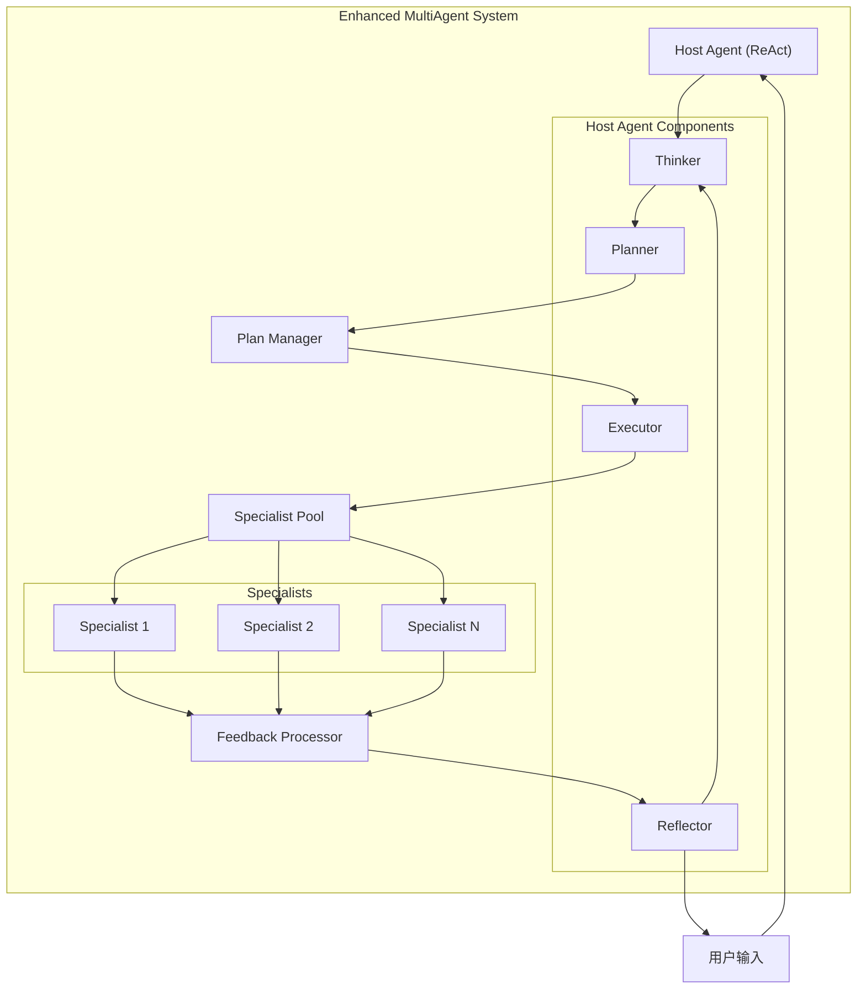
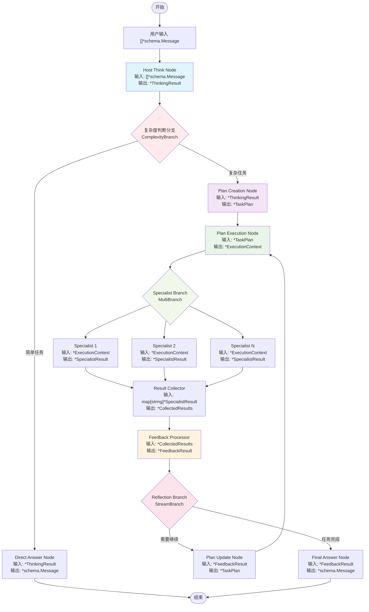

# Eino Enhanced MultiAgent 系统设计文档

## 概述

本文档描述了基于 Eino 框架的增强版多智能体系统设计。该系统在现有 Host 模式基础上，引入了 ReAct 思考模式、任务规划能力和持续反馈机制，实现了更智能的任务分解和执行。

## 设计目标

1. **智能主控**: 主控 Agent 采用 ReAct 模式，具备思考、规划和反馈能力
2. **任务规划**: 对复杂任务进行分解和规划，使用 Markdown 格式维护规划状态
3. **持续优化**: 根据专家执行结果持续更新规划和策略
4. **类型安全**: 严格遵循 Eino 框架的类型对齐原则
5. **可观测性**: 完整的回调机制支持监控和调试

## 核心架构

### 系统组件



### 数据流架构



## 核心类型定义

### 状态管理

```go
// EnhancedState 增强版多智能体系统的全局状态
type EnhancedState struct {
    // 原始输入消息
    OriginalMessages []*schema.Message
    
    // 当前任务规划（Markdown格式）
    CurrentPlan *TaskPlan
    
    // 当前执行上下文
    CurrentExecution *ExecutionContext
    
    // 当前专家结果映射
    CurrentSpecialistResults map[string]*SpecialistResult
    
    // 当前收集的结果
    CurrentCollectedResults *CollectedResults
    
    // 当前反馈结果
    CurrentFeedbackResult *FeedbackResult
    
    // 当前思考结果
    CurrentThinkingResult *ThinkingResult
    
    // 执行历史
    ExecutionHistory []*ExecutionRecord
    
    // 思考历史
    ThinkingHistory []*ThinkingResult
    
    // 当前执行轮次
    CurrentRound int
    
    // 最大执行轮次
    MaxRounds int
    
    // 是否为简单任务
    IsSimpleTask bool
    
    // 任务完成状态
    IsCompleted bool
    
    // 最终答案
    FinalAnswer *schema.Message
}

// ExecutionRecord 执行记录
type ExecutionRecord struct {
    Round     int
    Results   *CollectedResults
    Timestamp time.Time
}

// 枚举类型定义
type TaskComplexity int

const (
    TaskComplexitySimple TaskComplexity = iota
    TaskComplexityModerate
    TaskComplexityComplex
)

type ActionType int

const (
    ActionTypeDirectAnswer ActionType = iota
    ActionTypeCreatePlan
    ActionTypeExecuteStep
    ActionTypeReflect
    ActionTypeUpdatePlan
)

type StepStatus int

const (
    StepStatusPending StepStatus = iota
    StepStatusExecuting
    StepStatusCompleted
    StepStatusFailed
    StepStatusSkipped
)

type ExecutionStatus int

const (
    ExecutionStatusSuccess ExecutionStatus = iota
    ExecutionStatusFailed
    ExecutionStatusPartial
)

type PlanUpdateType int

const (
    PlanUpdateTypeAddStep PlanUpdateType = iota
    PlanUpdateTypeModifyStep
    PlanUpdateTypeRemoveStep
    PlanUpdateTypeReorderSteps
    PlanUpdateTypeModifyPlan
)

// TaskPlan 任务规划结构
type TaskPlan struct {
    // 规划内容（Markdown格式）
    Content string
    
    // 当前步骤
    CurrentStep int
    
    // 总步骤数（动态更新）
    TotalSteps int
    
    // 已完成的步骤
    CompletedSteps []int
    
    // 步骤详情（支持动态添加、修改、删除）
    Steps []*PlanStep
    
    // 规划版本号（每次更新递增）
    Version int
    
    // 是否允许动态调整
    AllowDynamicUpdate bool
    
    // 创建时间
    CreatedAt time.Time
    
    // 最后更新时间
    UpdatedAt time.Time
    
    // 更新历史
    UpdateHistory []*PlanUpdate
}

// PlanUpdate 规划更新记录
type PlanUpdate struct {
    Version     int
    UpdateType  PlanUpdateType // add_step, modify_step, remove_step, reorder_steps
    Description string
    Timestamp   time.Time
    Changes     map[string]interface{}
}

// PlanStep 规划步骤
type PlanStep struct {
    ID          int
    Description string
    Status      StepStatus // pending, executing, completed, failed, skipped
    AssignedTo  string     // 分配给哪个specialist
    Result      string     // 执行结果
    Feedback    string     // 反馈信息
    Priority    int        // 步骤优先级
    Dependencies []int     // 依赖的步骤ID
    EstimatedDuration time.Duration // 预估执行时间
    ActualDuration    time.Duration // 实际执行时间
    RetryCount  int        // 重试次数
    MaxRetries  int        // 最大重试次数
    CreatedAt   time.Time  // 步骤创建时间
    UpdatedAt   time.Time  // 步骤更新时间
}

// ThinkingResult 思考结果
type ThinkingResult struct {
    // 思考内容
    Thought string
    
    // 任务复杂度评估
    Complexity TaskComplexity // simple, moderate, complex
    
    // 推理过程
    Reasoning string
    
    // 下一步行动
    NextAction ActionType // direct_answer, create_plan, execute_step, reflect
    
    // 原始消息
    OriginalMessages []*schema.Message
    
    // 时间戳
    Timestamp time.Time
}

// ExecutionContext 执行上下文
type ExecutionContext struct {
    // 当前任务描述
    TaskDescription string
    
    // 相关的规划步骤
    PlanStep *PlanStep
    
    // 历史消息
    Messages []*schema.Message
    
    // 执行参数
    Parameters map[string]interface{}
    
    // 期望输出格式
    ExpectedFormat string
}

// SpecialistResult 专家执行结果
type SpecialistResult struct {
    // 专家名称
    SpecialistName string
    
    // 执行结果
    Result *schema.Message
    
    // 执行状态
    Status ExecutionStatus // success, failed, partial
    
    // 错误信息
    Error string
    
    // 执行时长
    Duration time.Duration
    
    // 置信度
    Confidence float64
}

// CollectedResults 收集的结果
type CollectedResults struct {
    // 所有专家结果
    Results map[string]*SpecialistResult
    
    // 成功的结果
    SuccessfulResults []*SpecialistResult
    
    // 失败的结果
    FailedResults []*SpecialistResult
    
    // 汇总信息
    Summary string
}

// FeedbackResult 反馈结果
type FeedbackResult struct {
    // 反馈内容
    Feedback string
    
    // 是否需要继续执行
    ShouldContinue bool
    
    // 建议的下一步行动
    SuggestedAction ActionType
    
    // 规划更新建议
    PlanUpdateSuggestion string
    
    // 最终答案（如果任务完成）
    FinalAnswer *schema.Message
    
    // 收集的结果
    CollectedResults *CollectedResults
}
```

### 配置类型

```go
// EnhancedMultiAgentConfig 增强版多智能体配置
type EnhancedMultiAgentConfig struct {
    // 主控Agent配置
    Host EnhancedHost
    
    // 专家Agent列表
    Specialists []*EnhancedSpecialist
    
    // 系统名称
    Name string
    
    // 最大执行轮次
    MaxRounds int
    
    // 复杂度判断阈值
    ComplexityThreshold float64
    
    // 规划模板
    PlanTemplate string
    
    // 思考提示模板
    ThinkingPromptTemplate string
    
    // 反思提示模板
    ReflectionPromptTemplate string
    
    // 流式工具调用检查器
    StreamToolCallChecker func(ctx context.Context, modelOutput *schema.StreamReader[*schema.Message]) (bool, error)
    
    // 回调处理器
    Callbacks []EnhancedMultiAgentCallback
}

// EnhancedHost 增强版主控Agent
type EnhancedHost struct {
    // 工具调用模型
    ToolCallingModel model.ToolCallingChatModel
    
    // 思考模型（可以与工具调用模型相同）
    ThinkingModel model.BaseChatModel
    
    // 系统提示
    SystemPrompt string
    
    // 思考提示模板
    ThinkingPrompt string
    
    // 规划提示模板
    PlanningPrompt string
    
    // 反思提示模板
    ReflectionPrompt string
}

// EnhancedSpecialist 增强版专家Agent
type EnhancedSpecialist struct {
    // 基础元信息
    AgentMeta
    
    // 聊天模型
    ChatModel model.BaseChatModel
    
    // 系统提示
    SystemPrompt string
    
    // 可调用组件
    Invokable compose.Invoke[[]*schema.Message, *schema.Message, agent.AgentOption]
    
    // 流式组件
    Streamable compose.Stream[[]*schema.Message, *schema.Message, agent.AgentOption]
    
    // 专家能力描述
    Capabilities []string
    
    // 输入预处理器
    InputProcessor func(ctx context.Context, input *ExecutionContext) ([]*schema.Message, error)
    
    // 输出后处理器
    OutputProcessor func(ctx context.Context, output *schema.Message) (*SpecialistResult, error)
}
```

## TaskPlan 动态更新机制

### 规划的动态特性

增强版MultiAgent系统的核心特性之一是**动态任务规划**。与传统的静态规划不同，本系统的TaskPlan具有以下动态特性：

#### 1. 动态步骤管理
- **步骤添加**: 根据执行过程中发现的新需求，动态添加新的执行步骤
- **步骤修改**: 根据执行反馈调整现有步骤的描述、优先级或分配
- **步骤删除**: 移除不再需要或已过时的步骤
- **步骤重排**: 根据依赖关系和优先级重新排序步骤

#### 2. 版本控制机制
```go
// 规划更新示例
func updatePlanDynamically(currentPlan *TaskPlan, feedback *FeedbackResult) *TaskPlan {
    newPlan := currentPlan.Clone()
    newPlan.Version++
    
    // 根据反馈类型进行不同的更新操作
    switch feedback.SuggestedAction {
    case ActionTypeAddStep:
        newStep := createStepFromFeedback(feedback)
        newPlan.Steps = append(newPlan.Steps, newStep)
        newPlan.TotalSteps++
        
    case ActionTypeModifyStep:
        modifyExistingStep(newPlan, feedback)
        
    case ActionTypeReorderSteps:
        reorderSteps(newPlan, feedback)
    }
    
    // 记录更新历史
    update := &PlanUpdate{
        Version:     newPlan.Version,
        UpdateType:  getUpdateType(feedback),
        Description: feedback.PlanUpdateSuggestion,
        Timestamp:   time.Now(),
        Changes:     extractChanges(currentPlan, newPlan),
    }
    newPlan.UpdateHistory = append(newPlan.UpdateHistory, update)
    
    return newPlan
}
```

#### 3. 依赖关系处理
- **前置依赖**: 确保步骤按正确顺序执行
- **并行执行**: 识别可并行执行的独立步骤
- **条件执行**: 根据前序步骤结果决定是否执行某些步骤

#### 4. 智能规划调整
- **失败恢复**: 当某个步骤失败时，自动调整后续规划
- **效率优化**: 根据执行效果动态优化步骤顺序和分配
- **资源适配**: 根据可用专家能力调整任务分配

## 节点设计与类型对齐

### 核心设计原则

1. **统一数据传递**: 所有节点间统一使用`*schema.Message`作为数据传递类型
2. **状态驱动**: 通过全局状态`EnhancedState`管理复杂的数据结构和业务逻辑
3. **处理器模式**: 使用`StatePreHandler`从状态中提取信息构建消息，使用`StatePostHandler`解析结果并保存到状态
4. **简化架构**: 避免过多的类型转换节点，保持图结构的简洁性

### 节点类型对齐策略

基于Eino框架的`StatePreHandler`和`StatePostHandler`类型一致性要求：

```go
type StatePreHandler[I, S any] func(ctx context.Context, input I, state S) (I, error)
type StatePostHandler[O, S any] func(ctx context.Context, output O, state S) (O, error)
```

我们的统一策略：
- **输入输出类型**: 所有节点统一使用`*schema.Message`
- **状态管理**: 复杂业务数据存储在`*EnhancedState`中
- **数据流转**: preHandler从state构建消息，postHandler解析消息并更新state

### 1. Host Think Node

<mcreference link="https://www.cloudwego.io/zh/docs/eino/core_modules/chain_and_graph_orchestration/orchestration_design_principles/#statehandler-%E7%9A%84%E7%B1%BB%E5%9E%8B%E5%AF%B9%E9%BD%90" index="0">根据Eino框架的类型对齐原则</mcreference>，每个节点的输入输出类型必须严格匹配。

**输入类型**: `*schema.Message`  
**输出类型**: `*schema.Message`  
**功能**: 分析用户输入，进行初步思考和复杂度评估

```go
// HostThinkNode 使用Eino图编排方式实现
func NewHostThinkNode(config *EnhancedHost) *compose.GraphNode {
    // 状态预处理器：从状态中构建思考提示
    preHandler := func(ctx context.Context, input *schema.Message, state *EnhancedState) (*schema.Message, error) {
        // 如果是首次处理，保存原始消息
        if state.OriginalMessages == nil {
            state.OriginalMessages = []*schema.Message{input}
        }
        
        // 构建思考提示，包含历史上下文
        thinkingPrompt := buildThinkingPrompt(state.OriginalMessages, state)
        return thinkingPrompt, nil
    }
    
    // 状态后处理器：解析思考结果并更新状态
    postHandler := func(ctx context.Context, output *schema.Message, state *EnhancedState) (*schema.Message, error) {
        // 解析思考结果
        result := parseThinkingResult(output)
        result.OriginalMessages = state.OriginalMessages
        result.Timestamp = time.Now()
        
        // 更新状态
        state.ThinkingHistory = append(state.ThinkingHistory, result)
        state.CurrentThinking = result
        
        return output, nil
    }
    
    // 创建图节点
    return compose.NewGraphNode(
        config.ThinkingModel,
        compose.WithStatePreHandler(preHandler),
        compose.WithStatePostHandler(postHandler),
    )
}
```

### 2. Direct Answer Node

**输入类型**: `*schema.Message`  
**输出类型**: `*schema.Message`  
**功能**: 对简单任务直接生成答案

```go
// DirectAnswerNode 使用Eino图编排方式实现
func NewDirectAnswerNode(config *EnhancedHost) *compose.GraphNode {
    // 状态预处理器：从状态中构建直接回答提示
    preHandler := func(ctx context.Context, input *schema.Message, state *EnhancedState) (*schema.Message, error) {
        // 从状态中获取思考结果，构建直接回答提示
        directPrompt := buildDirectAnswerPrompt(state.CurrentThinking, state)
        return directPrompt, nil
    }
    
    // 状态后处理器：标记任务完成
    postHandler := func(ctx context.Context, output *schema.Message, state *EnhancedState) (*schema.Message, error) {
        // 标记为简单任务已完成
        state.IsSimpleTask = true
        state.IsCompleted = true
        state.FinalAnswer = output.Content
        
        return output, nil
    }
    
    return compose.NewGraphNode(
        config.ToolCallingModel,
        compose.WithStatePreHandler(preHandler),
        compose.WithStatePostHandler(postHandler),
    )
}
```

### 3. Complexity Branch

**输入类型**: `*schema.Message`  
**分支输出**: 
- `direct_answer` → Direct Answer Node
- `complex_task` → Plan Creation Node

```go
func complexityBranchCondition(ctx context.Context, sr *schema.StreamReader[*schema.Message], state *EnhancedState) (string, error) {
    defer sr.Close()
    
    _, err := sr.Recv()
    if err != nil {
        return "", err
    }
    
    // 从状态中获取思考结果进行分支判断
    if state.CurrentThinking != nil {
        switch state.CurrentThinking.Complexity {
        case TaskComplexitySimple:
            return "direct_answer", nil
        case TaskComplexityModerate, TaskComplexityComplex:
            return "complex_task", nil
        default:
            return "direct_answer", nil
        }
    }
    
    return "direct_answer", nil
}
```

### 4. Plan Creation Node

**输入类型**: `*schema.Message`  
**输出类型**: `*schema.Message`  
**功能**: 基于思考结果创建任务规划

```go
// PlanCreationNode 使用Eino图编排方式实现
func NewPlanCreationNode(config *EnhancedHost) *compose.GraphNode {
    // 状态预处理器：从状态中构建规划提示
    preHandler := func(ctx context.Context, input *schema.Message, state *EnhancedState) (*schema.Message, error) {
        // 从状态中获取思考结果，构建规划提示
        planningPrompt := buildPlanningPrompt(state.CurrentThinking, state)
        return planningPrompt, nil
    }
    
    // 状态后处理器：解析规划结果并更新状态
    postHandler := func(ctx context.Context, output *schema.Message, state *EnhancedState) (*schema.Message, error) {
        // 解析规划结果
        plan := parsePlanFromMarkdown(output.Content)
        plan.Version = 1
        plan.AllowDynamicUpdate = true
        plan.CreatedAt = time.Now()
        plan.UpdatedAt = time.Now()
        
        // 更新状态
        state.CurrentPlan = plan
        state.IsSimpleTask = false
        
        return output, nil
    }
    
    return compose.NewGraphNode(
        config.PlanningModel,
        compose.WithStatePreHandler(preHandler),
        compose.WithStatePostHandler(postHandler),
    )
}


### 5. Plan Execution Node

**输入类型**: `*schema.Message`  
**输出类型**: `*schema.Message`  
**功能**: 准备执行上下文，确定当前要执行的步骤

```go
// PlanExecutionNode 使用Eino图编排方式实现
func NewPlanExecutionNode() *compose.GraphNode {
    // Lambda函数处理规划执行逻辑
    executionLambda := func(ctx context.Context, input *schema.Message, state *EnhancedState) (*schema.Message, error) {
        // 从状态中获取当前规划
        if state.CurrentPlan == nil {
            return nil, fmt.Errorf("no current plan found in state")
        }
        
        // 找到下一个待执行的步骤
        nextStep := findNextExecutableStep(state.CurrentPlan)
        if nextStep == nil {
            return nil, fmt.Errorf("no executable step found")
        }
        
        // 构建执行上下文并保存到状态
        execCtx := &ExecutionContext{
            TaskDescription: nextStep.Description,
            PlanStep:       nextStep,
            Messages:       state.OriginalMessages,
            Parameters:     make(map[string]interface{}),
            ExpectedFormat: "markdown",
        }
        
        // 更新步骤状态
        nextStep.Status = StepStatusExecuting
        nextStep.UpdatedAt = time.Now()
        
        // 更新规划状态
        state.CurrentPlan.CurrentStep = nextStep.ID
        state.CurrentPlan.UpdatedAt = time.Now()
        state.CurrentExecution = execCtx
        
        return input, nil
    }
    
    return compose.NewLambdaNode(executionLambda)
}
```

### 6. Specialist Multi-Branch

**输入类型**: `*schema.Message`  
**分支逻辑**: 根据当前步骤的分配决定调用哪些专家

```go
func specialistBranchCondition(ctx context.Context, sr *schema.StreamReader[*schema.Message], state *EnhancedState) (map[string]bool, error) {
    defer sr.Close()
    
    _, err := sr.Recv()
    if err != nil {
        return nil, err
    }
    
    results := make(map[string]bool)
    
    // 从状态中获取当前执行上下文
    if state.CurrentExecution != nil && state.CurrentExecution.PlanStep != nil {
        // 根据规划步骤确定需要调用的专家
        if state.CurrentExecution.PlanStep.AssignedTo != "" {
            results[state.CurrentExecution.PlanStep.AssignedTo] = true
        } else {
            // 如果没有明确分配，根据任务描述智能选择
            selectedSpecialists := selectSpecialistsByTask(state.CurrentExecution.TaskDescription)
            for _, specialist := range selectedSpecialists {
                results[specialist] = true
            }
        }
    }
    
    return results, nil
}
```

### 7. Specialist Nodes

**输入类型**: `*schema.Message`  
**输出类型**: `*schema.Message`  
**功能**: 执行专家任务并返回结果

```go
// SpecialistNode 使用Eino图编排方式实现
func NewSpecialistNode(specialist *EnhancedSpecialist) *compose.GraphNode {
    // 状态预处理器：从状态中构建专家提示
    preHandler := func(ctx context.Context, input *schema.Message, state *EnhancedState) (*schema.Message, error) {
        // 从状态中获取执行上下文
        if state.CurrentExecution == nil {
            return nil, fmt.Errorf("no current execution context found")
        }
        
        var messages []*schema.Message
        if specialist.InputProcessor != nil {
            processedMessages, err := specialist.InputProcessor(ctx, state.CurrentExecution)
            if err != nil {
                return nil, err
            }
            messages = processedMessages
        } else {
            // 默认处理：构建专家提示
            messages = buildSpecialistPrompt(specialist, state.CurrentExecution)
        }
        
        // 返回第一条消息作为输入
        if len(messages) > 0 {
            return messages[0], nil
        }
        return input, nil
    }
    
    // 状态后处理器：转换模型输出为专家结果并保存到状态
    postHandler := func(ctx context.Context, output *schema.Message, state *EnhancedState) (*schema.Message, error) {
        result := &SpecialistResult{
            SpecialistName: specialist.Name,
            Result:         output,
            Status:         ExecutionStatusSuccess,
            Duration:       time.Since(time.Now()), // 实际应该记录开始时间
            Confidence:     1.0,
        }
        
        if specialist.OutputProcessor != nil {
            processedResult, err := specialist.OutputProcessor(ctx, output)
            if err != nil {
                return nil, err
            }
            result = processedResult
        }
        
        // 保存结果到状态
        if state.SpecialistResults == nil {
            state.SpecialistResults = make(map[string]*SpecialistResult)
        }
        state.SpecialistResults[specialist.Name] = result
        
        return output, nil
    }
    
    // 选择使用Invokable或ChatModel
    if specialist.Invokable != nil {
        return compose.NewGraphNode(
            specialist.Invokable,
            compose.WithStatePreHandler(preHandler),
            compose.WithStatePostHandler(postHandler),
        )
    } else {
        return compose.NewGraphNode(
            specialist.ChatModel,
            compose.WithStatePreHandler(preHandler),
            compose.WithStatePostHandler(postHandler),
        )
    }
}
```

### 8. Result Collector Node

**输入类型**: `*schema.Message`  
**输出类型**: `*schema.Message`  
**功能**: 收集所有专家的执行结果

```go
// ResultCollectorNode 使用Eino图编排方式实现
func NewResultCollectorNode() *compose.GraphNode {
    // Lambda函数处理结果收集逻辑
    collectorLambda := func(ctx context.Context, input *schema.Message, state *EnhancedState) (*schema.Message, error) {
        // 从状态中获取专家结果
        if state.SpecialistResults == nil {
            return nil, fmt.Errorf("no specialist results found in state")
        }
        
        // 构建收集结果
        collected := &CollectedResults{
            Results:           state.SpecialistResults,
            SuccessfulResults: make([]*SpecialistResult, 0),
            FailedResults:     make([]*SpecialistResult, 0),
        }
        
        // 分类结果
        for _, result := range state.SpecialistResults {
            if result.Status == ExecutionStatusSuccess {
                collected.SuccessfulResults = append(collected.SuccessfulResults, result)
            } else {
                collected.FailedResults = append(collected.FailedResults, result)
            }
        }
        
        // 生成汇总
        collected.Summary = generateResultSummary(collected)
        
        // 记录执行历史
        record := &ExecutionRecord{
            Round:     state.CurrentRound,
            Results:   collected,
            Timestamp: time.Now(),
        }
        state.ExecutionHistory = append(state.ExecutionHistory, record)
        state.CurrentCollectedResults = collected
        
        return input, nil
    }
    
    return compose.NewLambdaNode(collectorLambda)
}
```

### 9. Feedback Processor Node

**输入类型**: `*schema.Message`  
**输出类型**: `*schema.Message`  
**功能**: 分析执行结果，生成反馈

```go
// FeedbackProcessorNode 使用Eino图编排方式实现
func NewFeedbackProcessorNode(config *EnhancedHost) *compose.GraphNode {
    // 状态预处理器：从状态中构建反馈分析提示
    preHandler := func(ctx context.Context, input *schema.Message, state *EnhancedState) (*schema.Message, error) {
        // 从状态中获取收集的结果
        if state.CurrentCollectedResults == nil {
            return nil, fmt.Errorf("no collected results found in state")
        }
        
        // 构建反馈分析提示，包含执行结果和当前规划
        feedbackPrompt := buildFeedbackPrompt(state.CurrentCollectedResults, state)
        return feedbackPrompt, nil
    }
    
    // 状态后处理器：解析反馈结果并保存到状态
    postHandler := func(ctx context.Context, output *schema.Message, state *EnhancedState) (*schema.Message, error) {
        // 解析反馈结果
        feedback := parseFeedbackResult(output)
        
        // 关联收集的结果
        feedback.CollectedResults = state.CurrentCollectedResults
        
        // 判断是否需要继续执行
        feedback.ShouldContinue = shouldContinueExecution(feedback, state)
        
        // 保存反馈结果到状态
        state.CurrentFeedback = feedback
        
        return output, nil
    }
    
    return compose.NewGraphNode(
        config.FeedbackModel,
        compose.WithStatePreHandler(preHandler),
        compose.WithStatePostHandler(postHandler),
    )
}


### 10. Plan Update Node

**输入类型**: `*schema.Message`  
**输出类型**: `*schema.Message`  
**功能**: 根据反馈结果动态更新任务规划

```go
// PlanUpdateNode 使用Eino图编排方式实现
func NewPlanUpdateNode(config *EnhancedHost) *compose.GraphNode {
    // 状态预处理器：从状态中构建规划更新提示
    preHandler := func(ctx context.Context, input *schema.Message, state *EnhancedState) (*schema.Message, error) {
        // 从状态中获取反馈结果
        if state.CurrentFeedback == nil {
            return nil, fmt.Errorf("no current feedback found in state")
        }
        
        // 构建规划更新提示，包含当前规划、执行结果和反馈
        updatePrompt := buildPlanUpdatePrompt(state.CurrentFeedback, state)
        return updatePrompt, nil
    }
    
    // 状态后处理器：解析更新后的规划并保存到状态
    postHandler := func(ctx context.Context, output *schema.Message, state *EnhancedState) (*schema.Message, error) {
        // 解析更新后的规划
        updatedPlan := parsePlanFromMarkdown(output.Content)
        
        // 保持原有信息并更新版本
        if state.CurrentPlan != nil {
            updatedPlan.Version = state.CurrentPlan.Version + 1
            updatedPlan.CreatedAt = state.CurrentPlan.CreatedAt
            
            // 记录更新历史
            planUpdate := &PlanUpdate{
                Version:     updatedPlan.Version,
                UpdateType:  PlanUpdateTypeModifyPlan,
                Description: "根据执行反馈更新规划",
                Timestamp:   time.Now(),
                Changes:     extractPlanChanges(state.CurrentPlan, updatedPlan),
            }
            updatedPlan.UpdateHistory = append(state.CurrentPlan.UpdateHistory, planUpdate)
        }
        
        updatedPlan.AllowDynamicUpdate = true
        updatedPlan.UpdatedAt = time.Now()
        
        // 更新状态
        state.CurrentPlan = updatedPlan
        state.CurrentRound++
        
        return output, nil
    }
    
    return compose.NewGraphNode(
        config.PlanningModel,
        compose.WithStatePreHandler(preHandler),
        compose.WithStatePostHandler(postHandler),
    )
}
```

### 11. Reflection Branch

**输入类型**: `*schema.Message`  
**分支输出**:
- `continue` → Plan Update Node
- `complete` → Final Answer Node

```go
func reflectionBranchCondition(ctx context.Context, sr *schema.StreamReader[*schema.Message], state *EnhancedState) (string, error) {
    defer sr.Close()
    
    _, err := sr.Recv()
    if err != nil {
        return "", err
    }
    
    // 从状态中获取反馈结果进行分支判断
    if state.CurrentFeedback != nil && !state.CurrentFeedback.ShouldContinue {
        return "complete", nil
    }
    
    return "continue", nil
}


### 12. Final Answer Node

**输入类型**: `*schema.Message`  
**输出类型**: `*schema.Message`  
**功能**: 生成最终答案

```go
// FinalAnswerNode 使用Eino图编排方式实现
func NewFinalAnswerNode(config *EnhancedHost) *compose.GraphNode {
    // 状态预处理器：从状态中构建最终答案提示
    preHandler := func(ctx context.Context, input *schema.Message, state *EnhancedState) (*schema.Message, error) {
        // 从状态中获取反馈结果
        if state.CurrentFeedback == nil {
            return nil, fmt.Errorf("no current feedback found in state")
        }
        
        // 如果反馈中已有最终答案，直接使用
        if state.CurrentFeedback.FinalAnswer != nil {
            return state.CurrentFeedback.FinalAnswer, nil
        }
        
        // 否则构建最终答案生成提示
        finalAnswerPrompt := buildFinalAnswerPrompt(state.CurrentFeedback, state)
        return finalAnswerPrompt, nil
    }
    
    // 状态后处理器：标记任务完成并保存最终答案
    postHandler := func(ctx context.Context, output *schema.Message, state *EnhancedState) (*schema.Message, error) {
        // 标记任务完成
        state.IsCompleted = true
        state.FinalAnswer = output.Content
        
        return output, nil
    }
    
    return compose.NewGraphNode(
        config.ToolCallingModel,
        compose.WithStatePreHandler(preHandler),
        compose.WithStatePostHandler(postHandler),
    )
}
```

## 回调机制设计

### 增强版回调接口

```go
// EnhancedMultiAgentCallback 增强版多智能体回调接口
type EnhancedMultiAgentCallback interface {
    // 思考开始
    OnThinkingStart(ctx context.Context, info *ThinkingStartInfo) context.Context
    
    // 思考完成
    OnThinkingComplete(ctx context.Context, info *ThinkingCompleteInfo) context.Context
    
    // 规划创建
    OnPlanCreated(ctx context.Context, info *PlanCreatedInfo) context.Context
    
    // 规划更新
    OnPlanUpdated(ctx context.Context, info *PlanUpdatedInfo) context.Context
    
    // 专家调用
    OnSpecialistInvoke(ctx context.Context, info *SpecialistInvokeInfo) context.Context
    
    // 专家完成
    OnSpecialistComplete(ctx context.Context, info *SpecialistCompleteInfo) context.Context
    
    // 反馈生成
    OnFeedbackGenerated(ctx context.Context, info *FeedbackGeneratedInfo) context.Context
    
    // 任务完成
    OnTaskComplete(ctx context.Context, info *TaskCompleteInfo) context.Context
}
```

## 实现计划

### 阶段一：核心框架
1. 定义核心类型和接口
2. 实现基础的状态管理
3. 创建主要节点的骨架实现

### 阶段二：思考和规划
1. 实现 Host Think Node
2. 实现 Plan Creation Node
3. 实现复杂度判断逻辑

### 阶段三：执行和反馈
1. 实现专家调用机制
2. 实现结果收集和反馈处理
3. 实现规划更新逻辑

### 阶段四：优化和测试
1. 完善回调机制
2. 添加错误处理和容错机制
3. 性能优化和测试

## 技术特性

### 1. 类型安全
- 严格遵循 Eino 框架的类型对齐原则
- 编译时类型检查
- 明确的输入输出类型定义

### 2. 状态管理
- 全局状态跟踪任务执行过程
- 支持状态序列化和恢复
- 历史记录和审计跟踪

### 3. 可扩展性
- 插件化的专家Agent设计
- 可配置的规划模板
- 灵活的回调机制

### 4. 容错性
- 专家执行失败的处理机制
- 规划调整和重试逻辑
- 优雅的错误恢复

### 5. 可观测性
- 完整的执行日志
- 详细的性能指标
- 实时状态监控

## 辅助函数声明

为了确保节点实现的完整性，以下是需要实现的辅助函数：

### 序列化和反序列化函数

```go
// 序列化函数
func serializeThinkingResult(result *ThinkingResult) string
func serializeTaskPlan(plan *TaskPlan) string
func serializeSpecialistResult(result *SpecialistResult) string
func serializeFeedbackResult(feedback *FeedbackResult) string
func serializeCollectedResults(collected *CollectedResults) string

// 反序列化函数
func deserializeThinkingResult(content string) *ThinkingResult
func deserializeTaskPlan(content string) *TaskPlan
func deserializeSpecialistResult(content string) *SpecialistResult
func deserializeFeedbackResult(content string) *FeedbackResult
func deserializeCollectedResults(content string) *CollectedResults
```

### 提示构建函数

```go
// 提示构建函数
func buildThinkingPrompt(input []*schema.Message, state *EnhancedState) []*schema.Message
func buildDirectAnswerPrompt(input *ThinkingResult, state *EnhancedState) []*schema.Message
func buildPlanningPrompt(input *ThinkingResult, state *EnhancedState) []*schema.Message
func buildSpecialistPrompt(specialist *EnhancedSpecialist, input *ExecutionContext) []*schema.Message
func buildFeedbackPrompt(input *CollectedResults, state *EnhancedState) []*schema.Message
func buildPlanUpdatePrompt(input *FeedbackResult, state *EnhancedState) []*schema.Message
func buildResultCollectorPrompt(collected *CollectedResults, state *EnhancedState) []*schema.Message
func buildFinalAnswerPrompt(input *FeedbackResult, state *EnhancedState) []*schema.Message
```

### 解析函数

```go
// 解析函数
func parseThinkingResult(output *schema.Message) *ThinkingResult
func parsePlanFromMarkdown(content string) *TaskPlan
func parseFeedbackResult(output *schema.Message) *FeedbackResult
func parseCollectedResults(content string) *CollectedResults
```

### 业务逻辑函数

```go
// 业务逻辑函数
func getCurrentExecutionStep(plan *TaskPlan, state *EnhancedState) *PlanStep
func findNextExecutableStep(plan *TaskPlan) *PlanStep
func selectSpecialistsByTask(taskDescription string) []string
func updateStepStatus(plan *TaskPlan, result *SpecialistResult)
func generateResultSummary(collected *CollectedResults) string
func shouldContinueExecution(feedback *FeedbackResult, state *EnhancedState) bool
func extractPlanChanges(oldPlan, newPlan *TaskPlan) []string
func generateFinalAnswer(results *CollectedResults, state *EnhancedState) *schema.Message
```

## 类型对齐说明

根据Eino框架中`StatePreHandler`和`StatePostHandler`的定义要求，所有的preHandler和postHandler必须保持输入输出类型一致。在我们的设计中：

1. **StatePreHandler**: `func(ctx context.Context, input T, state *EnhancedState) (T, error)`
2. **StatePostHandler**: `func(ctx context.Context, output T, state *EnhancedState) (T, error)`

为了满足这个要求，我们采用了以下策略：

- **类型转换节点**: 使用`compose.NewLambdaNode`创建专门的类型转换节点
- **序列化机制**: 将复杂类型序列化到`schema.Message`的Content字段中
- **提取器节点**: 创建专门的提取器节点来反序列化数据
- **分离关注点**: 将输入处理和模型调用分离到不同的节点中

这种设计确保了类型安全，同时保持了代码的清晰性和可维护性。

## 总结

增强版 MultiAgent 系统在保持 Eino 框架设计理念的基础上，引入了智能化的思考、规划和反馈机制。通过严格的类型对齐和状态管理，确保系统的可靠性和可维护性。

**关键改进点：**

1. **严格类型对齐**: 所有节点都遵循Eino框架的类型一致性要求
2. **模块化设计**: 将复杂的处理逻辑分解为多个专门的节点
3. **状态处理器模式**: 使用`WithStatePreHandler`和`WithStatePostHandler`进行状态管理
4. **序列化机制**: 通过序列化实现复杂类型在节点间的传递
5. **Lambda节点**: 使用Lambda节点处理纯函数式的转换逻辑

该设计为构建复杂的多智能体应用提供了强大的基础架构，同时确保了与Eino框架的完全兼容性。